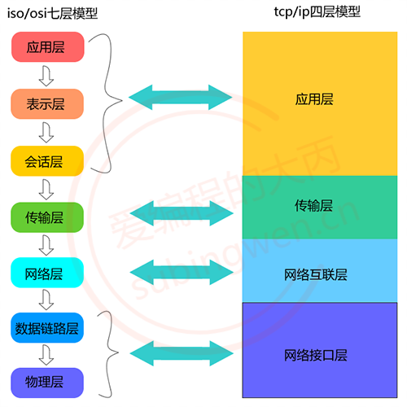
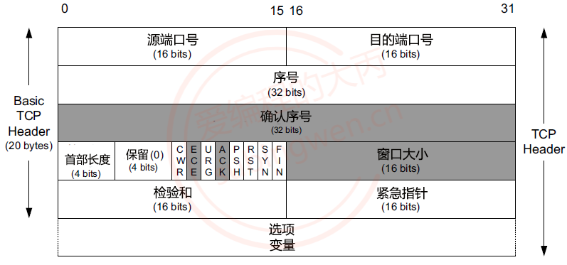
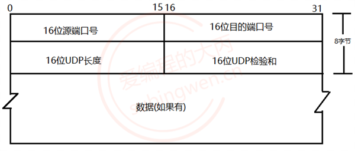
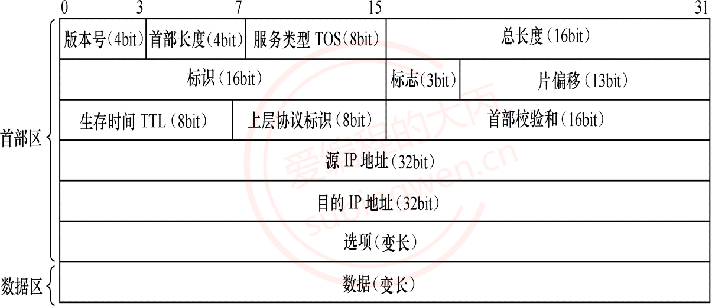
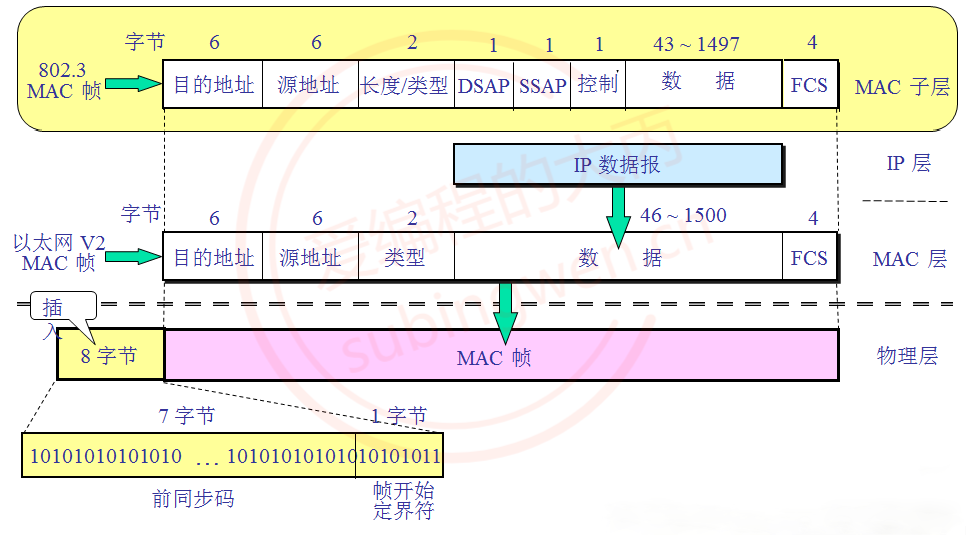
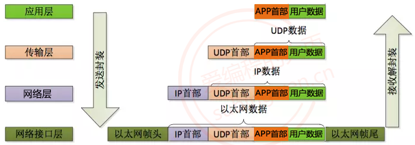
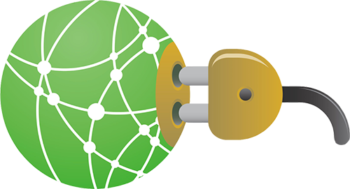

+ [author](https://github.com/3293172751)

# 第10节 网络编程基础

+ [回到目录](../README.md)
+ [回到项目首页](../../README.md)
+ [上一节](9.md)
> ❤️💕💕计算机网络--TCP/IP 学习。Myblog:[http://nsddd.top](http://nsddd.top/)
---
[TOC]

> **我们的网络编程都是基于Linux的，windows差不多，就是有几个多余的步骤，需要加载和释放。**
>
> **编程语言主要是基于C/C++的，后面有Go语言，Java语言，python语言的版本**

## 概念

+ 客户端和服务器的比例是：$$\mathcal{n:1}$$ 
+ 客户端和服务器的比例是：$$\mathcal{n:n}$$ 

**服务器处理顺序：**

1. 依照请求顺序依次处理
2. 并发处理（使用多线程并发）
3. 多进程处理  ==>  进程池
4. IO转接 + 多线程
5. 开源框架$$libevent$$：天然接收高并发


## 网络和IP

### 局域网和广域网

- 局域网：局域网将一定区域内的各种计算机、外部设备和数据库连接起来形成计算机通信的私有网络。
- 广域网：又称**广域网**、**外网**、**公网**。是连接不同地区局域网或城域网计算机通信的远程公共网络。

### ip

IP（Internet Protocol）：本质是一个整形数，用于表示计算机在网络中的地址。

> IP 协议版本有两个：IPv4 和 IPv6

- IPv4（Internet Protocol version4）：
  - 使用一个 32 位的整形数描述一个 IP 地址，4 个字节，int 型
  - 也可以使用一个点分十进制字符串描述这个 IP 地址： `192.168.247.135`
  - 分成了 4 份，每份 1 字节，8bit（char），最大值为 255
    - `0.0.0.0` 是最小的 IP 地址
    - `255.255.255.255` 是最大的 IP 地址
  - 按照 IPv4 协议计算，可以使用的 IP 地址共有 232 个
- IPv6（Internet Protocol version6）：
  - 使用一个 128 位的整形数描述一个 IP 地址，16 个字节
  - 也可以使用一个字符串描述这个 IP 地址：`2001:0db8:3c4d:0015:0000:0000:1a2f:1a2b`
  - 分成了 8 份，每份 2 字节，每一部分以 16 进制的方式表示
  - 按照 IPv6 协议计算，可以使用的 IP 地址共有 2128 个

### 查看 IP 地址

```shell
# linux
$ ifconfig

# windows
$ ipconfig

# 测试网络是否畅通
# 主机a: 192.168.1.11
# 当前主机: 192.168.1.12
$ ping 192.168.1.11     
$ ping www.baidu.com    

# 特殊的IP地址: 127.0.0.1  ==> 和本地的IP地址是等价的
# 假设当前电脑没有联网, 就没有IP地址, 又要做网络测试, 可用使用 127.0.0.1 进行本地测试
```

### 端口

端口的作用是定位到主机上的某一个进程，通过这个端口进程就可以接受到对应的网络数据了。

> 在电脑上运行了微信和 QQ, 小明通过客户端给我的的微信发消息，电脑上的微信就收到了消息，为什么？
>
> - 运行在电脑上的微信和 QQ 都绑定了不同的端口
> - 通过 IP 地址可以定位到某一台主机，通过端口就可以定位到主机上的某一个进程
> - 通过指定的 IP 和端口，发送数据的时候对端就能接受到数据了

端口也是一个整形数` unsigned short` ，一个 16 位整形数，有效端口的取值范围是：`0 ~ 65535`(0 ~ 216-1)

提问：计算机中所有的进程都需要关联一个端口吗，一个端口可以被重复使用吗？

- 不需要，如果这个进程不需要网络通信，那么这个进程就不需要绑定端口的
- 一个端口只能给某一个进程使用，多个进程不能同时使用同一个端口


### OSI/ISO 网络分层模型

OSI（Open System Interconnect），即开放式系统互联。 一般都叫 OSI 参考模型，是 ISO（国际标准化组织组织）在 1985 年研究的网络互联模型。



物理层：负责最后将信息编码成电流脉冲或其它信号用于网上传输数据链路层:数据链路层通过物理网络链路供数据传输。规定了 0 和 1 的分包形式，确定了网络数据包的形式；网络层网络层负责在源和终点之间建立连接；此处需要确定计算机的位置，通过 IPv4，IPv6 格式的 IP 地址来找到对应的主机传输层传输层向高层提供可靠的端到端的网络数据流服务。每一个应用程序都会在网卡注册一个端口号，该层就是端口与端口的通信会话层会话层建立、管理和终止表示层与实体之间的通信会话；建立一个连接（自动的手机信息、自动的网络寻址）;表示层:对应用层数据编码和转化，确保以一个系统应用层发送的信息 可以被另一个系统应用层识别；


网络协议指的是计算机网络中互相通信的对等实体之间交换信息时所必须遵守的规则的集合。一般系统网络协议包括五个部分：通信环境，传输服务，词汇表，信息的编码格式，时序、规则和过程。先来通过下面几幅图了解一下常用的网络协议的格式：


- TCP 协议 -> 传输层协议

  

  


- UDP 协议 -> 传输层协议

  

  

  


- IP 协议 -> 网络层协议

  

  

  


- 以太网帧协议 -> 网络接口层协议

  

  

  

- 数据的封装

  

  

  

  在网络通信的时候，程序猿需要负责的应用层数据的处理 (最上层)

  - 应用层的数据可以使用某些协议进行封装，也可以不封装
  - 程序猿需要调用发送数据的接口函数，将数据发送出去
  - 程序猿调用的 API 做底层数据处理
    - 传输层使用传输层协议打包数据
    - 网络层使用网络层协议打包数据
    - 网络接口层使用网络接口层协议打包数据
    - 数据被发送到 internet
  - 接收端接收到发送端的数据
    - 程序猿调用接收数据的函数接收数据
    - 调用的 API 做相关的底层处理:
      - 网络接口层拆包 ==> 网络层的包
      - 网络层拆包 ==> 网络层的包
      - 传输层拆包 ==> 传输层数据
    - 如果应用层也使用了协议对数据进行了封装，数据的包的解析需要程序猿做


## Socket套接字

Socket 套接字由远景研究规划局（Advanced Research Projects Agency, ARPA）资助加里福尼亚大学伯克利分校的一个研究组研发。其目的是将 TCP/IP 协议相关软件移植到 UNIX 类系统中。设计者开发了一个接口，以便应用程序能简单地调用该接口通信。这个接口不断完善，最终形成了 Socket 套接字。Linux 系统采用了 Socket 套接字，因此，Socket 接口就被广泛使用，到现在已经成为事实上的标准。与套接字相关的函数被包含在头文件 sys/socket.h 中。




通过上面的描述可以得知，套接字对应程序猿来说就是一套网络通信的接口，使用这套接口就可以完成网络通信。网络通信的主体主要分为两部分：`客户端`和`服务器端`。在客户端和服务器通信的时候需要频繁提到三个概念：`IP`、`端口`、`通信数据`，下面介绍一下需要注意的一些细节问题。END 链接

+ [回到目录](../README.md)
+ [上一节](9.md)
+ [下一节](11.md)
---
+ [参与贡献❤️💕💕](https://github.com/3293172751/CS_COURSE/blob/master/Git/git-contributor.md)
