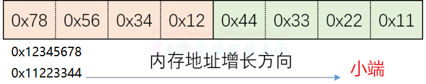
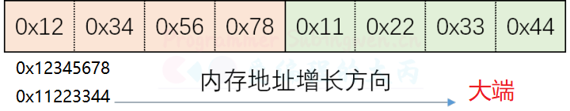

+ [author](https://github.com/3293172751)

# 第11节 大小端字节序和地址转化

+ [回到目录](../README.md)
+ [回到项目首页](../../README.md)
+ [上一节](10.md)
> ❤️💕💕计算机网络--TCP/IP 学习。Myblog:[http://nsddd.top](http://nsddd.top/)
---
[TOC]

## 字节序

在各种计算机体系结构中，对于字节、字等的存储机制有所不同，因而引发了计算机通信领域中一个很重要的问题，即通信双方交流的信息单元（比特、字节、字、双字等等）应该以什么样的顺序进行传送。如果不达成一致的规则，通信双方将无法进行正确的编 / 译码从而导致通信失败。

**字节序，顾名思义字节的顺序，就是大于一个字节类型的数据在内存中的存放顺序，也就是说对于单字符来说是没有字节序问题的，字符串是单字符的集合，因此字符串也没有字节序问题。**


### 大小端

- Little-Endian -> 主机字节序 (小端)

  - 数据的`低位字节`存储到内存的`低地址位` , 数据的`高位字节`存储到内存的`高地址位`
  - 我们使用的 PC 机，数据的存储默认使用的是小端（补码，方便从低位到高位运算）

- Big-Endian -> 网络字节序 (大端)

  - 据的`低位字节`存储到内存的`高地址位` , 数据的`高位字节`存储到内存的`低地址位`
  - `套接字通信过程中操作的数据都是大端存储的，包括：接收/发送的数据、IP地址、端口。`

- 字节序举例

  ```c
  // 有一个16进制的数，有32位（int）：oxffab5c01ff
  // 字节序，最小的单位：char字节，int有4个字节，需要拆分为4份
  内存低地址位                内存的高地址位
  --------------------------------------------------------------------------->
  小端:         0xff        0x01        0x5c        0xab
  大端:         0xab        0x5c        0x01        0xff
  ```

  

  

  > 我们记住大端模式是正常的顺序$$12345678$$

**小端模式优点**：

1. 内存的低地址处存放低字节，所以在强制转换数据时不需要调整字节的内容（注解：比如把int的4字节强制转换成short的2字节时，就直接把int数据存储的前两个字节给short就行，因为其前两个字节刚好就是最低的两个字节，符合转换逻辑）；
2. CPU做数值运算时从内存中依顺序依次从低位到高位取数据进行运算，直到最后刷新最高位的符号位，这样的运算方式会更高效

**大端模式优点**：符号位在所表示的数据的内存的第一个字节中，便于快速判断数据的正负和大小

其各自的优点就是对方的缺点，正因为两者彼此不分伯仲，再加上一些硬件厂商的坚持，因此在多字节存储顺序上始终没有一个统一的标准


## 网络字节序

- 函数

  BSD Socket 提供了封装好的转换接口，方便程序员使用。包括从主机字节序到网络字节序的转换函数：htons、htonl；从网络字节序到主机字节序的转换函数：ntohs、ntohl。

  ```c
  #include <arpa/inet.h>
  // h:主机
  // n:网络
  // s:short
  // i:int
  
  //这套api主要用于网络通信中IP和端口的转换
  //将一个短整型从字节序 -> 网络字节序
  uint16_t htons(uint16_t hostshort);	
  //将一个整型从字节序 -> 网络字节序
  uint32_t htonl(uint32_t hostlong);	
  
  //将一个短整型从字节序 -> 主机字节序
  uint16_t ntohs(uint16_t netshort)
  //将一个整型从字节序 -> 主机字节序  
  uint32_t ntohl(uint32_t netlong);
  ```


## IP 地址转换

虽然 IP 地址本质是一个整形数，但是在使用的过程中都是通过一个字符串来描述，下面的函数描述了如何将一个字符串类型的 IP 地址进行大小端转换：

```c
// 主机字符串的IP地址转化为网络字符串
// 主机字符串的IP地址是字符串，网络字节序IP地址是整形
int inet_pton(int af, const char *src, void *dst);
```

**关于`inet_pton()`函数，我们可以直接查man文档**

```
man inet_pton
```

- 参数:
  - af: 地址族 (IP 地址的家族包括 ipv4 和 ipv6) 协议
    - AF_INET: ipv4 格式的 ip 地址
    - AF_INET6: ipv6 格式的 ip 地址
  - src: 传入参数，对应要转换的点分十进制的 ip 地址: 192.168.1.100
  - dst: 传出参数，函数调用完成，转换得到的大端整形 IP 被写入到这块内存中
- 返回值：成功返回 1，失败返回 0 或者 - 1


**将大端的整形数，转换为小端的点分十进制的IP地址（主机字节序的字符串）**

```c
// 将大端的整形数，转换为小端的点分十进制的IP地址
#include <arpa/inet.h>
const char *inet_ntop(int af, const void *src, char *dst, socklen_t size);
```

- 参数:

  - af: 地址族协议
    - AF_INET: ipv4 格式的 ip 地址 
    - AF_INET6: ipv6 格式的 ip 地址
  - src: 传入参数，这个指针指向的内存中存储了大端的整形 IP 地址
  - dst: 传出参数，存储转换得到的小端的点分十进制的 IP 地址
  - size: 修饰 dst 参数的，标记 dst 指向的内存中最多可以存储多少个字节

- 返回值:

  - 成功：指针指向第三个参数对应的内存地址，通过返回值也可以直接取出转换得到的 IP 字符串
  - 失败: NULL

  

还有一组函数也能进程 IP 地址大小端的转换，但是只能处理 ipv4 的 ip 地址（建议还是使用上面的函数）：

```c
// 点分十进制IP ==> 大端整形
in_addr_t inet_addr (const char *cp);

// 大端整形 ==> 点分十进制IP
char* inet_ntoa(struct in_addr in);
```

## END 链接

+ [回到目录](../README.md)
+ [上一节](10.md)
+ [下一节](12.md)
---
+ [参与贡献❤️💕💕](https://github.com/3293172751/CS_COURSE/blob/master/Git/git-contributor.md)
