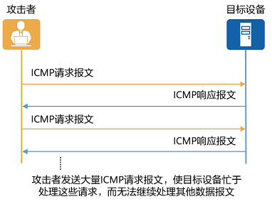

+ [author](https://github.com/3293172751)

# 第20节 ICMP以及功能使用

+ [回到目录](../README.md)
+ [回到项目首页](../../README.md)
+ [上一节](19.md)
> ❤️💕💕计算机网络--TCP/IP 学习。Myblog:[http://nsddd.top](http://nsddd.top/)
---
[TOC]

因特网控制报文协议 ICMP（Internet Control Message Protocol）是一个差错报告机制，是 TCP/IP 协议簇中的一个重要子协议，通常被 IP 层或更高层协议（TCP 或 UDP）使用，属于网络层协议，主要用于在主机和路由器之间传递控制消息，报告主机是否可达、路由是否可用等。

**我们都知道IP是尽力传输服务，如果发生错误，就会丢弃该数据包，然后发送ICMP信息给信源端**


## 为什么需要 ICMP？

在数据传输的过程中，IP 提供尽力而为的服务，指为了把数据包发送到目的地址尽最大努力。它并不对目的主机是否收到数据包进行验证，无法进行流量控制和差错控制。因此在数据包传输过程中，产生各种错误在所难免。为了更有效地转发 IP 数据包和提高数据包交付成功的机会，ICMP 应运而生。使用 ICMP，当网络中数据包传输出现问题时，主机或设备就会向上层协议报告差错情况和提供有关异常情况的报告，使得上层协议能够通过自己的差错控制程序来判断通信是否正确，以进行流量控制和差错控制，从而保证服务质量。


## ICMP 如何工作？

从技术角度来说，ICMP 就是一个差错报告机制，其工作机理也比较简单，即当数据包处理过程出现差错时，ICMP 向数据包的源端设备报告这个差错，它既不会纠正这个差错，也不会通知中间的网络设备。因为 ICMP 报文被封装在 IP 数据包内部，作为 IP 数据包的数据部分通过互联网传递。IP 数据包中的字段包含源端和最终的目的端，并没有记录报文在网络传递中的全部路径（除非 IP 数据包中设置了路由记录选项）。因此当设备检测到差错时，它无法通知中间的网络设备，只能向源端发送差错报告。

源端在收到差错报告后，它虽然不能判断差错是由中间哪个网络设备所引起的，但是却可以根据 ICMP 报文确定发生错误的类型，并确定如何才能更好地重发传递失败的数据包。

ICMP 报文格式如图所示，每一个 ICMP 消息都将包含引发这条 ICMP 消息的数据包的完全 IP 包头，ICMP 报文则作为 IP 数据包的数据部分封装在 IP 数据包内部。ICMP 包头中包含的三个固定字段就是源端设备确定发生错误的类型的主要依据。

- Type 字段表示 ICMP 消息的类型；
- Code 字段表示 ICMP 消息类型细分的子类型；
- Checksum 字段表示 ICMP 报文的校验和。

不同的 Type 和 Code 值表示不同的 ICMP 报文类型，对应了数据包处理过程中可能出现的不同错误情况，不同类型的 ICMP 报文又分为差错报文和查询报文两种，如 ICMP 报文分类表所示。

此外，我们还要认识到，ICMP 协议在以下情况下不会产生 ICMP 差错报文：

- ICMP 差错报文不会产生 ICMP 差错报文（但 ICMP 查询报文可能会产生 ICMP 差错报文），此条规定主要为了防止 ICMP 消息的无限产生和传递；
- 目的地址是广播地址或多波地址的 IP 数据报文；
- 作为链路层广播的数据包；
- 不是 IP 分片的第一片；
- 源地址不是单个主机的数据包，也就是说，源地址不能为零地址、环回地址、广播地址或[多播](https://info.support.huawei.com/info-finder/encyclopedia/zh/组播.html)地址。


ICMP 报文格式


### ICMP 报文分类

| Type            | Code                            | 描述                           | 查询 / 差错 |
| --------------- | ------------------------------- | ------------------------------ | ----------- |
| 0-Echo 响应     | 0                               | Echo 响应报文                  | 查询        |
| 3 - 目的不可达  | 0                               | 目标网络不可达报文             | 差错        |
| 1               | 目标主机不可达报文              | 差错                           |             |
| 2               | 目标协议不可达报文              | 差错                           |             |
| 3               | 目标端口不可达报文              | 差错                           |             |
| 4               | 要求分段并设置 DF flag 标志报文 | 差错                           |             |
| 5               | 源路由失败报文                  | 差错                           |             |
| 6               | 未知的目标网络报文              | 差错                           |             |
| 7               | 未知的目标主机报文              | 差错                           |             |
| 8               | 源主机隔离报文                  | 差错                           |             |
| 9               | 禁止访问的网络报文              | 差错                           |             |
| 10              | 禁止访问的主机报文              | 差错                           |             |
| 11              | 对特定的 TOS 网络不可达报文     | 差错                           |             |
| 12              | 对特定的 TOS 主机不可达报文     | 差错                           |             |
| 13              | 由于过滤 网络流量被禁止报文     | 差错                           |             |
| 14              | 主机越权报文                    | 差错                           |             |
| 15              | 优先权终止生效报文              | 差错                           |             |
| 5 - 重定向      | 0                               | 重定向网络报文                 | 差错        |
| 1               | 重定向主机报文                  | 差错                           |             |
| 2               | 基于 TOS 的网络重定向报文       | 差错                           |             |
| 3               | 基于 TOS 的主机重定向报文       | 差错                           |             |
| 8-Echo 请求     | 0                               | Echo 请求报文                  | 查询        |
| 9 - 路由器通告  | 0                               | 路由通告报文                   | 查询        |
| 10 - 路由器请求 | 0                               | 路由器的发现 / 选择 / 请求报文 | 查询        |
| 11-ICMP 超时    | 0                               | TTL 超时报文                   | 差错        |
| 1               | 分片重组超时报文                | 差错                           |             |
| 12 - 参数问题   | 0                               | IP 报首部参数错误报文          | 差错        |
| 1               | 丢失必要选项报文                | 差错                           |             |
| 2               | 不支持的长度报文                | 差错                           |             |
| 13 - 时间戳请求 | 0                               | 时间戳请求报文                 | 查询        |
| 14 - 时间戳应答 | 0                               | 时间戳应答报文                 | 查询        |
| 15 - 信息请求   | 0                               | 信息请求报文                   | 查询        |
| 16 - 信息应答   | 0                               | 信息应答报文                   | 查询        |


## ICMP 的典型应用

IP 数据报及其他应用程序通过 ICMP 报文可以实现多种应用，其中 Ping 程序和 Tracert（Traceroute）程序最为常见。此外，在网络管理和监测中，网络质量分析 [NQA](https://info.support.huawei.com/info-finder/encyclopedia/zh/NQA.html)（Network Quality Analysis）技术更加充分应用了 ICMP。


### Ping

Ping 程序是最常见的用于检测 IPv4 和 [IPv6](https://info.support.huawei.com/info-finder/encyclopedia/zh/IPv6.html) 网络设备是否可达的调试手段，它使用 ICMP 的 echo 信息来确定：

- 远程设备是否可达；
- 与远程主机通信的来回旅程（round-trip）的延迟；
- 报文包的丢失情况。

### ping 本地环回

本地回环地址（Loop back address），不属于任何一个有类别地址类。它代表设备的本地虚拟接口，所以默认被看作是永远不会宕掉的接口。

  主要作用有两个：一是测试本机的网络配置，能PING通127.0.0.1说明本机的网卡和IP协议安装都没有问题；另一个作用是某些SERVER/CLIENT的应用程序在运行时需调用服务器上的资源，一般要指定SERVER的IP地址，但当该程序要在同一台机器上运行而没有别的SERVER时就可以把SERVER的资源装在本机，SERVER的IP地址设为127.0.0.1同样也可以运行。


   本地回环地址指的是以127开头的地址（127.0.0.1 - 127.255.255.254），通常用127.0.0.1来表示。

```bash
C:\Users\smile>ipconfig


无线局域网适配器 WLAN:

   连接特定的 DNS 后缀 . . . . . . . :
   IPv6 地址 . . . . . . . . . . . . : 240e:45d:ac30:22e:b43f:52a3:c9be:e0ad
   临时 IPv6 地址. . . . . . . . . . : 240e:45d:ac30:22e:5596:f0e8:8313:1a78
   本地链接 IPv6 地址. . . . . . . . : fe80::b43f:52a3:c9be:e0ad%3
   IPv4 地址 . . . . . . . . . . . . : 192.168.184.29
   子网掩码  . . . . . . . . . . . . : 255.255.255.0
   默认网关. . . . . . . . . . . . . : fe80::74d6:83ff:fe47:2943%3
                                       192.168.184.240

以太网适配器 蓝牙网络连接:

   媒体状态  . . . . . . . . . . . . : 媒体已断开连接
   连接特定的 DNS 后缀 . . . . . . . :

C:\Users\smile>ping 192.168.137.1

正在 Ping 192.168.137.1 具有 32 字节的数据:
来自 192.168.137.1 的回复: 字节=32 时间<1ms TTL=128
来自 192.168.137.1 的回复: 字节=32 时间<1ms TTL=128
来自 192.168.137.1 的回复: 字节=32 时间<1ms TTL=128

192.168.137.1 的 Ping 统计信息:
    数据包: 已发送 = 3，已接收 = 3，丢失 = 0 (0% 丢失)，
往返行程的估计时间(以毫秒为单位):
    最短 = 0ms，最长 = 0ms，平均 = 0ms
Control-C
^C
C:\Users\smile>ping 127.5.2.0

正在 Ping 127.5.2.0 具有 32 字节的数据:
来自 127.5.2.0 的回复: 字节=32 时间<1ms TTL=128
来自 127.5.2.0 的回复: 字节=32 时间<1ms TTL=128
来自 127.5.2.0 的回复: 字节=32 时间<1ms TTL=128
来自 127.5.2.0 的回复: 字节=32 时间<1ms TTL=128

127.5.2.0 的 Ping 统计信息:
    数据包: 已发送 = 4，已接收 = 4，丢失 = 0 (0% 丢失)，
往返行程的估计时间(以毫秒为单位):
    最短 = 0ms，最长 = 0ms，平均 = 0ms
```


### Tracert

Tracert 程序主要用于查看数据包从源端到目的端的路径信息，从而检查网络连接是否可用。当网络出现故障时，用户可以使用该命令定位故障点。

Tracert 利用 ICMP 超时信息和目的不可达信息来确定从一个主机到网络上其他主机的路由，并显示 IP 网络中每一跳的延迟（这里的延迟是指：分组从信息源发送到目的地所需的时间，延迟也分为许多的种类——传播延迟、传输延迟、处理延迟、排队延迟等）。


### 路径mtu发现

> 我们发送一个数据包，出的mtu将如果超过大小的包**分片**，再传输，此时路径可能会有很多路由结点，有着不同的mtu，我们需要选择最小的mtu的大小进行选择
>
> + 分片是出去的瞬间分
> + 组装是最后接入的时候组装

#### MTU的概念

   **MTU即Maximum Transmission Unit 最大传输单元。它是指一种通信协议的某一层上面所能通过的最大数据包大小（以字节为单位）。**

#### 路径MTU

   路径MTU是指一条因特网传输路径中，从源地址到目的地址所经过的“路径”上的所有IP跳的最大传输单元的最小值。

   或者从另外一个角度来看，就是无需进行分片处理就能穿过这条“路径”的最大传输单元的最大值。

#### 路径MTU的发现方法

   这是确定两个IP主机之间路径最大传输单元的技术，其目的就是为了避免IP分片。

   首先源地址将数据报的DF位置位，在逐渐增大发送的数据报的大小——路径上任何需要将分组进行分片的设备都会将这种数据报丢弃并返回“数据报过大“的ICMP响应

   到源地址——这样源主机就”学习“到了无需分片就能通过这条路径的最大的最大传输单元。

#### TraceRoute

  Traceroute是用来侦测主机到目的主机之间所经路由情况的重要工具。

  **它的原理如下：**它受到目的主机的IP后，首先给目的主机发送一个TTL=1的UDP数据包（每次送出的为3个40字节的包，包括源地址，目的地址和包发出的时间标签），

   而经过的第一个路由器收到这个数据包以后，就自动把TTL减1，而TTL变为0以后，路由器就把这个包给抛弃了，并同时产生 一个主机不可达的ICMP数据报给主机。

  主机收到这个数据报以后再发一个TTL=2的UDP数据报给目的主机，然后刺激第二个路由器给主机发ICMP数据报。如此往复直到到达目的主机。这样，traceroute就拿到了所有的路由器ip。

  Traceroute提取发送 ICMP TTL到期消息设备的IP地址并作域名解析。每次 ，Traceroute都打印出一系列数据,包括所经过的路由设备的域名及 IP地址,三个包每次来回所花时间。

```bash
C:\Users\smile>tracert baidu.com

通过最多 30 个跃点跟踪
到 baidu.com [39.156.66.10] 的路由:

  1     2 ms     1 ms     1 ms  192.168.184.240
  2     *        *        *     请求超时。
  3     *        *        *     请求超时。
  4     *        *        *     请求超时。
  5    18 ms    13 ms    24 ms  111.183.255.161
  6    19 ms    13 ms    12 ms  111.183.255.209
  7     *       44 ms    33 ms  202.97.65.253
  8     *       48 ms    43 ms  202.97.17.78
  9    52 ms     *        *     221.183.66.1
 10     *     ^C
```


### NQA

网络质量分析 NQA（Network Quality Analysis）是一种实时的网络性能探测和统计技术，可以对响应时间、网络抖动、丢包率等网络信息进行统计。NQA 能够实时监视网络服务质量，在网络发生故障时进行有效的故障诊断和定位。

利用不同类型的 ICMP 报文，NQA 实现了 Ping 和 Tracert 功能的扩展和增强，可以实现对网络运行状况的准确测试，输出统计信息。比如 NQA 的 ICMP 测试、ICMP Jitter 测试和 Trace 测试等。

- ICMP 测试

  ICMP 测试是通过发送 ICMP Echo 请求报文和 Echo 响应报文来判断目的地的可达性、计算网络响应时间及丢包率，从而清晰地反映出网络性能及畅通情况。ICMP 测试提供类似于命令行下的 Ping 命令功能，但输出信息更为丰富。

- ICMP Jitter 测试

  ICMP Jitter 测试是以 ICMP 报文为承载，通过记录在报文中的时间戳信息来统计时延、抖动、丢包的一种测试方法。Jitter（抖动时间）是指相邻两个报文的接收时间间隔减去这两个报文的发送时间间隔。

- Trace 测试

  NQA 的 Trace 测试用于检测源端到目的端的转发路径，并沿该路径记录源设备到中间各个设备的时延等信息。Trace 测试类似于 Tracert 命令功能，但输出信息更为丰富。每一跳信息中能够显示平均时延、丢包、最后一个包接收时间等信息。


## ICMP 安全

ICMP 对于网络安全具有极为重要的意义。ICMP 本身非常简单，它并不具有验证机制，这也导致它非常容易被用于攻击交换机、路由器等网络设备。


### ICMP 攻击

目前 ICMP 攻击绝大部分都可以归类为拒绝服务攻击（Denial of Service, DOS），其中最为常见的是 ICMP 泛洪攻击，是指攻击者在短时间内向目标设备发送大量的 ICMP 虚假报文，导致目标设备忙于应付无用报文，而无法为用户提供正常服务，其过程如下图所示。



#### ICMP 泛洪攻击

ICMP 泛洪攻击具体又可分为针对带宽的 DOS 攻击和端口扫描攻击（针对连接的 DOS 攻击）两类：

- 针对带宽的 DOS 攻击

  攻击者发送大量伪造的 ICMP Echo 请求报文，交换机、路由器等网络设备的 CPU 需要响应这种报文，会占用大量的带宽和 CPU 资源，这种 DOS 攻击和其他 DOS 攻击一样，消耗设备的资源而使得设备无法提供正常服务。

  ICMP Echo 响应报文具有较高的优先级，在一般情况下，网络总是允许内部主机使用 Ping 命令。 这种攻击仅限于攻击网络带宽，单个攻击者就能发起这种攻击。更厉害的攻击形式，如 smurf 和 papa-smurf，可以使整个子网内的主机对目标主机进行攻击，从而扩大 ICMP 流量。

- 端口扫描攻击（针对连接的 DOS 攻击）

  端口扫描是指攻击者发送大量的端口扫描报文，交换机需要回应大量的 ICMP 目的不可达报文，这种攻击既消耗系统的资源，同时攻击者能够很轻易获得设备开启的端口，然后可以针对这些端口进行攻击，可以影响所有 IP 设备的网络连接。

此外，还有**针对主机的 DOS 攻击**，又被称为 **Ping-of-Death**，主要是攻击操作系统的漏洞。

由于在早期的阶段，路由器对包的最大尺寸都有限制，许多操作系统对 TCP/IP 栈的实现在 ICMP 包上都是规定 64KB，并且在对包的标题头进行读取之后，要根据该标题头里包含的信息来为有效载荷生成缓冲区。当产生畸形的，声称自己的尺寸超过 ICMP 上限的包也就是加载的尺寸超过 64K 上限时，就会出现内存分配错误，导致 TCP/IP 堆栈崩溃，致使接受方宕机。

根据这个原理，可以简单通过发送一个非法的 ICMP Echo 请求报文，就可以使目标系统崩溃或重启。许多系统包括 Windows、Unix、Macintosh ，还有一些交换机、路由器和打印机，都容易遭受此类攻击。如果用户使用的操作系统的版本过于陈旧，请确保打好了补丁。


### ICMP 攻击防范

ICMP 协议在网络数据传输和网络管理与监测中具有极为重要的作用，同时其本身对于网络安全也具有极为重要的意义。因此，为了减轻设备处理 ICMP 报文的压力以及防范 ICMP 攻击，ICMP 攻击防范技术尤为重要。目前主要采用 ICMP 报文限速、ICMP 报文合法性检查、丢弃不需要处理的 ICMP 报文和不响应不可达报文来防范攻击，保护设备的 CPU 资源。

- 报文限速

  ICMP 报文限速包括端口限速、[VLAN](https://info.support.huawei.com/info-finder/encyclopedia/zh/VLAN.html) 限速和全局限速，同时也实现芯片的限速，通过多个维度来保证 ICMP 的洪泛攻击。

- 合法性检查 & 丢弃不需要处理的报文

  对于一些不合法的 ICMP 报文，比如 TTL 为 0、ICMP 类型为 15、16、17 的报文，都直接丢弃，同时可配置丢弃一些不常用或基本不使用的 ICMP 报文，包括 TTL 为 1、带选项、不可达的 ICMP 报文。

- 不响应不可达报文

  在用户通过发送大量端口不可达或网络不可达报文攻击设备时，设备收到这些报文后可以不响应，直接丢弃，以保护 CPU 资源。


## END 链接
+ [回到目录](../README.md)
+ [上一节](19.md)
+ [下一节](21.md)
---
+ [参与贡献❤️💕💕](https://github.com/3293172751/CS_COURSE/blob/master/Git/git-contributor.md)
