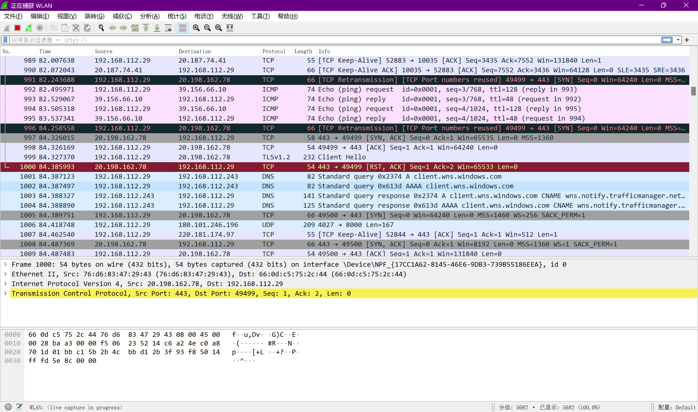

+ [author](https://github.com/3293172751)

# 第21节 WireShark抓包原理及筛选

+ [回到目录](../README.md)
+ [回到项目首页](../../README.md)
+ [上一节](20.md)
> ❤️💕💕计算机网络--TCP/IP 学习。Myblog:[http://nsddd.top](http://nsddd.top/)
---
[TOC]

### Wire Shark

**WireShark是一个网络封包分析软件，功能是获取网络封包，并尽可能最为详细显示封包资料，使用WinPCAP接口，直接与网卡进行数据报文交换。**

+ win中需要安装
+ kil中自带

1. **网络管理员用WireShark检测网络问题**
2. **网路安全工程师用来检测咨询安全问题**
3. **开发者用来获取新的通讯协议除错**
4. **普通人用来学习网络协议相关知识**


### WireShark混杂模式

+ 在所有接口上使用混杂模式就可以直接进行抓包了




### 过滤器

**筛选需要的数据包**

- TCP
- UDP
- ARP   –  ip与mac的映射
- DNS(很多都支持的UDP，但是数据包很大的时候使用的是TCP)


**TCP中也有很多类型的数据包。使用`.`进行赛选**

```
tcp.flags.fin == 1
tcp.flags.syn == 1   //第一次握手
```

**除此之外，我们不仅可以对协议类型进行赛选，我们还有很多的筛选方式，比如源地址和目标地址的等等**

+ 源IP地址

  ```
  ip.src_host == 127.0.0.1
  ```

+ 目标ip

  ```
  ip.dst_host == 192.168.217.1
  ```

+ 或者`or`

+ 而且`and`


## END 链接

+ [回到目录](../README.md)
+ [上一节](20.md)
+ [下一节](22.md)
---
+ [参与贡献❤️💕💕](https://github.com/3293172751/CS_COURSE/blob/master/Git/git-contributor.md)
