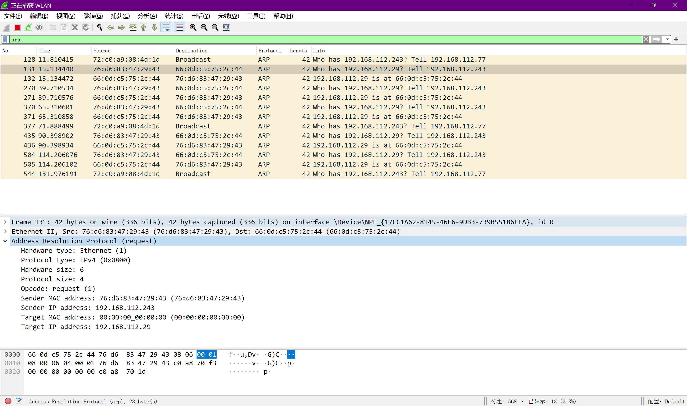

+ [author](https://github.com/3293172751)

# 第22节 对常用协议抓包并分析原理

+ [回到目录](../README.md)
+ [回到项目首页](../../README.md)
+ [上一节](21.md)
> ❤️💕💕计算机网络--TCP/IP 学习。Myblog:[http://nsddd.top](http://nsddd.top/)
---
[TOC]

## ARP地址解析协议

> APR再IP v4中极其重要，通过网络地址来定位MAC地址

+ 关闭混合模式重新抓包




### 分析

```
370	65.310601	76:d6:83:47:29:43	66:0d:c5:75:2c:44	ARP	42	Who has 192.168.112.29? Tell 192.168.112.243
371	65.310858	66:0d:c5:75:2c:44	76:d6:83:47:29:43	ARP	42	192.168.112.29 is at 66:0d:c5:75:2c:44
```

> 192.168.112.243广播：谁有192.168.112.29的MAC地址？
>
> 192.168.112.29应答：192.168.112.29的MAC地址是66:0d:c5:75:2c:44

#### 请求

+ hardware type：硬件类型，标识链路层以太网协议
+ protocol type：协议类型，标识网络层协议
+ Hardware size：硬件地址长度（MAC地址长度）
+ Protocol size：协议地址长度（IP地址长度32位）
+ Opcode：操作码，标识数据类型
  + 1：请求
  + 2：响应
+ Sender MAC address：原MAC地址
+ Sender IP address：原IP地址
+ Target MAC address：目标MAC地址
+ Target IP address：目标IP地址

```
Frame 131: 42 bytes on wire (336 bits), 42 bytes captured (336 bits) on interface \Device\NPF_{17CC1A62-8145-46E6-9DB3-739B55186EEA}, id 0
Ethernet II, Src: 76:d6:83:47:29:43 (76:d6:83:47:29:43), Dst: 66:0d:c5:75:2c:44 (66:0d:c5:75:2c:44)
Address Resolution Protocol (request)
    Hardware type: Ethernet (1)
    Protocol type: IPv4 (0x0800)
    Hardware size: 6
    Protocol size: 4
    Opcode: request (1)
    Sender MAC address: 76:d6:83:47:29:43 (76:d6:83:47:29:43)
    Sender IP address: 192.168.112.243
    Target MAC address: 00:00:00_00:00:00 (00:00:00:00:00:00)
    Target IP address: 192.168.112.29
```

#### 回应

```
Frame 371: 42 bytes on wire (336 bits), 42 bytes captured (336 bits) on interface \Device\NPF_{17CC1A62-8145-46E6-9DB3-739B55186EEA}, id 0
Ethernet II, Src: 66:0d:c5:75:2c:44 (66:0d:c5:75:2c:44), Dst: 76:d6:83:47:29:43 (76:d6:83:47:29:43)
Address Resolution Protocol (reply)
    Hardware type: Ethernet (1)
    Protocol type: IPv4 (0x0800)
    Hardware size: 6
    Protocol size: 4
    Opcode: reply (2)
    Sender MAC address: 66:0d:c5:75:2c:44 (66:0d:c5:75:2c:44)
    Sender IP address: 192.168.112.29
    Target MAC address: 76:d6:83:47:29:43 (76:d6:83:47:29:43)
    Target IP address: 192.168.112.243
```


## ICMP 协议

+ [ICMP](20.md)

> 在[第二十章](20.md)我们知道ICMP使用的很常见
>
> 计算机网络自顶向下  – p273

### ping案例

```bash
C:\Users\smile>Ping google.com
正在 Ping google.com [142.251.43.14] 具有 32 字节的数据:
请求超时。
142.251.43.14 的 Ping 统计信息:
    数据包: 已发送 = 1，已接收 = 0，丢失 = 1 (100% 丢失)，
Control-C
C:\Users\smile>Ping nsddd.top

正在 Ping nsddd.top [110.42.175.115] 具有 32 字节的数据:
来自 110.42.175.115 的回复: 字节=32 时间=38ms TTL=52
110.42.175.115 的 Ping 统计信息:
    数据包: 已发送 = 1，已接收 = 1，丢失 = 0 (0% 丢失)，
往返行程的估计时间(以毫秒为单位):
    最短 = 38ms，最长 = 38ms，平均 = 38ms
Control-C
```

#### ping通 – 去

+ Src：原目标IP
+ Dst：目的IP
+ Type：请求数据包类型
  + 8：回显请求
  + 0：回显类型
  + 3
    + 1：目的网络不可达
    + 2：目的协议不可达
    + 3：目的端口不可达
    + 6：目的网络未知
    + 7：目的主机未知
  + 11：TTL过期
+ Checksum Status：校验状态：good没问题
+ Request frame：请求与Response frame对应   `+1`
+ Data：填充的数据

```
Frame 1419: 74 bytes on wire (592 bits), 74 bytes captured (592 bits) on interface \Device\NPF_{17CC1A62-8145-46E6-9DB3-739B55186EEA}, id 0
Ethernet II, Src: 66:0d:c5:75:2c:44 (66:0d:c5:75:2c:44), Dst: 76:d6:83:47:29:43 (76:d6:83:47:29:43)
Internet Protocol Version 4, Src: 192.168.112.29, Dst: 110.42.175.115
Internet Control Message Protocol
    Type: 8 (Echo (ping) request)
    Code: 0
    Checksum: 0x4d45 [correct]
    [Checksum Status: Good]
    Identifier (BE): 1 (0x0001)
    Identifier (LE): 256 (0x0100)
    Sequence Number (BE): 22 (0x0016)
    Sequence Number (LE): 5632 (0x1600)
    [Response frame: 1420]
    Data (32 bytes)
```

#### ping通 – 回

```
Frame 1420: 74 bytes on wire (592 bits), 74 bytes captured (592 bits) on interface \Device\NPF_{17CC1A62-8145-46E6-9DB3-739B55186EEA}, id 0
Ethernet II, Src: 76:d6:83:47:29:43 (76:d6:83:47:29:43), Dst: 66:0d:c5:75:2c:44 (66:0d:c5:75:2c:44)
Internet Protocol Version 4, Src: 110.42.175.115, Dst: 192.168.112.29
Internet Control Message Protocol
    Type: 0 (Echo (ping) reply)
    Code: 0
    Checksum: 0x5545 [correct]
    [Checksum Status: Good]
    Identifier (BE): 1 (0x0001)
    Identifier (LE): 256 (0x0100)
    Sequence Number (BE): 22 (0x0016)
    Sequence Number (LE): 5632 (0x1600)
    [Request frame: 1419]
    [Response time: 29.685 ms]
    Data (32 bytes)
```


#### ping不通

+ No response seen：没有反应过

```
Frame 635: 74 bytes on wire (592 bits), 74 bytes captured (592 bits) on interface \Device\NPF_{17CC1A62-8145-46E6-9DB3-739B55186EEA}, id 0
Ethernet II, Src: 66:0d:c5:75:2c:44 (66:0d:c5:75:2c:44), Dst: 76:d6:83:47:29:43 (76:d6:83:47:29:43)
Internet Protocol Version 4, Src: 192.168.112.29, Dst: 142.251.43.14
Internet Control Message Protocol
    Type: 8 (Echo (ping) request)
    Code: 0
    Checksum: 0x4d48 [correct]
    [Checksum Status: Good]
    Identifier (BE): 1 (0x0001)
    Identifier (LE): 256 (0x0100)
    Sequence Number (BE): 19 (0x0013)
    Sequence Number (LE): 4864 (0x1300)
    [No response seen]
    Data (32 bytes)

```


## END 链接

+ [回到目录](../README.md)
+ [上一节](21.md)
+ [下一节](23.md)
---
+ [参与贡献❤️💕💕](https://github.com/3293172751/CS_COURSE/blob/master/Git/git-contributor.md)
