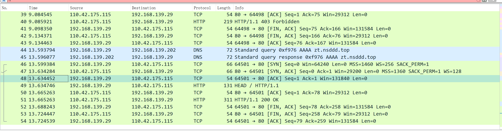

+ [author](https://github.com/3293172751)

# 第24节 HTTP协议抓包

+ [回到目录](../README.md)
+ [回到项目首页](../../README.md)
+ [上一节](23.md)
> ❤️💕💕计算机网络--TCP/IP 学习。Myblog:[http://nsddd.top](http://nsddd.top/)
---
[TOC]



## 发送请求

```
curl -I nsddd.top
```

**`curl`是一个在命令行下工作的文件传输工具，我们在这里用来发送HTTP请求。**

+ `-I`大写的i表示仅返回头部信息。
+ 这个过程包含了TCP的三次握手和四次挥手。

```
C:\Users\smile>curl -I nsddd.top
HTTP/1.1 403 Forbidden
Server: nginx
Date: Sun, 24 Jul 2022 06:38:18 GMT
Content-Type: text/html; charset=UTF-8
Connection: keep-alive
Vary: Accept-Encoding
C:\Users\smile>Ping nsddd.top

正在 Ping nsddd.top [110.42.175.115] 具有 32 字节的数据:
来自 110.42.175.115 的回复: 字节=32 时间=38ms TTL=52

110.42.175.115 的 Ping 统计信息:
    数据包: 已发送 = 1，已接收 = 1，丢失 = 0 (0% 丢失)，
往返行程的估计时间(以毫秒为单位):
    最短 = 38ms，最长 = 38ms，平均 = 38ms
Control-C
^C
C:\Users\smile>curl -I nsddd.top
HTTP/1.1 403 Forbidden
Server: nginx
Date: Sun, 24 Jul 2022 06:38:18 GMT
Content-Type: text/html; charset=UTF-8
Connection: keep-alive
Vary: Accept-Encoding
```

### HTTP  –  失败403

> 第一次失败，第二次成功`200ok`

```
38	9.048950	192.168.139.29	110.42.175.115	HTTP	128	HEAD / HTTP/1.1 
40	9.085921	110.42.175.115	192.168.139.29	HTTP	219	HTTP/1.1 403 Forbidden 
```


**字段**


### HTTP成功 – 200ok

```
49	13.634746	192.168.139.29	110.42.175.115	HTTP	131	HEAD / HTTP/1.1 
51	13.665263	110.42.175.115	192.168.139.29	HTTP	311	HTTP/1.1 200 OK 
```

#### 请求

```
Frame 49: 131 bytes on wire (1048 bits), 131 bytes captured (1048 bits) on interface \Device\NPF_{17CC1A62-8145-46E6-9DB3-739B55186EEA}, id 0
Ethernet II, Src: 66:0d:c5:75:2c:44 (66:0d:c5:75:2c:44), Dst: 76:d6:83:47:29:43 (76:d6:83:47:29:43)
Internet Protocol Version 4, Src: 192.168.139.29, Dst: 110.42.175.115
Transmission Control Protocol, Src Port: 64501, Dst Port: 80, Seq: 1, Ack: 1, Len: 77
    Source Port: 64501
    Destination Port: 80
    [Stream index: 3]
    [Conversation completeness: Complete, WITH_DATA (31)]
    [TCP Segment Len: 77]
    Sequence Number: 1    (relative sequence number)
    Sequence Number (raw): 2761004373
    [Next Sequence Number: 78    (relative sequence number)]
    Acknowledgment Number: 1    (relative ack number)
    Acknowledgment number (raw): 3993791944
    0101 .... = Header Length: 20 bytes (5)
    Flags: 0x018 (PSH, ACK)
        000. .... .... = Reserved: Not set
        ...0 .... .... = Nonce: Not set
        .... 0... .... = Congestion Window Reduced (CWR): Not set
        .... .0.. .... = ECN-Echo: Not set
        .... ..0. .... = Urgent: Not set
        .... ...1 .... = Acknowledgment: Set
        .... .... 1... = Push: Set
        .... .... .0.. = Reset: Not set
        .... .... ..0. = Syn: Not set
        .... .... ...0 = Fin: Not set
        [TCP Flags: ·······AP···]
    Window: 515
    [Calculated window size: 131840]
    [Window size scaling factor: 256]
    Checksum: 0x69cb [unverified]
    [Checksum Status: Unverified]
    Urgent Pointer: 0
    [Timestamps]
        [Time since first frame in this TCP stream: 0.035362000 seconds]
        [Time since previous frame in this TCP stream: 0.000294000 seconds]
    [SEQ/ACK analysis]
        [iRTT: 0.035068000 seconds]
        [Bytes in flight: 77]
        [Bytes sent since last PSH flag: 77]
    TCP payload (77 bytes)
Hypertext Transfer Protocol
    HEAD / HTTP/1.1\r\n
        [Expert Info (Chat/Sequence): HEAD / HTTP/1.1\r\n]
            [HEAD / HTTP/1.1\r\n]
            [Severity level: Chat]
            [Group: Sequence]
        Request Method: HEAD
        Request URI: /
        Request Version: HTTP/1.1
    Host: zt.nsddd.top\r\n
    User-Agent: curl/7.83.1\r\n
    Accept: */*\r\n
    \r\n
    [Full request URI: http://zt.nsddd.top/]
    [HTTP request 1/1]
    [Response in frame: 51]

```

#### 响应

```
Frame 51: 311 bytes on wire (2488 bits), 311 bytes captured (2488 bits) on interface \Device\NPF_{17CC1A62-8145-46E6-9DB3-739B55186EEA}, id 0
Ethernet II, Src: 76:d6:83:47:29:43 (76:d6:83:47:29:43), Dst: 66:0d:c5:75:2c:44 (66:0d:c5:75:2c:44)
Internet Protocol Version 4, Src: 110.42.175.115, Dst: 192.168.139.29
Transmission Control Protocol, Src Port: 80, Dst Port: 64501, Seq: 1, Ack: 78, Len: 257
    Source Port: 80
    Destination Port: 64501
    [Stream index: 3]
    [Conversation completeness: Complete, WITH_DATA (31)]
    [TCP Segment Len: 257]
    Sequence Number: 1    (relative sequence number)
    Sequence Number (raw): 3993791944
    [Next Sequence Number: 258    (relative sequence number)]
    Acknowledgment Number: 78    (relative ack number)
    Acknowledgment number (raw): 2761004450
    0101 .... = Header Length: 20 bytes (5)
    Flags: 0x018 (PSH, ACK)
        000. .... .... = Reserved: Not set
        ...0 .... .... = Nonce: Not set
        .... 0... .... = Congestion Window Reduced (CWR): Not set
        .... .0.. .... = ECN-Echo: Not set
        .... ..0. .... = Urgent: Not set
        .... ...1 .... = Acknowledgment: Set
        .... .... 1... = Push: Set
        .... .... .0.. = Reset: Not set
        .... .... ..0. = Syn: Not set
        .... .... ...0 = Fin: Not set
        [TCP Flags: ·······AP···]
    Window: 229
    [Calculated window size: 29312]
    [Window size scaling factor: 128]
    Checksum: 0x3278 [unverified]
    [Checksum Status: Unverified]
    Urgent Pointer: 0
    [Timestamps]
        [Time since first frame in this TCP stream: 0.065879000 seconds]
        [Time since previous frame in this TCP stream: 0.000000000 seconds]
    [SEQ/ACK analysis]
        [iRTT: 0.035068000 seconds]
        [Bytes in flight: 257]
        [Bytes sent since last PSH flag: 257]
    TCP payload (257 bytes)
Hypertext Transfer Protocol
    HTTP/1.1 200 OK\r\n
        [Expert Info (Chat/Sequence): HTTP/1.1 200 OK\r\n]
            [HTTP/1.1 200 OK\r\n]
            [Severity level: Chat]
            [Group: Sequence]
        Response Version: HTTP/1.1
        Status Code: 200
        [Status Code Description: OK]
        Response Phrase: OK
    Server: nginx\r\n
    Date: Sun, 24 Jul 2022 06:39:44 GMT\r\n
    Content-Type: text/html\r\n
    Content-Length: 16902\r\n
    Last-Modified: Thu, 05 May 2022 12:19:04 GMT\r\n
    Connection: keep-alive\r\n
    Vary: Accept-Encoding\r\n
    ETag: "6273c0b8-4206"\r\n
    Accept-Ranges: bytes\r\n
    \r\n
    [HTTP response 1/1]
    [Time since request: 0.030517000 seconds]
    [Request in frame: 49]
    [Request URI: http://zt.nsddd.top/]

```


## END 链接

+ [回到目录](../README.md)
+ [上一节](23.md)
+ [下一节](25.md)
---
+ [参与贡献❤️💕💕](https://github.com/3293172751/CS_COURSE/blob/master/Git/git-contributor.md)
