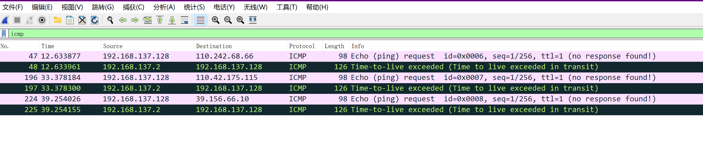
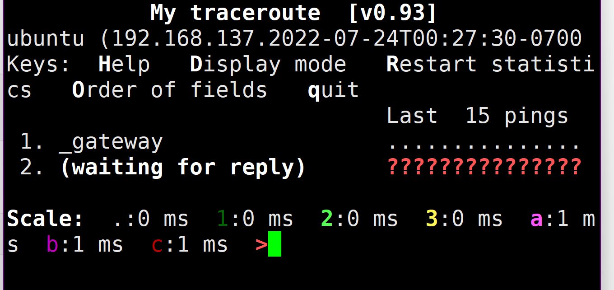

+ [author](https://github.com/3293172751)

# 第25节 WireShark抓包解决服务器无法上网

+ [回到目录](../README.md)
+ [回到项目首页](../../README.md)
+ [上一节](24.md)
> ❤️💕💕计算机网络--TCP/IP 学习。Myblog:[http://nsddd.top](http://nsddd.top/)
---
[TOC]

## WireShark抓包解决服务器被黑无法上网

+ 可以ping通，但是不能上网
+ TTL是数据报文的生存周期

**Linux上默认TTL值是64，每经过一个路由节点，TTL值减1，TTL值为0，表示目标地址不可达，返回Time to live exceeded**

**我们临时修改为1**

```
echo "1" > /proc/sys/net/ipv4/ip_default_ttl
```

### 测试

> 能ping通本地，但是远程服务器`baidu.com`没有办法通，显示Time to live exceeded

```
root@ubuntu:/home/smile# ping 127.5.2.0 -c 1
PING 127.5.2.0 (127.5.2.0) 56(84) bytes of data.
64 bytes from 127.5.2.0: icmp_seq=1 ttl=1 time=0.180 ms
--- 127.5.2.0 ping statistics ---
1 packets transmitted, 1 received, 0% packet loss, time 0ms
rtt min/avg/max/mdev = 0.180/0.180/0.180/0.000 ms

root@ubuntu:/home/smile# ping baidu.com -c 1
PING baidu.com (110.242.68.66) 56(84) bytes of data.
From _gateway (192.168.137.2) icmp_seq=1 Time to live exceeded
--- baidu.com ping statistics ---
1 packets transmitted, 0 received, +1 errors, 100% packet loss, time 0ms
```

**此时应该想到一个问题，TTL值**


### 验证

**我们恢复Linux下的TTL值为64或者255，可以正常访问**

+ 而且我们可以在下面看到它返回给我们的ttl值为128，意味着我们需要`>127`才能访问
  $$
  TTL > 255 - 128 =  127
  $$

```
root@ubuntu:/home/smile# echo "255" > /proc/sys/net/ipv4/ip_default_ttl
root@ubuntu:/home/smile# ping baidu.com -c 1
PING baidu.com (39.156.66.10) 56(84) bytes of data.
64 bytes from 39.156.66.10 (39.156.66.10): icmp_seq=1 ttl=128 time=42.0 ms

--- baidu.com ping statistics ---
1 packets transmitted, 1 received, 0% packet loss, time 0ms
rtt min/avg/max/mdev = 42.024/42.024/42.024/0.000 ms
```


## WireShark分析

+ 筛选ICMP，抓取错误
+ 分别对应如下，请求包和相应包



**显示Time to live exceeded说明请求超时。**


## MTR

**MTL可以检测我们到达目标网络之间的所有网络设备的网路质量**

### 安装MTR

```
sudo apt-get install mtr
mtr -v
```

### MTR检测

```
mtr ip/域名
```


### 测试

```
mtr baidu.com
```



## END 链接

+ [回到目录](../README.md)
+ [上一节](24.md)
+ [下一节](26.md)
---
+ [参与贡献❤️💕💕](https://github.com/3293172751/CS_COURSE/blob/master/Git/git-contributor.md)
