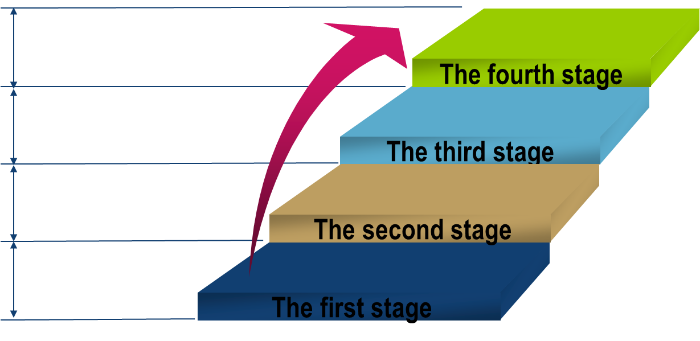
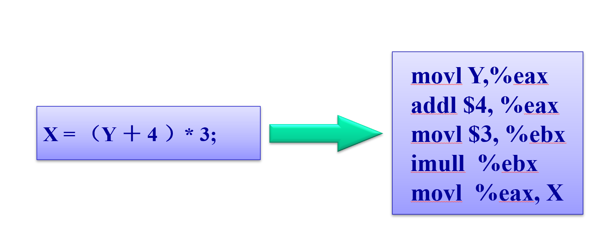
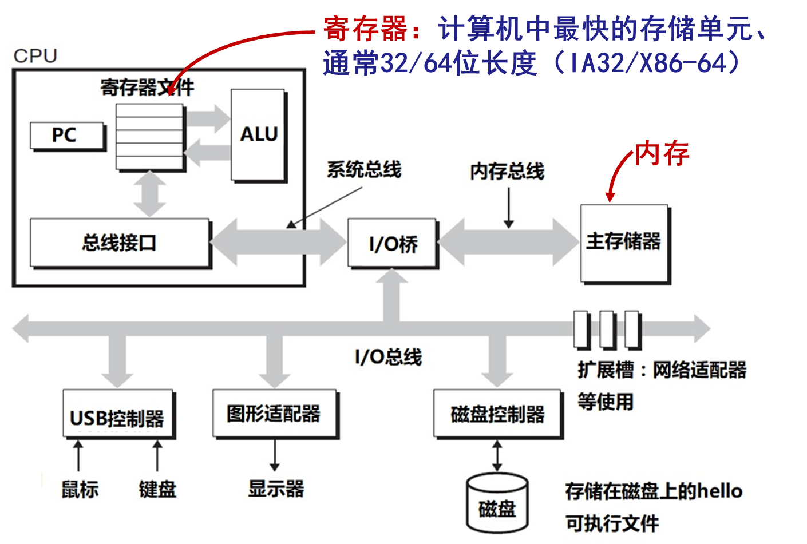

+ [author](https://github.com/3293172751)

# 第1节 汇编语言

+ [回到目录](../README.md)
+ [回到项目首页](../../README.md)
> ❤️💕💕汇编语言目前仍在发挥着不可替代的作用，在效率上无可替代，在底层，学习linux内核，计算机外围设备和驱动，都离不开汇编。Myblog:[http://nsddd.top](http://nsddd.top/)
---
[TOC]

## 最新的编程语言排行榜

| 排名 | 编程语言          | 流行度 | 对比上月 | 年度明星语言                 |
| ---- | ----------------- | ------ | -------- | ---------------------------- |
| 1    | Python            | 12.74% | 1.18%    | 2010, 2007, 2018, 2020, 2021 |
| 2    | C                 | 11.59% | 1.12%    | 2017, 2008, 2019             |
| 3    | Java              | 10.99% | 0.17%    | 2015, 2005                   |
| 4    | C++               | 8.83%  | 0.55%    | 2003                         |
| 5    | C#                | 6.39%  | 0.43%    |                              |
| 6    | Visual Basic      | 5.86%  | 0.46%    |                              |
| 7    | JavaScript        | 2.12%  | 0.29%    | 2014                         |
| 8    | Assembly language | 1.92%  | 0.43%    |                              |
| 9    | SQL               | 1.87%  | 0.41%    |                              |
| 10   | PHP               | 1.52%  | 0.12%    | 2004                         |


## 汇编语言的发展阶段




## 汇编语言编写程序的过程


## 汇编语言能帮助我什么

+ 向上理解各种软件的原理，打下技术理论的基础。
+ 向下为掌握计算机硬件系统的原理，打下实践应用基础。


## 机器语言到汇编语言

+ 机器语言是机器指令的集合
+ 机器指令是一台计算机可以正确执行的命令
+ 机器语言由一串二进制数表示，`01010001`


## 高级语言与汇编语言之间的联系

**C++和Java等高级语言与汇编语言的关系**

+ C++和Java等高级语言与汇编语言及机器语言之间是一对多的关系。
+ 一条简单的C++语句会被扩展成多条汇编语言或者机器语言指令。




## 汇编语言和高级语言的比较

| **应用程序类型**                                     | **高级语言**                                                 | **汇编语言**                                                 |
| ---------------------------------------------------- | ------------------------------------------------------------ | ------------------------------------------------------------ |
| 用于单一平台的**中到大型**商业应用软件               | **正式的结构化支持使组织和维护大量代码很方便**               | 最小的结构支持使程序员需要人工组织大量代码，使各种不同水平的程序员维护现存代码的难度极高 |
| **硬件**驱动程序                                     | 语言本身未必提供直接访问硬件的能力，即使提供了也因为要经常使用大量的技巧而导致维护困难 | **硬件访问简单直接。当程序很短并且文档齐全时很容易维护**     |
| **多种平台**下的商业应用软件                         | **可移植性好，在不同平台可以重新编译，需要改动的源代码很少** | 必须为每种平台重新编写程序，通常要使用不同的汇编语言，难于维护 |
| 需要**直接访问硬件**的**嵌入式系统**和**计算机游戏** | 由于生成的执行代码过大，执行效率低                           | **很理想，执行代码很小并且运行很快**                         |


##  Go语言和Java打印二进制

> 使用一个函数$$print()$$打印一个`int`数的二进制信息

### Java

```java
public static void print(int num) {
	for(int i = 31; i >= 0; i--) {
        System.out.println((num & (1 << i) == 0 ? "0" : "1"));
    }
    System.out.println();
}
```

### Go语言实现

```go
package main

import (
	"fmt"
)

func main() {
	fmt.Println("hello word!")
	var s int
	Print := func(a int) int {
		for i := 31; i >= 0; i-- {
			//小端，高位低存
			s = (a & (1 << i))
			if s == 0 {
				s = 0
			} else {
				s = 1
			}
			fmt.Printf("%d", s)
		}
		return 0
	}
	fmt.Println("Print地址为:", Print)
	Print(3)
	fmt.Println()
	func(a int) {
		for i := 31; i >= 0; i-- {
			//小端，高位低存
			s = (a & (1 << i))
			if s == 0 {
				s = 0
			} else {
				s = 1
			}
			fmt.Printf("%d", s)
		}
	}(2)
}
```


> 为什么需要if -- else 判断呢？
>
> 如果不进行判断的话，或许会有进位，产生的效果可能就是`00000000000000000000000000000021`


## Linux汇编

+ [x] [对应高级操作系统的笔记](https://github.com/3293172751/os)
+ [ ] 对应的Linux内核笔记


+ 汇编语言的主体是**汇编指令**
+ 汇编语言和机器语言的差别在于指令的表达方式上
  + 汇编指令是机器指令便于记忆的书写格式
  + 汇编指令是机器指令的逐记符


### Linux汇编语言的两种格式

**两种汇编格式:  AT&T 汇编、Intel汇编**

1. **寄存器前缀%**

   ```assembly
   AT&T:   %eax                     	        Intel:   eax 
   ```

2. **源/目的操作数顺序**

   ```assembly
   AT&T:   movl %eax,%ebx 	        Intel:   mov ebx,eax ;反过来的
   ```

3. **常数/立即数的格式** 

   ```assembly
   AT&T:  movl _value,  %ebx    #把变量_value的地址放入ebx
             movl $0xd00d, %ebx
             
   Intel:    mov eax, offset   _value 
             mov ebx,0d00dh 
   ```

4. **操作数长度标识:b-1字节，w-2，L-4 ,q-8**

   ```assembly
   AT&T:  movw    var_x, %bx 	Intel: mov bx, word ptr var_x
   ```

    

### linux汇编程序两种方式对比

```assembly
;变址寻址/基址变址寻址/相对基址变址寻址/带比例因子的** 
  AT&T:  movl %ecx,     var (,%eax) 
     	 movl %ecx,     array(,%eax,4) 
  	 movl %ecx,    array(%ebx,%eax,8)     
   Intel:   mov    [eax + var],   ecx
                mov    [eax*4 + array] ,   ecx
                mov    [ebx + eax*8 + array],   ecx
                
;C中嵌入式汇编
asm( “pushl %eax\n\t”                      asm{
	 "movl $0,%eax\n\t" 			 pushl eax;
	 "popl %eax"); 			 mov eax,0;
asm("movl %eax,%ebx"); 		}	
asm("xorl %ebx,%edx"); 		asm      mov  ebx,eax;
asm("movl $0,_booga); 		asm 	xor    edx,ebx; 
					asm 	mov  _booga,0;
```


### Linux汇编程序：AT&T 格式程序

> ```
> $ as hello.s -o hello.o
> $ ld hello.o -o hello
> $ ./hello
> ```

```assembly
  #hello.s
.data							 # 数据段声明
msg : .string "Hello, world! --------- AT&T ASM\r\n “	 # 要输出的字符串
len = . – msg						 # 字串长度
.text							 # 代码段声明
.global _start						 # 指定入口函数
_start: 						# 在屏幕上显示一个字符串
movl $len, %edx				 # 参数三：字符串长度
movl $msg, %ecx				 # 参数二：要显示的字符串
movl $1, %ebx			 # 参数一：文件描述符(stdout)
movl $4, %eax 			# 系统调用号(sys_write)
int $0x80				 # 调用内核功能
# ==================退出程序
movl $0,%ebx			 # 参数一：退出代码
movl $1,%eax 			# 系统调用号(sys_exit)
int $0x80 				# 调用内核功能
```

### Linux汇编程序： Intel格式程序（非微软）

```assembly
; hello.asm
.data ; 数据段声明
msg db "Hello, world! --------- Intel ASM .", 0xA       ; 要输出的字符串
len equ $ - msg 				  ; 字串长度
.text 						; 代码段声明
global _start 					; 指定入口函数
_start: 						; 在屏幕上显示一个字符串
mov edx, len					 ; 参数三：字符串长度
mov ecx, msg 					; 参数二：要显示的字符串
mov ebx, 1 				; 参数一：文件描述符(stdout)
mov eax, 4 				; 系统调用号(sys_write)
int 80h 				; 调用内核功能
; =================退出程序
mov ebx, 0 				; 参数一：退出代码
mov eax, 1 				; 系统调用号(sys_exit)
int 80h 				; 调用内核功能
```


### Linux编译链接

> 两种汇编格式:  AT&T 汇编、Intel汇编

**汇编器**

GAS汇编器——AT&T汇编格式 Linux 的标准汇编器，GCC 的后台汇编工具

```
as -gstabs -o hello.o hello.s
-gstabs ：生成的目标代码中包含符号表，便于调试。
```

NASM——intel汇编格式

提供很好的宏指令功能，支持的目标代码格式多，包括 bin、a.out、coff、elf、rdf 等。
采用人工编写的语法分析器，执行速度要比 GAS 快

```
   nasm -f elf hello.asm
```


**连接器**

 ld 将目标文件链接成可执行程序

> 为便于用 GDB 和 DDD 来进行源码级调试，要在生成的可执行程序中包含符号表，GAS 可以在生成的目标代码中包含符号表：
>
> ```
> as --gstabs -o hello.o hello.s
> 
> ld -o hello hello.o
> ```
>
>  注意：ld的-s选项会剥离所有符号，调试的时候不方便。


## 指令和数据的表示

+ 计算机中的数据和指令，存储在内存或者磁盘中
+ 指令和数据都是二进制信息

**在汇编语言中如何表示数据**

+ 10001001110111101**B**(二进制)
+ 89D8**H**(十六进制)：使用的最多，简单
+ 104730**O**(八进制)
+ 45288**D**（十进制，可以去掉D，默认）


## 计算机中存储单元

**存储器被划分为若干个存储单元，每个存储单元从0开始顺序编号。**


## 计算机中的总线

**计算机中连接CPU和其他芯片的导线，通常称之为总线**

+ 物理上：**一条导向的集合**
+ 逻辑上划分为：
  + **地址总线**：
  + **数据总线**
  + **控制总线**


### 地址总线

1. CPU通过地址总线指定存储单元
2. 地址总线宽度，决定了可寻址的存储单元大小
3. N根地址总线（宽度为N），对应的寻址空间为2^N^


### 数据总线

1. CPU和其他器件之间的数据传输是通过数据总线进行的
2. 数据总线宽度决定了CPU和外界的数据传输速度


### 控制总线

1. CPU通过控制总线对外部器件进行控制的
2. 控制总线式一些不同控制线的集合
3. 控制总线的宽度决定了CPU对外部器件的控制能力


## RAM和ROM

CPU通过总线向接口卡发送命令，接口卡根据CPU的命令控制外设工作。如：网卡、显卡、声卡等。


### 各类存储器芯片

**RAM:** 随机存储器，可读可写，但必须带电存储，断电后存储内容消失。
**ROM:** 只读存储器，只能读出，不能写入。断电后存储内容不消失。
**BIOS:** Basic Input/Output System，基本输入输出系统。BIOS是由主板和各类接口卡（如显卡、网卡等）厂商提供的软件系统。 可以通过它利用该硬件设备进行最基本的输入输出。在主板和某些接口卡上茶油存储相应BIOS的ROM。例如，主板上的ROM中存储着主板的BIOS(通常称为系统BIOS)；显卡上的ROM存储着显卡的BIOS；如果网卡上装有ROM，那其中就可以存储网卡的BIOS。

+ 所有的物理存储器都被看作由若干个存储单元组成的**逻辑存储器**
+ 每个物理存储器在这个逻辑存储器中**占有一个地址段，即一段地址空间**
+ CPU在这段地址空间中读写数据，实际上就是在相对应的物理存储器中读写数据

**8086内存地址空间分配方案**


## IA32处理机架构

- **架构(Architecture)**
  - 即，指令集体系结构，处理器设计的一部分，理解或编写汇编/机器代码时需要知道。 
  - 例如：指令集规范,寄存器
- **微架构(Microarchitecture)**
  - 架构的具体实现
  - 例如：缓存大小、核心的频率
- **代码格式(Code Forms)**
  - 机器码(Machine Code):处理器接执行的字节级程序
  - 汇编码(Assembly Code): 机器码的文本表示
- **指令体系结构(ISA)例子:** 
  - Intel: x86, IA32, Itanium, x86-64
  - ARM: 广泛用于移动电话


### 微机的架构模型




### IA32寄存器

| **32**位 | **16**位 | **高**8位 | **低8位** |
| -------- | -------- | --------- | --------- |
| EAX      | AX       | AH        | AL        |
| EBX      | BX       | BH        | BL        |
| ECX      | CX       | CH        | CL        |
| EDX      | DX       | DH        | DL        |


### 通用寄存器

> EBP ESP ESI EDI只有低16位有特别名字，通常在编写实地址模式程序时使用


| **32位** | **16位** |
| -------- | -------- |
| EBP      | BP       |
| ESP      | SP       |
| ESI      | SI       |
| EDI      | DI       |

### 段寄存器

在实地址模式下，段寄存器用于存放段的基址；

段寄存器包括：CS、SS、DS、ES、FS、GS。

- CS往往用于存放代码段(程序的指令)地址；
- DS存放数据段(程序的变量)地址；
- SS存放堆栈段(函数的局部变量和参数)地址；
- ES、FS和GS则可指向其他数据段。
- 保护模式下，段寄存器存放段描述符表的指针(索引)。


## END 链接

+ [回到目录](../README.md)
+ [上一节](0.md)
+ [下一节](2.md)
---
+ [参与贡献❤️💕💕](https://github.com/3293172751/Block_Chain/blob/master/Git/git-contributor.md)