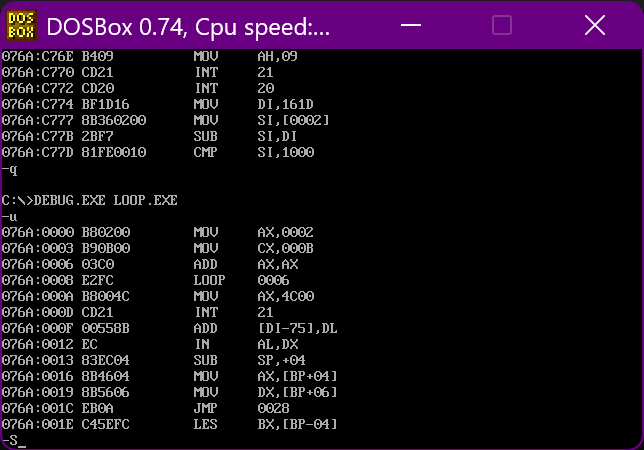
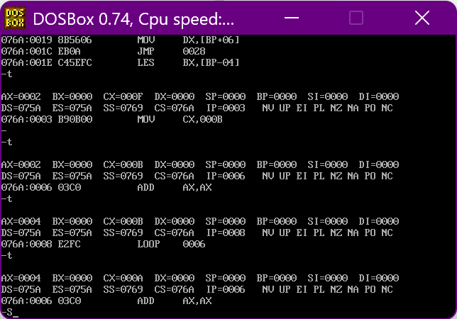
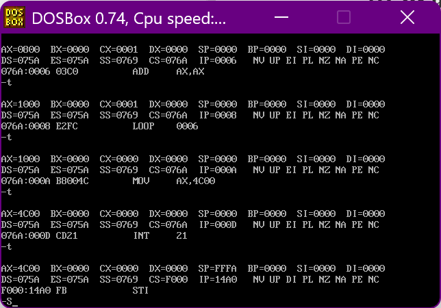

+ [author](https://github.com/3293172751)

# 第12节 Loop指令

+ [回到目录](../README.md)
+ [回到项目首页](../../README.md)
+ [上一节](11.md)
> ❤️💕💕汇编语言目前仍在发挥着不可替代的作用，在效率上无可替代，在底层，学习linux内核，计算机外围设备和驱动，都离不开汇编。Myblog:[http://nsddd.top](http://nsddd.top/)
---
[TOC]

## loop指令

```assembly
assume cs:code
code segment
	mov ax,2
	mov cx,11	;cx设置为11   循环11次
s:  
	add ax,ax   ; 2,4,8,16 .... 
	loop s
	
	mov ax, 4c00h
	int 21h
code ends
end
```

+ **功能：实现循环（计数型循环）**

+ 指令的格式：

  ```
  loop 标号
  ```

> CPU执行loop指令要进行的操作：
>
> + (cx) = (cx) - 1;
> + 判断cx的值
>   + 不为`0`转到标号`s`处
>   + 为`0`则向下执行

**要求：**

1. CX中要提前存放循环次数
2. 要定义一个标号
3. 在标号`s`和`loop`指令中间的部分，写循环执行的程序段（循环体）


## debug调试程序

> 

> 我们可以看到`loop`指令后的`0006`是`add`的偏移地址，说明`s`标志是一个地址

**单步调试**



> 很明显的看出
>
> + 在`loop`后`ip`变回了`0006`,可以所loop改变的是IP值
>
> + `CS`在不断地减少，当`CS`减少为`0000`后，`loop`就不会再跳转，而是继续执行后面指令
>
>   


## 案例

### 用123×236

```assembly
assume cs:code
code segment
	mov ax,0
	mov cx,236	;cx设置为236
s:  
	add ax,123   ; 2,4,8,16 .... 
	loop s
	
	mov ax, 4c00h
	int 21h
code ends
end
```

### ffff:0006字节单元数×3 结果存储dx

1. 先将内存中的数据取出  – 设置段地址和偏移地址

```assembly
assume cs:code
code segment
	mov ax,0ffffh	;段地址  -- 汇编语言中，数据不能以字母开头，所以 + 0
	mov ds, ax
	mov bx, 6		;偏移地址放入bx
	mov al, [bx]	;放入al寄存器（字节）
	mov ah, 0
	
	mov dx, 0	
	mov cs, 3     ;循环次数
s:  
	add dx,ax   ; 2,4,8,16 .... 
	loop s
	
	mov ax, 4c00h
	int 21h
code ends
end
```

> 把dx换成dl可以不？  可能会产生溢出


## 段前缀

**对策：在[idata]前显示地写上段寄存器**

```assembly
mov ax, 2000h
mov ds,ax
mov bx,0
mov al, ds:[bx]
```

**常量作为偏移地址时在程序中**

```assembly
mov al, [0]   	;同  mov al, 0
mov al,ds:[0]	;同  mov al, ds * 16 +0  
```

**变量作为偏移地址时在程序中**

```assembly
mov al, [bx]  	;同mov al,ds:[bx]
mov al,ds:[bx]	
```


## 访问连续地内存单元 – loop和[bx]联手

问题：计算`ffff:0 ~ ffff:b`字节单元中的数据和，结果存储在`dx`中

**取出8位数据，加到16位寄存器中**

```assembly
mov al,ds:[addr]
mov ah,0   ;取数
add ds,ax

.....
```


**使用loop循环改进**

```assembly
assume cs:code
code segment
	
	mov ax,0ffffh
	mov ds,ax
	mov ax,0020h
	mov es,ax
	
	mov bx,0
	mov cx,12
	
	s: mov dl,[bx]
	mov es:[bx],dl
	int bx
	loop s
	
	mov ax, 4c00h 
	int 21h
code ends
end
```

**问题**

+ 程序中直接写入数据很危险！

  有些地方不应该放数据部分，如何安全的存放？


## 代码段中间使用数据

**编程计算下面8个数据的和，结果放在ax寄存器中**

```assembly
assume cs:code
code segment
;编程计算下面8个数据的和，结果放在ax寄存器中1,2,3,4,5,6,7,8
	dw 1,2,3,4,5,6,7,8	
start:
	mov bx,0	;定义开始的偏移地址为0
	mov ax,0
	mov cx,8	;循环8次
	
addNumber:
	add ax,cs:[bx]  
	add bx,2	;以2个偏移位作为单位，每次+2
	loop addNumber
 
	mov ax,4c00h
	int 21h
	
code ends
end start
```

**dw：`define word` 定义字型数据**

+ dw：定义一个字
+ db：定义一个字节
+ dd：定义一个双字

> 有了这个`dw`，我们把后面的数都加起来，就很简单了


**start：定义一个标号，指示代码开始的位置**

> 程序加载后，`CS:IP`指向要执行的第一条指令在`start`处

**end start：定义标号，除了通知编译器程序结束外，还可以通知编译器程序的入口在什么地方。**


## 代码段使用栈 – 数据逆序存放

```assembly
assume cs:code
code segment
;编程计算下面8个数据的和，结果放在ax寄存器中1,2,3,4,5,6,7,8
	dw 1,2,3,4,5,6,7,8	
start: 
	mov ax,cs	;定义开始的偏移地址为0
	mov ss,ax	;栈段开始的位置是CS 的位置
	mov sp,30h	;sp指向栈顶指针
	
	;入栈
	mov bx,0
	mov cx,8
addNumber:
	push cs:[bx]
	add bx,2
	loop addNumber
 
 	;出栈
 	mov bx,0
 	mov cx,8
 s:
 	pop cs:[bx]
 	add bx,2
 	loop s
 	
	mov ax,4c00h
	int 21h
	
code ends
end start
```


## (BOSS)数据、代码、栈放入不同段

> 在上一个用段逆序存放，我们发现数据、代码、栈都在同一个段，看起来比较混乱，于是进行修改，放入不同的段

```assembly
assume cs:code,ds:data,ss:stack
data segment
	dw 1,2,3,4,5,6,7,8
data ends
 	
stack segment
	dw 0,0,0,0,0,0,0,0,0,0
stack ends

code segment
start: 
	mov ax,stack ;定义开始的偏移地址为0  程序开始的地方
	mov ss,ax	;栈段开始的位置是CS 的位置
	mov sp,20h	;sp指向栈顶指针
	mov ax,data	;数据段 --> ax
	mov ds,ax
	
	;入栈
	mov bx,0
	mov cx,8
s:
	push [bx]
	add bx,2
	loop s
 
 	;出栈
 	mov bx,0
 	mov cs,8
 s0:
 	pop [bx]
 	add bx,2
 	loop s0
 	
	mov ax,4c00h
	int 21h
	
code ends
end start
```


## END 链接

+ [回到目录](../README.md)
+ [上一节](11.md)
+ [下一节](13.md)
---
+ [参与贡献❤️💕💕](https://github.com/3293172751/Block_Chain/blob/master/Git/git-contributor.md)