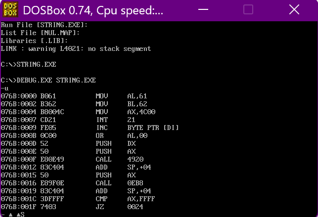
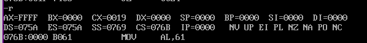
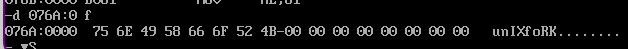

+ [author](https://github.com/3293172751)

# 第13节 内存寻址方式

+ [回到目录](../README.md)
+ [回到项目首页](../../README.md)
+ [上一节](12.md)
> ❤️💕💕汇编语言目前仍在发挥着不可替代的作用，在效率上无可替代，在底层，学习linux内核，计算机外围设备和驱动，都离不开汇编。Myblog:[http://nsddd.top](http://nsddd.top/)
---
[TOC]

## 处理字符问题

**在汇编语言中，用'…….'的方式指明数据是以字符的形式给出的，编译器将他们转化为对应的ASCII码。**

```assembly
assume cs:code, ds:data  ;代码段和数据段
data segment
	db 'unIX'
	db 'foRK'
data ends

code segment
start: 
	mov al, 'a'  ;程序开始的地方
	mov bl, 'b'
	mov ax,4c00h
	int 21h
code ends
end start
```

**调试**



> 对a,b来说，ASCII码的值就是61和62.



> `DS:0`,即`075A`是程序开始的地址，隔过100H程序段前缀。我们看下`076A`
>
> 
>
> 可以看出对应ASCII 码值：
>
> + u对应的75
> + n对应的6E
> + ……
>
> **所以在汇编语言中，我们使用的'字符'就是ASCII码对应的数值**

**小写字母的ASCII码值比大写字母的ASCII码值大`20H`**


## 小写字母转化大写字母

**我们需要用到的技巧，可以不用到分支:我们看一下大小写的字符区别：**

| **null**     | **字符** | **16进制** | **二进制**     |
| ------------ | -------- | ---------- | -------------- |
| **小写字符** | b        | 62H        | 01**1**0 0010B |
| **大写字符** | B        | 42H        | 01**0**0 0010B |

> 我们可以很明显的看到差距，就是：
>
> + 大写字符的第六位是0
> + 小写字符的第六位是1
>
> 所以我们可以:
>
> + 小写转化为大写，用与(and)运算 —>  和`11011111`
> + 大写转化为小写，用或(or)  运算 —>  和`00100000`

```assembly
assume cs:codesg,datasg
datasg segment
	db 'BaSiC'
	db 'iNfOrMaTiOn'
datasg ends   ;数据段

codesg segment
start:
	mov ax, datasg
	mov ds, ax
	
	;第一个字符串：小写字母转化为大写字母
	mov bx, 0	;从0开始
	mov cx, 5
s:
	mov al,[bx]	;[bx]作为基础地址，从0开始~B 取出的是字节
	and al,11011111b	;与运算  -- 小写字符转化为大写字符，大写字符不变
	mov [bx],al		
	inc bx	;bx增加1
	loop s
	
	;第二个字符串：大写字母转化为小写字母
	mov bx,5	;i开始
	mov cx, 11
s0:
	mov al,[bx]
	or al,00100000b		;或运算 -- 大写字符转化为小写字符，小写字符不变
	mov [bx]， al
	inc bx
	loop s0
	
	mov ax,4c00h
	int 21h
codesg ends
end start	
```


## [bx+idata]方式寻址

+ `[bx+idata]`表示的是一个内存单元，偏移地址为`(bx)+idata`

+ 对于`mov ax,[bx + 200]的含义：`

  + 将一个内存单元的内容送入`ax`寄存器
  + 因为存放到`ax`，这个内存单元长度是`2`字节（字单元），存放一个字
  + 内存单元的段地址在`ds`中，偏移地址为`200+bx`

  $$
  (ax) = ((ds) × 16 + 200 + (bx))
  $$

+ 其他的写法`mov ax,[bx + 200]`

  ```
  mov ax,[200 + bx]
  mov ax,200[bx]
  mov ax,[bx].200
  ```

  > 好像和C语言数组类似。所以[bx+idata]就是模拟高级语言的结构。


### 大小写转换改进程序

**我们之前的程序**

```assembly
assume cs:codesg,datasg
datasg segment
	db 'BaSiC'
	db 'iNfOr'
datasg ends   ;数据段

codesg segment
start:
	mov ax, datasg
	mov ds, ax
	
	;第一个字符串：小写字母转化为大写字母
	mov bx, 0	;从0开始
	mov cx, 5
s:
	mov al,[bx]	;[bx]作为基础地址，从0开始~B 取出的是字节
	and al,11011111b	;与运算  -- 小写字符转化为大写字符，大写字符不变
	mov [bx],al		
	inc bx	;bx增加1
	loop s
	
	;第二个字符串：大写字母转化为小写字母
	mov bx,5	;i开始
	mov cx, 5
s0:
	mov al,[bx]
	or al,00100000b		;或运算 -- 大写字符转化为小写字符，小写字符不变
	mov [bx]， al
	inc bx
	loop s0
	
	mov ax,4c00h
	int 21h
codesg ends
end start	
```

**对于两个一样长度的字符串，可以看到下面的转换程序类似，主要区别是:**

+ 开始位置：`mov bx *`
+ 与或运算

**那么我们可以改进了**

```assembly
assume cs:codesg,datasg
datasg segment
	db 'BaSiC'
	db 'iNfOr'
datasg ends   ;数据段

codesg segment
start:
	mov ax, datasg
	mov ds, ax
	
	;第一个字符串：小写字母转化为大写字母
	mov bx, 0	;从0开始
	mov cx, 5
s:
	mov al,[bx]	;[bx]作为基础地址，从0开始~B 取出的是字节
	and al,11011111b	;与运算  -- 小写字符转化为大写字符，大写字符不变
	mov [bx],al		
	
	;主意，关键在这
	mov al,[5+bx]	;i开始
	or al,00100000b		;或运算 -- 大写字符转化为小写字符，小写字符不变
	mov [5+bx]， al
	inc bx
	loop s0
	
	mov ax,4c00h
	int 21h
codesg ends
end start	
```

> `[bx + idata]`的方式为高级语言实现数据提供了便利机制。


> 

## END 链接

+ [回到目录](../README.md)
+ [上一节](12.md)
+ [下一节](14.md)
---
+ [参与贡献❤️💕💕](https://github.com/3293172751/Block_Chain/blob/master/Git/git-contributor.md)