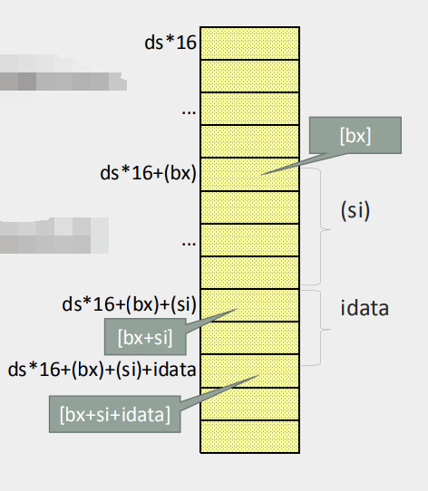
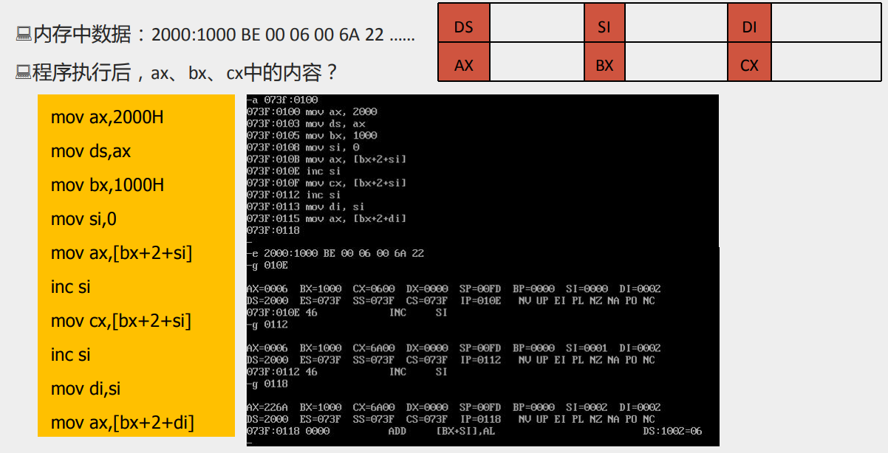
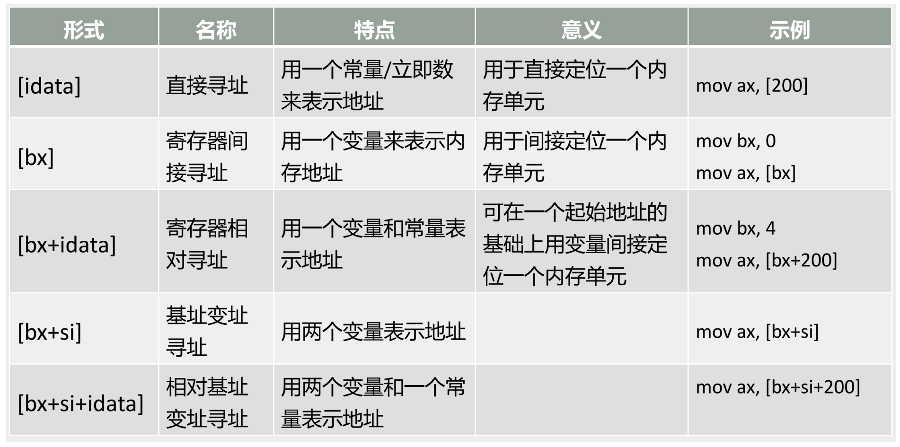
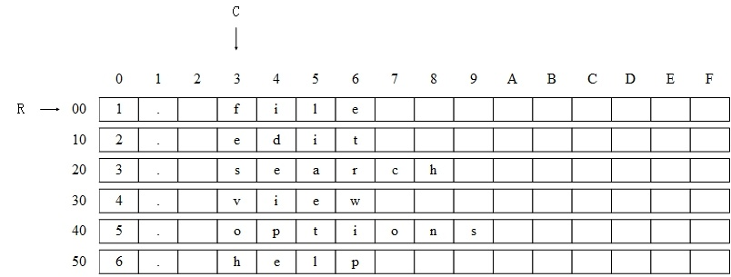
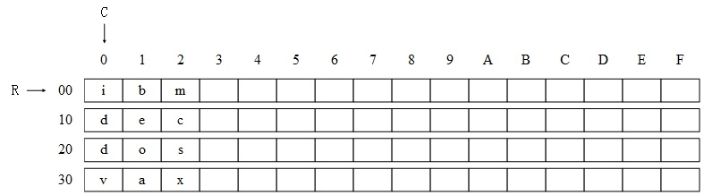

+ [author](https://github.com/3293172751)

# 第14节 变址寄存器

+ [回到目录](../README.md)
+ [回到项目首页](../../README.md)
+ [上一节](13.md)
> ❤️💕💕汇编语言目前仍在发挥着不可替代的作用，在效率上无可替代，在底层，学习linux内核，计算机外围设备和驱动，都离不开汇编。Myblog:[http://nsddd.top](http://nsddd.top/)
---
[TOC]

## 变址寄存器

**8086一共有`14`个寄存器：**

+ 通用寄存器：AX、BX、CX、DX
+ **变址寄存器：SI、DI**
+ 指针寄存器：SP、BP
+ 指令指针寄存器：IP
+ 段寄存器：CS、SS、DS、ES
+ 标志寄存器：PSW


**`SI`和`DI`是8086CPU中和`BX`功能相接近的寄存器。**

+ BX：通用寄存器，在计算存储器地址时，常作为基址寄存器使用
+ SI：源变址寄存器
+ DI：目标变址寄存器

> 区别在于`si`和`di`不能和通用寄存器一样分为两个8位寄存器来使用


## 案例

**用si和di实现将字符串’welcome to masm!'复制到它后面的数据区中。**

+ 源数据起始地址：`data:0`
+ 目标数据起始地址：`data:16`

```assembly
;用si和di实现将字符串'welcome to masm!'复制到它后面的数据区中。
assume cs:code,ds:data    ;两个程序段
data segment
	db 'welcome to masm!'
	db '................'  ;同样大小的空间
data ends

code segment
	start:
		mov ax,data
		mov ds,ax
		
		mov si,0
		mov di,16 ;设置两个偏移地址寄存器  或mov di,10H
		
		mov cx,8;可以用字型数据来复制，所以可以设cx=8，循环八次

	copystring:
		mov ax,ds:[si]	;从si中取处一个字，注意是一个字
		mov ds:[di],ax	;把字复制过去
		add si,2	;ax寄存器地址是16位，两个字节，对应地址+2
		add di,2
		loop copystring

		mov ax,4c00h
		int 21h
code ends
end
```


## [bx+si]和[bx+di]方式寻址

`[bx+si]`表示一个内存单元

+ 偏移地址位`(bx)+(si)`,即bx中的数值加上si中的数值
+ 我们一般称bx为基址，si为变址


`mov ax,[bx+si]`的含义

+ 将一个内存单元地址送入ax

+ 这个内存单元的长度为2字节，存放一个字

+ 偏移地址为bx中的数值加上si中的数值

+ 段地址在ds中
  $$
  (ax) = ((ds)×16+(bx)+(si))
  $$

+ 其他写法

  ```
  mov ax,[bx][si]
  ```


## [bx+si+idata]和[bx+di+idata]方式寻址

`[bx+si+idata]`表示一个内存单元

+ 偏移地址位`(bx)+(si)+idata`,即bx中的数值加上si中的数值再加上`idata`
+ 我们一般称bx为基址，si为变址



`mov ax,[bx+si+idata]`的含义

+ 将一个内存单元地址送入ax

+ 这个内存单元的长度为2字节，存放一个字

+ 偏移地址为bx中的数值加上si中的数值再加上idata,段地址在ds中

+ 段地址在ds中
  $$
  (ax) = ((ds)×16+(bx)+(si)+idata)
  $$

+ 其他写法

  ```assembly
  mov ax,[bx+200+si]
  mov ax,[200+bx+si]
  mov ax,200[bx][si]
  mov ax,[bx].200[si]
  mov ax,[bx][si].200
  mov ax,[bx][si]
  ```


### 案例




## 不同的寻址方式灵活应用



① `[idata]` 用一个常量来表示地址，可用于直接定位一个内存单元;

② `[bx]` 用一个变量表示内存地址，可用于间接定位一个内存单元；

③ `[bx+idata]` 用一个变量和常量来表示地址，可在一个起始地址的基础上用变量定位一个内存单元；

④ `[bx + si]` 有两个变量表示地址；

⑤ `[bx + si+ idata]` 用两个变量和一个常量表示地址。


### 任务1：

编程，将data段中每个单词的头一个字母改为大写字母. (每一个字符串都占16个字节).

```assembly
assume cs:code

data segment
	db "1. file         "
	db "2. edit         "
	db "3. search       "
	db "4. view         "
	db "5. options      "
	db "6. help         "
data ends

code segment
    start: ......
code ends

end start
```

分析：我们先来看一下，data段中，数据的存储结构，可以将这6个字符串看成一个6行16列的二维数组，按照要求，需要修改一个单词的第一个字母，即二维数组的每一行的第4列(相对于行首偏移地址为3).



我们需要进行6次循环，用一个变量R定位行，用常量3定位列. 处理的过程如下：

```assembly
R = 第一行的地址
mov cx, 6
s: 改变 R行，3列的字母为大写
   R = 下一行地址
   loop s
```

我们用bx作变量，定位每行的起始地址，**用3定位要修改的列**，用`[bx+idata]`的方式来对目标单元进行寻址，程序如下：

```assembly
assume cs:code

data segment
	db "1. file         "
	db "2. edit         "
	db "3. search       "
	db "4. view         "
	db "5. options      "
	db "6. help         "
data ends

code segment
	start:  mov ax, data
		mov ds, ax
		   
		mov bx, 0
		mov cx, 6	;循环6次
		s: mov al, 3[bx]	;[bx + 3]	  
		   and al, 0dfH		; and al,11011111b 转化为大写
		   mov 3[bx], al	;[bx + 3]
		   add bx, 16
		   loop s

		mov ax, 4c00H
		int 21H
code ends

end start
```


### 任务2：

编程，将dataseg段中每个单词改为大写字母.

```assembly
assume cs:code

data segment
	db "ibm             "
	db "dec             "
	db "dos             "
	db "vax             "
data ends

code segment
	start: ......
code ends

end start
```

分析：

data段的数据存储结构如图2所示：可以将这4个字符串看成一个4行16列的二维数组，按照要求，我们需要对每个字母改变大写.



显然，现在我们不只是改变首字母大写，而是改变整个字符串大写，这就带来一个问题，行和列都是变量.

通过观察，我们需要进行4 x 3次的二重循环，用变量R定位行，变量C定位列. 外层循环来行来进行，内存循环用列来进行. 首先用R定位第1行，然后用R循环修改R行的前3列；然后再用R定位到下一行，再次循环修改R行的前3列......，如此重复直到所有的数据修改完毕，处理的过程大致如下：

```assembly
R = 第一行的地址
mov cx, 4
s0: C = 第一列的地址
mov cx, 3
s: 改变R行，C列的字母大写
C = 下一列的地址；
loop s
R = 下一行的地址
loop s0
```

```assembly
mov ax, data
mov ds, ax
mov bx, 0

mov cx, 4
s0: mov si, 0
    mov cx, 3  ;重置cx
    s1: mov al, [bx + si]
       and al, 0dfH
       mov [bx + si], al
       inc si
       loop s1
    add bx, 16
    loop s0
```

仔细观察上面的程序，看看有什么问题？

分析：上面的问题主要在于寄存器cx的使用，循环进行二重循环，却只用了一个循环计数器，造成在进行内部循环时，覆盖了外层循环的循环计数值，多用一个计数器，又不可能，因为loop指令默认cx为循环计数器，那怎么办呢？

我们应该在每次进行内层循环时，将外层循环的cx中的数值保存起来，外层循环的loop指令前，再恢复外层循环的cx数值. 可以用临时寄存器dx来临时保存cx中的数值. 程序如下：

```assembly
assume cs:code

data segment
	db "ibm             "
	db "dec             "
	db "dos             "
	db "vax             "
data ends

code segment
	start:  mov ax, data
	        mov ds, ax
		   
		mov bx, 0
		mov cx, 4
		s0:  
			mov dx, cx   ;保存cx的值
		     mov si, 0
		     mov cx, 3	  ;cs设置为内存循环次数
		   s1:  
		      mov al, [bx + si]
		   	  and al, 0dfH
		   	  mov [bx + si], al
		   	  inc si
		   	  loop s1
		   	  add bx, 16
		   	  mov cx, dx	;恢复cx的值
		   	  loop s0
		 mov ax, 4c00H
		 int 21H
code ends

end start
```

上面的程序用**dx来暂存cx中的值**，如果在内层循环中，dx寄存器也被使用，那该怎么办呢? 我们似乎可以使用别的寄存器，但是CPU中的寄存器毕竟数量毕竟有有限的，8086CPU只有14个寄存器。

显然，我们如果没有可用的寄存器，那么可以使用内存. 可以考虑将需要暂存的数据放到内存单元中，需要使用时，再从内存单元中恢复. 改进的程序如下：

```assembly
assume cs:code

data segment
	db "ibm             "
	db "dec             "
	db "dos             "
	db "vax             "
	db "0"
data ends

code segment
	start: mov ax, data
	       mov ds, ax
	       
	       mov bx, 0
	       mov cx, 4
	       s0: 
	       	 mov ds:[40H], cx	;将外层循环的cx值保存在data:40h的单元中
	       	 mov si, 0
	         mov cx, 3
		    s1: mov al, [bx + si]
		       and al, 0dfH
		       mov [bx + si], al
		       inc si
		       loop s1
	       add bx, 16
	       mov cx, ds:[40H]		;恢复cx
	       loop s0
code ends

end start
```

上面的程序，用内存单元来保存数据，可是上面的作法却有些麻烦，因为如果需要保存多个数据时，你必须要记住数据放到了哪个单元中，这样程序容易混乱.

我们用内存来暂存数据，这一点是确定了的，但是值得推敲的是，我们用怎样的结构来保存这些数据，而使用我们的程序更加清晰. **一般来说，在需要暂存数据时，我们都应该使用栈.** 下面，我们再对我们的程序进行改进。

```assembly
assume cs:code

data segment
	db "ibm             "
	db "dec             "
	db "dos             "
	db "vax             "
data ends

stack segment
dw 0, 0, 0, 0, 0, 0, 0, 0
stack ends

code segment
	start: mov ax, data
	       mov ds, ax
               mov ax, stack
               mov ss, ax
               mov sp, 16
	       
	       mov bx, 0
	       mov cx, 4
	       s0: push cx 	;对cx进行入栈(外层循环)
	       	   mov si, 0
	           mov cx, 3	;cx设置为内层循环的次数
		   s1: mov al, [bx + si]   
		       and al, 0dfH
		       mov [bx + si], al
		       inc si
		       loop s1
	       add bx, 16	
	       pop cx	;对cx进行出栈
	       loop s0
code ends

end start
```


### 任务3：

编程，将data 段中每个单词的前4个字母改为大写字母.

```assembly
assume cs:code, ss:stack, ds:data

stack segment
	dw 0, 0, 0, 0, 0, 0, 0, 0
stack ends

data segment
	db "1. display      "
	db "2. brows        "
	db "3. replace      "
	db "4. modify       "
data ends

code segment
	start:  ......
code ends

end start
```

完整程序如下：

```assembly
assume cs:code, ss:stack, ds:data

stack segment
	dw 0, 0, 0, 0, 0, 0, 0, 0
stack ends

data segment
	db "1. display      "
	db "2. brows        "
	db "3. replace      "
	db "4. modify       "
data ends

code segment
	start:  mov ax, data
		mov ds, ax
		mov ax, stack
		mov ss, ax
		mov sp, 16

		mov bx, 0
		mov cx, 4
		s0: push cx
		    mov si, 3
		    mov cx, 4
		    s1: mov al, [bx + si]
			and al, 0dfH
			mov [bx + si], al
			inc si
			loop s1
		     add bx, 16
		     pop cx 
		     loop s0

		mov ax, 4c00H
                int 21H
code ends

end start
```


## 总结

**这一节主要学会了寄存器的寻址方式，还包括二层循环的`cx`寄存器的问题和解决方案。**


## END 链接
+ [回到目录](../README.md)
+ [上一节](13.md)
+ [下一节](15.md)
---
+ [参与贡献❤️💕💕](https://github.com/3293172751/Block_Chain/blob/master/Git/git-contributor.md)