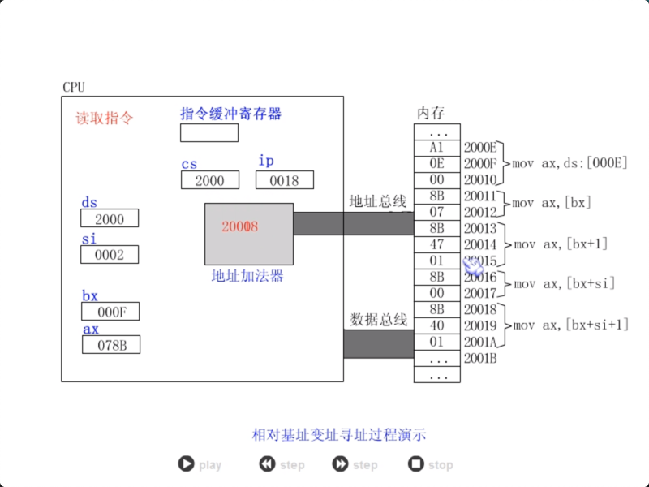
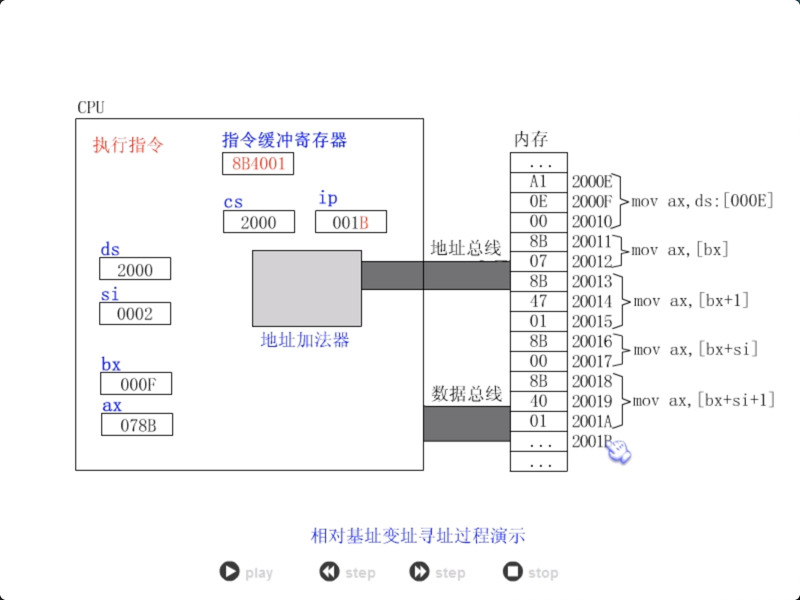
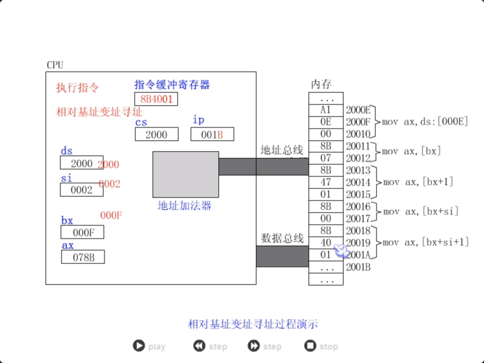
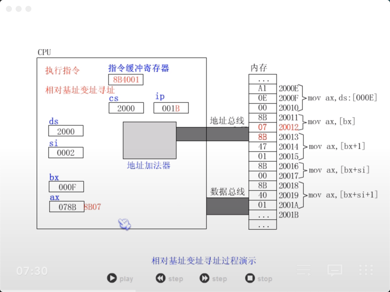

+ [author](https://github.com/3293172751)

# 第15节 寻址方式

+ [回到目录](../README.md)
+ [回到项目首页](../../README.md)
+ [上一节](14.md)
> ❤️💕💕汇编语言目前仍在发挥着不可替代的作用，在效率上无可替代，在底层，学习linux内核，计算机外围设备和驱动，都离不开汇编。Myblog:[http://nsddd.top](http://nsddd.top/)
---
[TOC]

## 寻址方式

当数据存放在内存中的时候，我们可以用多种方式来给定这个内存单元的偏移地址，这种定位内存单元的方法一般称为寻址方式。

+ EA:   偏移地址

+ SA：段地址

**用于寻址的寄存器有四种**

1. bx
2. si
3. di
4. bp

**只有dx、dp、si、di可以用在[…]对内存单元进行寻址**


### 直接寻址：（根据idata寻址）

```
寻址方式：[idata]

含义：EA = idata; SA = (ds)

常用：[idata]
```

### 寄存器间接寻址：（根据寄存器中地址寻址）

```
寻址方式: 
		 [bx]
	     [si]	；变址寄存器
		 [di]	；变址寄存器
		 [bp]	；指针寄存器（下一节讲）

含义:
     EA = (bx); SA = (ds)
     EA = (si); SA = (ds) 
	 EA = (di); SA = (ds)
	 EA = (bp); SA = (ss)

常用格式：
	    [bx]
		[si]等
```

### 寄存器相对寻址：（相对于一个idata寻址）

```
寻址方式：
		[bx + idata]
		[si + idata]
		[di + idata]
		[bp + idata]
	
含义：
	 EA = (bx) + idata; SA = (ds)
	 EA = (si) + idata; SA = (ds)
	 EA = (di) + idata; SA = (ds)
	 EA = (bp) + idata; SA = (ss)

常用格式：
	    用于结构体：[bx].idata
		用于数组：  idata[bx], idata[di]
		用于二维数组：[bx][idata]
```

### 基址变址寻址：

```
寻址方式：
		[bx + di]
		[bx + si]
		[bp + di]
		[bp + si]

含义：
	EA = (bx) + (di); SA = (ds)
	EA = (bx) + (si); SA = (ds)
	EA = (bp) + (di); SA = (ss)
	EA = (bp) + (si); SA = (ss)

常用格式：
		用于二维数组:[bx][di]
```

### 相对基址变址寻址：

```
寻址方式：
		[bx + di + idata]
		[bx + si + idata]
		[bp + di + idata]
		[bp + si + idata]

含义：
	EA = (bx) + (di) + idata; SA = (ds)
	EA = (bx) + (si) + idata; SA = (ds)
	EA = (bp) + (di) + idata; SA = (ss)
	EA = (bp) + (si) + idata; SA = (ss)

常用格式：
		用于表格（结构）中的数组项：[bx]:idata[si]
		用于二维数组：idata[bx][si] ## 寻址方式的综合应用
```

**DEC公司记录：**

公司名：DEC 总裁姓名：Ken Olsen 排名： 137 收入： 40 著名产品：PDP

**内存地址中为：**

```
	seg:60  00 'DEC'
	03 'Ken Oslen'
	0C 137
	0E 40
	10 'PDP'
```

**现在要修改为：**

 1）排名 = 38

 2）DEC = 70

 3）PDP = VAX

**C语言：**

```assembly
struct company
{
	char cn[3];
	char hn[9];
	int pm;
	int sr;
	char cp[3];
};

int main()
{
	
	company dec;
 
	int i = 0;
	dec.pm = 38;
	dec.sr = dec.sr + 70;
	
	dec.cp[i] = 'v';
	i++;
	dec.cp[i] = 'A';
	i++;
	dec.cp[i] = 'x'
	return 0;
}
```

**汇编：**

```assembly
mov ax, seg //seg 段寄存器
mov ds, ax
mov bx, 0060H
mov bi, 0

mov word ptr [bx].oCH, 38
add word ptr [bx].0EH, 70       //dec.pm = 70

mov byte ptr [bx].10H[bi], 'v' //dec.cp[i] = 'v'
inc bi 
mov byte ptr [bx].10H[bi], 'A'
inc bi
mov byte ptr [bx].10H[bi], 'V'
```

8080CPU提供了如 **[bx + si + idata]** 的寻址方式为结构化数据的处理提供了方便。使得我们可以在编程的时候，从结构化的角度去看待所要处理的数据。

如，用**bx**定位整个结构体，用**idata**定位结构体中的某一项数据，用**si**定位数组中的每个元素。

```
[bx].idata

[bx].idata[si]
```


## 不同寻址方式的演示


## 寻址方式的对比

| 寻址方式      | 含义                       | 名称             | 常用格式举例                  |
| ------------- | -------------------------- | ---------------- | ----------------------------- |
| [idata]       | EA=idata;SA=(ds)           | 直接寻址         | [idata]                       |
| [bx]          | EA=(bx);SA=(ds)            | 寄存器间接寻址   | [bx]                          |
| [si]          | EA=(bx);SA=(ds)            |                  |                               |
| [di]          | EA=(di);SA=(ds)            |                  |                               |
| [bp]          | EA=(bp);SA=(ss)            |                  |                               |
| [bx+idata]    | EA=(bx)+idata;SA=(ds)      | 寄存器相对寻址   | 用于结构体: [bx].idata        |
| [si+idata]    | EA=(si)+idata;SA=(ds)      |                  | 用于数组: idata[si],idata[di] |
| [di+idata]    | EA=(di)+idata;SA=(ds)      |                  | 用于二位数组: [bx][idata]     |
| [bp+idata]    | EA=(bp)+idata;SA=(ss)      |                  |                               |
| [bx+si]       | EA=(bx)+(si);SA=(ds)       | 基址变址寻址     | 用于二维数组: [bx][si]        |
| [bx+di]       | EA=(bx)+(di);SA=(ds)       |                  |                               |
| [bp+si]       | EA=(bp)+(si);SA=(ss)       |                  |                               |
| [bp+di]       | EA=(bp)+(di);SA=(ss)       |                  |                               |
| [bx+si+idata] | EA=(bx)+(si)+idata;SA=(ds) | 相对基址变址寻址 | 用于表格(结构)中的数组项      |
| [bx+di+idata] | EA=(bx)+(di)+idata;SA=(ds) |                  | [bx].idata[si]                |
| [bp+si+idata] | EA=(bp)+(si)+idata;SA=(ss) |                  | 用于二维数组                  |
| [bp+di+idata] | EA=(bp)+(di)+idata;SA=(ss) |                  | idata[bx][si]                 |

## 寻址和运行步骤

我们以相对基址变址寻址为例，用图例讲一下寻址和运行的步骤：

首先代码段地址和偏移地址在地址加法器合成20位地址数据:20位地址20018随着地址总线传输到内存，寻找对应地址的代码地址8B4001，并沿数据总线传输到指令缓冲寄存器。之后CPU会从对应的指令缓冲寄存器中的指令，将对应在ds, si, bx中的地址在地址加法器中进行处理变为20012，再沿地址总线寻找对应地址的数据8B07(低位在前，高位在后)。之后8B07将会沿着数据总线进入ax中。


##  指令要处理的数据有多长

8086CPU的指令，可以处理两种尺寸的数据，byte和word。所以在机器指令中要指明，指令进行的是字操作。对于这个问题，汇编语言中用一下方法处理。

(1) 通过寄存器名指明要处理的数据的尺寸。

寄存器指明了指令进行的是字(字型)操作。

```x86asm
mov ax, 1
mov bx, ds:[0] ;这里的ds:[0]传入了bx中，为字型数据
      ;所以这里的ds:[0]应该包含ds:[1](前8位高位地址)
      ;ds:[0]包含低位的后8位数据
mov ds, ax
mov ds:[0], ax
inc ax
add ax, 1000
```

而对于字节型的操作。

```x86asm
mov al, 1    ;字节型
mov al, bl
mov al, ds:[0]
mov ds:[0], al
inc al
add al, 100
```

(2) 在没有寄存器名存在的情况下，用操作符X ptr指明内存单元的长度，X 为word 或者byte。例如：

```x86asm
;字型
mov word ptr ds:[0], 1
inc word ptr [bx]
inc word ptr ds:[0]
add word ptr [bx], 2
;字节
mov byte ptr ds:[0], 1
inc byte ptr [bx]
inc byte ptr ds:[0]
add byte ptr [bx], 2
```

如果没有指明数据类型，很容易造成溢出错误，例如’FFH’ + ‘1’ = ‘00H’，而16位的数据’00FFH’ + 1 = ‘0100H’。

再如，

```
2000: 1000 FF FF FF FF FF FF
```

指令，

```x86asm
mov ax, 2000H
mov ds, ax
mov byte ptr [1000H], 1
```

将使内存中的内容变为,

2000: 1000 01 FF FF FF FF FF

而如果指令为，

```x86asm
mov ax, 2000H
mov ds, ax
mov word ptr [1000H], 1
```

将使内存中的内容变为，

2000: 1000 01 00 FF FF FF FF

因为对于字节型和字型数据，所针对的数据长度是不同的。同样也强调了明确数据类型的必要性!

(3) 其他方法

有些指令默认了访问的是字单元还是字节单元，如栈指令，`push`，只针对字单元进行操作(对于`push`，sp=sp-2)。

Last One


## END 链接
+ [回到目录](../README.md)
+ [上一节](14.md)
+ [下一节](16.md)
---
+ [参与贡献❤️💕💕](https://github.com/3293172751/Block_Chain/blob/master/Git/git-contributor.md)