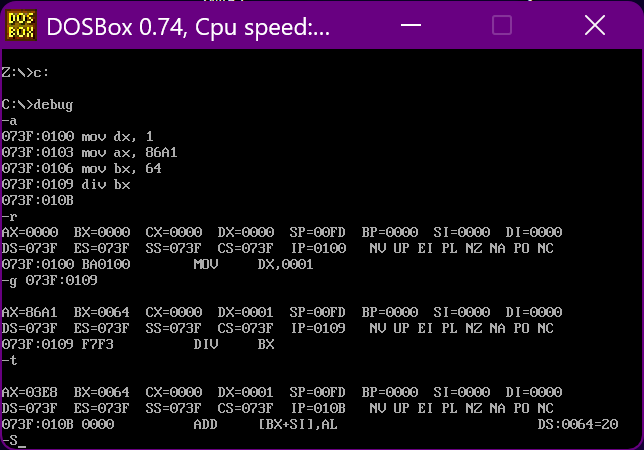
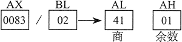
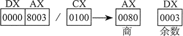
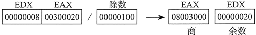

+ [author](https://github.com/3293172751)

# 第17节 div指令实现除法

+ [回到目录](../README.md)
+ [回到项目首页](../../README.md)
+ [上一节](16.md)
> ❤️💕💕汇编语言目前仍在发挥着不可替代的作用，在效率上无可替代，在底层，学习linux内核，计算机外围设备和驱动，都离不开汇编。Myblog:[http://nsddd.top](http://nsddd.top/)
---
[TOC]

## div指令


**div是除法指令，使用div作除法地时候**

+ 被除数：(默认)放在`AX`或者`DX`和`AX`中
+ 除数：`8`位或者`16`位，在寄存器或者内存单元中
+ 结果：……


32 位模式下，DIV（无符号除法）指令执行 8 位、16 位和 32 位无符号数除法。其中，单寄存器或内存操作数是除数。格式如下：

```
DIV reg/mem8
DIV reg/meml6
DIV reg/mem32
```


**被除数、除数、商和余数之间的关系：**

| 被除数  | 除数      | 商   | 余数 |
| ------- | --------- | ---- | ---- |
| AX      | reg/mem8  | AL   | AH   |
| DX:AX   | reg/mem16 | AX   | DX   |
| EDX:EAX | reg/mem32 | EAX  | EDX  |

> 64 位模式下，DIV 指令用 RDX:RAX 作被除数，用 64 位寄存器和内存操作数作除数, 商存放到 RAX，余数存放在 RDX 中。
>
> 如果除数 B 是8位，那么除法的结果AL保存商，AH保存余数，
>
> 如果除数 B 是16位，那么除法的结果 AX保存商，DX保存余数。


例如：

```
div bl

含义：
被除数：(ax)
除数：bl
商：al
余数：ah
```

---

```
div byte ptr ds:[0]

含义：
(al)=(ax)/((ds)*16+0) 的商
(ah)=(ax)/((ds)*16+0) 的余数
```

------

```
div word ptr es:[0]
(高十六位）+(低十六位)

含义：
(ax)=[(dx)*10000H+(ax)]/((es)*16+0) 的商
(dx)=[(dx)*10000H+(ax)]/((es)*16+0) 的余数
```

------

```
div byte ptr [bx+si+8]

含义：
(al)=(ax)/((ds)*16+(bx)+(si)+8) 的商
(ah)=(ax)/((ds)*16+(bx)+(si)+8) 的余数
```

------

```
div word ptr [bx+si+8]
(高十六位)+(低十六位)

含义：
(ax)=[(dx)*10000H+(ax)]/((ds)*16+(bx)+(si)+8) 的商
(dx)=[(dx)*10000H+(ax)]/((ds)*16+(bx)+(si)+8) 的余数
```

------


### 运算要求：

除法指令正确执行是有条件的

这个条件是：被除数的高一半，必须小于除数 ，如果数据不满足这样的条件，被除数的高一半大于或者等于除数，就会产生除法溢出，若发生除法溢出，会自动触发0号中断 －－－ 除法溢出中断，


## DIV 示例

### 利用除法指令计算100001/100

分析：

+ 1000001D = 186A1H
+ 需要进行16位除法
+ 用`dx`和`ax`两个寄存器联合存放`186A1H`
+ 用`bx`存放除数`1000D=64H`

```assembly
mov dx,1	;高位置
mov ax,80A1	;低16位
mov bx,64	;放除数
div bx
```

> 我们直接在debug中调试就好了
>
> 1. 先用`-a`输入汇编指令
> 2. `-r`查看寄存器信息
> 3. 再用`-g`指定要执行地目标
> 4. `-t`查看结果



**可以看出`-t`后`AX`寄存器中保存的商是:`03E8`,而`DX`保存余数的`0001`**


### 利用除法指令计算1001/100

分析

+ 进行`8`位除法即可
+ 在`ax`寄存器中存放被除数`3E9H`
+ 在`bx`寄存器中存放除数`100D=64H`

```
mov ax,3E9
mov bl,64
div bl
```


## 其他案例

下述指令执行 8 位无符号除法 (83h/2)，生成的商为 41h，余数为 1：

```assembly
mov ax, 0083h   ; 被除数
mov bl, 2        ; 除数
div bl           ; AL = 41h, AH = Olh
```

下图展示了寄存器内容的变化：





下述指令执行 16 位无符号除法 (8003h/100h)，生成的商为 80h，余数为 3。DX 包含的是被除数的高位部分，因此在执行 DIV 指令之前，必须将其清零：

```assembly
mov dx, 0         ; 清除被除数高16位
mov ax, 8003h     ; 被除数的低16位
mov ex, 100h      ; 除数
div ex            ; AX = 0080h, DX = 0003h
```

下图展示了寄存器内容的变化：





下述指令执行 32 位无符号除法，其除数为内存操作数：

```assembly
.data
dividend QWORD 0000000800300020h
divisor DWORD 00000100h
.code
mov edx, DWORD PTR dividend + 4  ; 高双字
mov eax, DWORD PTR dividend      ; 低双字
div divisor                      ; EAX = 08003000h, EDX = 00000020h
```

下图展示了寄存器内容的变化：





下面的 64 位除法生成的商 (0108 0000 0000 3330h) 在 RAX 中，余数 (0000 0000 0000 0020h) 在 RDX 中：

```assembly
.data
dividend_hi QWORD 0000000000000108h
dividend_lo QWORD 0000000033300020h
divisor QWORD OOOOOOOOOOOlOOOOh
.code
mov rdx, dividend_hi
mov rax, dividend_lo
div divisor                ; RAX = 0108000000003330
                           ; RDX = 0000000000000020
```

请注意，由于被 64k 除，被除数中的每个十六进制数字是如何右移 4 位的。(若被 16 除，则每个数字只需右移一位。)


## END 链接
+ [回到目录](../README.md)
+ [上一节](16.md)
+ [下一节](18.md)
---
+ [参与贡献❤️💕💕](https://github.com/3293172751/Block_Chain/blob/master/Git/git-contributor.md)