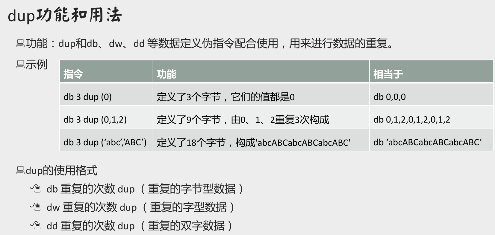
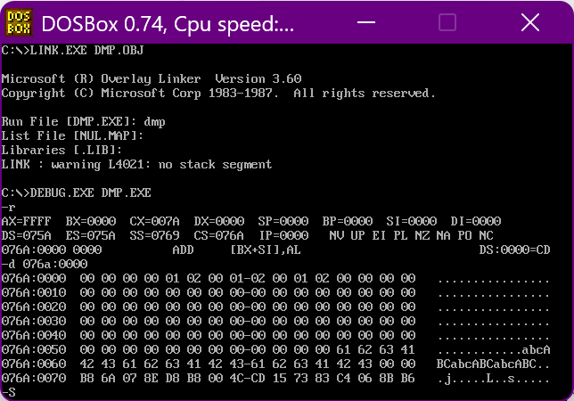

+ [author](https://github.com/3293172751)

# 第18节 用dup设置内存空间

+ [回到目录](../README.md)
+ [回到项目首页](../../README.md)
+ [上一节](17.md)
> ❤️💕💕汇编语言目前仍在发挥着不可替代的作用，在效率上无可替代，在底层，学习linux内核，计算机外围设备和驱动，都离不开汇编。Myblog:[http://nsddd.top](http://nsddd.top/)
---
[TOC]

## dup的功能和用法



功能：dup和db、dw、dd 等数据定义伪指令配合使用，用来进行数据的重复。

**dup的使用格式**

1. db 重复的次数 dup （重复的字节型数据） 
2. dw 重复的次数 dup （重复的字型数据） 
3. dd 重复的次数 dup （重复的双字数据）


## 案例


**程序**

```assembly
assume cs:code, ds:data
data segment
	db 3 dup (0)
	db 3 dup (0,1,2)
	db 80 dup (0)
	db 3 dup ('abc','ABC')
data ends

code segment
	mov ax, data
	mov ds, ax
	 
	mov ax,4c00H
	int 21
code ends
end
```


**debug调试**

> 我们可以用`-r`看到`DS`的地址是075A,所以我们可以直接看`076A`位置




## END 链接

+ [回到目录](../README.md)
+ [上一节](17.md)
+ [下一节](19.md)
---
+ [参与贡献❤️💕💕](https://github.com/3293172751/Block_Chain/blob/master/Git/git-contributor.md)