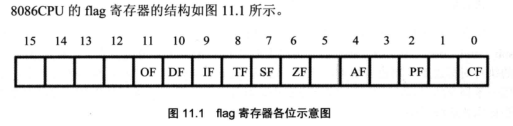
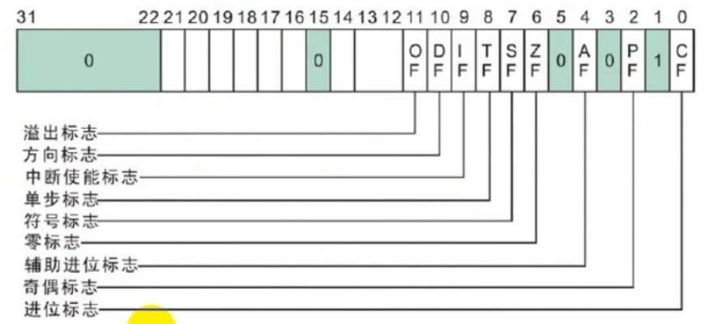
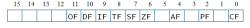
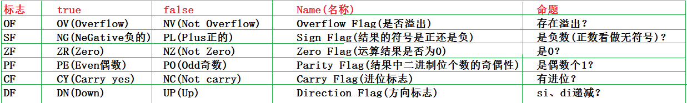
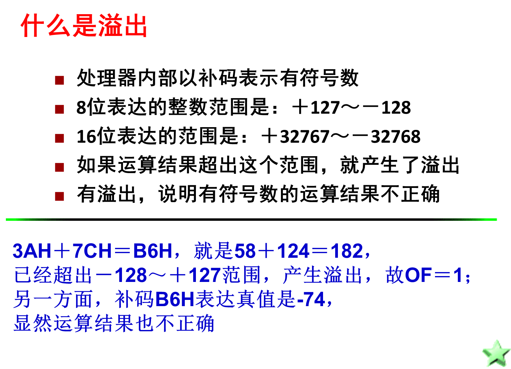
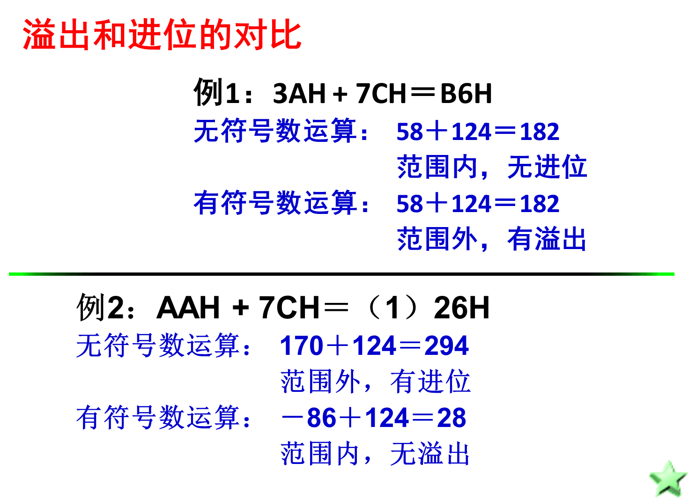
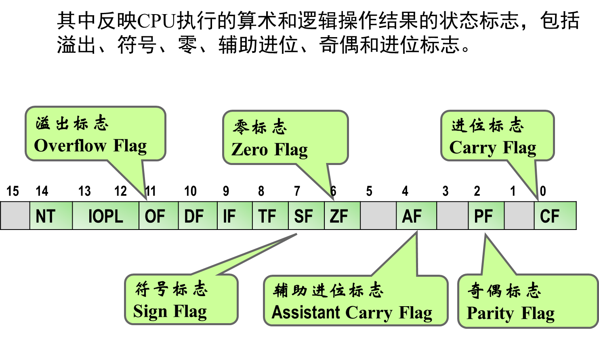

+ [author](https://github.com/3293172751)

# 第24节 标志寄存器

+ [回到目录](../README.md)
+ [回到项目首页](../../README.md)
+ [上一节](23.md)
> ❤️💕💕汇编语言目前仍在发挥着不可替代的作用，在效率上无可替代，在底层，学习linux内核，计算机外围设备和驱动，都离不开汇编。Myblog:[http://nsddd.top](http://nsddd.top/)
---
[TOC]

## 标志寄存器

标志寄存器（简称flag）的作用：

1. 用来存储相关指令的某些执行结果。
2. 用来为CPU执行相关指令提供行为依据。
3. 用来控制CPU的相关工作方式。

**flag和其他寄存器不一样，其他寄存器是用来存放数据的，都是整个寄存器具有一个含义。而flag寄存器死按位起作用的，它的每一位都有专门的含义，记录特定的信息。**

> flag的1,3,5,12,13,14,15位在8086CPU中没有使用，不具有任何含义

标志寄存器又称程序状态字（外语缩写：PSW、外语全称：Program Status Word）。

这是一个16位的存放条件标志、控制标志寄存器，主要用于反映处理器的状态和ALU运算结果的某些特征及控制指令的执行。




## 符号含义

| 标志位（外语缩写） | 标志位名称及外语全称              | =1                       | =0                           |
| ------------------ | --------------------------------- | ------------------------ | ---------------------------- |
| CF                 | 进位标志/Carry Flag               | CY/Carry/进位            | NC/No Carry/无进位           |
| PF                 | 奇偶标志/Parity Flag              | PE/Parity Even/偶        | PO/Parity Odd/奇             |
| AF                 | 辅助进位标志/Auxiliary Carry Flag | AC/Auxiliary Carry/进位  | NA/No Auxiliary Carry/无进位 |
| ZF                 | 零标志/Zero Flag                  | ZR/Zero/等于零           | NZ/Not Zero/不等于零         |
| SF                 | 符号标志/Sign Flag                | NG/Negative/负           | PL/Positive/非负             |
| TF                 | 跟踪标志/Trace Flag               |                          |                              |
| IF                 | 中断标志/Interrupt Flag           | EI/Enable Interrupt/允许 | DI/Disable Interrupt/禁止    |
| DF                 | 方向标志/Direction Flag           | DN/Down/减少             | UP/增加                      |
| OF                 | 溢出标志/Overflow Flag            | OV/Overflow/溢出         | NV/Not Overflow/未溢出       |


## 标志类型

|  |
| ------------------------------------------------------- |
| 各标志在标志寄存器中的位置                              |



**条件标志：**

- 进位标志：用于反映运算是否产生进位或借位。如果运算结果的最高位产生一个进位或借位，则CF置1，否则置0。运算结果的最高位包括字操作的第15位和字节操作的第7位。移位指令也会将操作数的最高位或最低位移入CF。
- 奇偶标志：用于反映运算结果低8位中“1”的个数。“1”的个数为偶数，则PF置1，否则置0。
- 辅助进位标志：算数操作结果的第三位（从0开始计数）如果产生了进位或者借位则将其置为1，否则置为0，常在BCD(binary-codedecimal)算术运算中被使用。
- 零标志：用于判断结果是否为0。运算结果0，ZF置1，否则置0。
- 符号标志：用于反映运算结果的符号，运算结果为负，SF置1，否则置0。因为有符号数采用补码的形式表示，所以SF与运算结果的最高位相同。
- 溢出标志：反映有符号数加减运算是否溢出。如果运算结果超过了8位或者16位有符号数的表示范围，则OF置1，否则置0。


**控制标志：**

- 跟踪标志：当TF被设置为1时，CPU进入单步模式，所谓单步模式就是CPU在每执行一步指令后都产生一个单步中断。主要用于程序的调试。8086/8088中没有专门用来置位和清零TF的命令，需要用其他办法。
- 中断标志：决定CPU是否响应外部可屏蔽中断请求。IF为1时，CPU允许响应外部的可屏蔽中断请求。
- 方向标志：决定串操作指令执行时有关指针寄存器调整方向。当DF为1时，串操作指令按递减方式改变有关存储器指针值，每次操作后使SI、DI递减。


## 直接访问标志寄存器方法

| pushf：将标志寄存器的值压入栈            |
| :--------------------------------------- |
| **popf：**从栈中弹出数据，送入标志寄存器 |


## ZF标志

flag的第六位是ZF，零标志位。它记录相关指令执行后，其结果是否为0.如果结果为0，那么zf=1，如果结果不为0，那么zf=0

例如指令：

```
mov ax,1
sub ax,1
```

执行后，结果为0，则zf=1


## PF标志

flag的第二位是PF，奇偶标志位，它记录相关指令执行后，其结果的所有bit位中1的个数是否位偶数。如果1的个数为偶数，pf=1，如果为奇数，那么pf=0

比如指令：

```
mov ax,1
add al,10
```

执行后，结果为00001011B，其中有3个1，则pf=0


## SF标志

flag的第七位是SF，符号标志位，它记录相关指令后，其结果是否为负。如果结果为负，sf=1，如果不为负，sf=0

计算机通常用补码来表示有符号数据。计算机的UI个数据可以看做是由富豪书，也可以看做成无符号数。比如：

- 00000001B，可以看做无符号数1，或有符号数+1；
- 10000001B，可以看做无符号数129，也可以看作有符号数-127

> 不管我们如何看待，CPU在执行add等指令的时候，就已经包含了两种含义，也将得到同一种信息来记录的两种结果。关键在于我们的程序需要哪一种结果。
>
> ```assembly
> ; -5的补码
> -5对应的正数5 ：00000101
> 取反：		    11111010
> + 1 ：         11111011 
> ```

比如：

```
mov al,10000001B
add al,1
```

执行后，结果为10000010B，sf=1，表示：如果指令进行的是有符号数运算，那么结果为负；

```
mov al,100000001B
add al,011111111B
```

执行后，结果为0，sf=0，表示：**如果指令进行的是有符号数运算，那么结果为非负。如果是无符号数，那么sf是没有意义的。**

某些指令将影响寄存器中的多个标记为，这些被影响的标记位比较全面地记录了指令的执行结果，为相关的处理提供了所需的依据。比如指令sub，al，al执行后，ZF、PF、SF等标志位都要受到影响，它们分别为：1,1,0。


## CF标志位

flag的第0位是CF，进位标志位，一般情况下，在进行无符号运算的时候，它记录了运算结果的最高有效位向更高位的进位值，或从更高位的借位值。

比如：

```assembly
mov al,98H
add al,al		; 执行后：（al）=30H，CF=1，CF记录了从最高有效位向更高位的进位值
add al,al		; 执行后：（al）=60H，CF=0
```

而当两个数据做减法的时候，有可能向更高位借位，比如：

```assembly
mov al,97H
sub al,98H		; 执行后（al）=FFH，CF=1，CF记录了向更高位的借位值
sub al,al		; 执行后（al）=0，CF=0，CF记录了向更高位借位值
```


## OF标志位

> **注意：`OP`对应的是有符号数，而`CF`针对的是无符号数**

flag的第十一位是OF，溢出标志位。一般情况下，OF记录了有符号数运算的结果是否发生了溢出。如果发生溢出，OF=1；如果没有，OF=0。

**区别：**

+ 对于无符号数运算，98+99没有进位，CF=0
+ 对于有符号数运算，98+99发生溢出，OF=1

例如：

```
mov al,F0H
add al,88H
```

add指令执行后：CF=1，OF=0.对于无符号运算，F0H+78H有进位，CF=1；
对于有符号数运算，F0H+78H不发生溢出，OF=0


## DF标志位

> flag的第10位是DF，方向标志位。在串处理指令中，控制每次操作后si，di的增减。


- df=0 每次操作后si、di递增
- df=1 每次操作后si、di递减


## 问题和解决

### 问题

1. **什么是溢出？**
2. **溢出和进位有什么区别？**
3. **处理器怎么处理，程序员如何运用？**
4. **如何判断是否溢出？**


### 解决

#### 什么是溢出



#### 溢出和进位

- 溢出标志OF和进位标志CF是两个意义不同的标志
- 进位标志表示无符号数运算结果是否超出范围，运算结果仍然正确；
- 溢出标志表示有符号数运算结果是否超出范围，运算结果已经不正确。

**溢出和进位对比：**


**如何运用溢出和进位**

- 处理器对两个操作数进行运算时，按照无符号数求得结果，并相应设置进位标志CF；同时，根据是否超出有符号数的范围设置溢出标志OF。
- 应该利用哪个标志，**则由程序员来决定。也就是说，如果将参加运算的操作数认为是无符号数，就应该关心进位；认为是有符号数，则要注意是否溢出。**


#### 溢出的判断

**判断运算结果是否溢出有一个简单的规则：**

- 只有当两个相同符号数相加（包括不同符号数相减），而运算结果的符号与原数据符号相反时，产生溢出；因为，此时的运算结果显然不正确
- 其他情况下，则不会产生溢出


### 比较无符号数的高低

- 无符号数的大小用高（Above）低（Below）表示

- 利用CF确定高低、利用ZF标志确定相等（Equal）

- 两数的高低分成4种关系：

  ⑴ 低于（不高于等于）：JB（JNAE）
  ⑵ 不低于（高于等于）：JNB（JAE）
  ⑶ 低于等于（不高于）：JBE（JNA）
  ⑷ 不低于等于（高于）：JNBE（JA ）


### 比较无符号数的大小

- 有符号数的大（Greater）小（Less）需要组合OF、SF标志，并利用ZF标志确定相等（Equal）

- 两数的大小分成4种关系：

  ⑴ 小于（不大于等于）：JL（JNGE）

  ⑵ 不小于（大于等于）：JNL（JGE）

  ⑶ 小于等于（不大于）：JLE（JNG）

  ⑷ 不小于等于（大于）：JNLE（JG ）


## IEA的标志位



### 状态

**EFLAGS寄存器的状态标志（条件码）**

1. 进位标志CF：在无符号算术运算的结果，无法容纳于目的操作数中时被设置。
2. 溢出标志OF：在有符号算术运算的结果位数太多，而无法容纳于目的操作数中时被设置。
3. 符号标志SF：在算术或逻辑运算产生的结果为负时被设置。
4. 零标志ZF：在算术或逻辑运算产生的结果为零时被设置。
5. 辅助进位标志AC：8位操作数的位3到位4产生进位时被设置,BCD码运算时使用。
6. 奇偶标志PF：结果的最低8位中，为1的总位数为偶数，则设置该标志；否则清除该标志。


## END 链接
+ [回到目录](../README.md)
+ [上一节](23.md)
+ [下一节](25.md)
---
+ [参与贡献❤️💕💕](https://github.com/3293172751/Block_Chain/blob/master/Git/git-contributor.md)