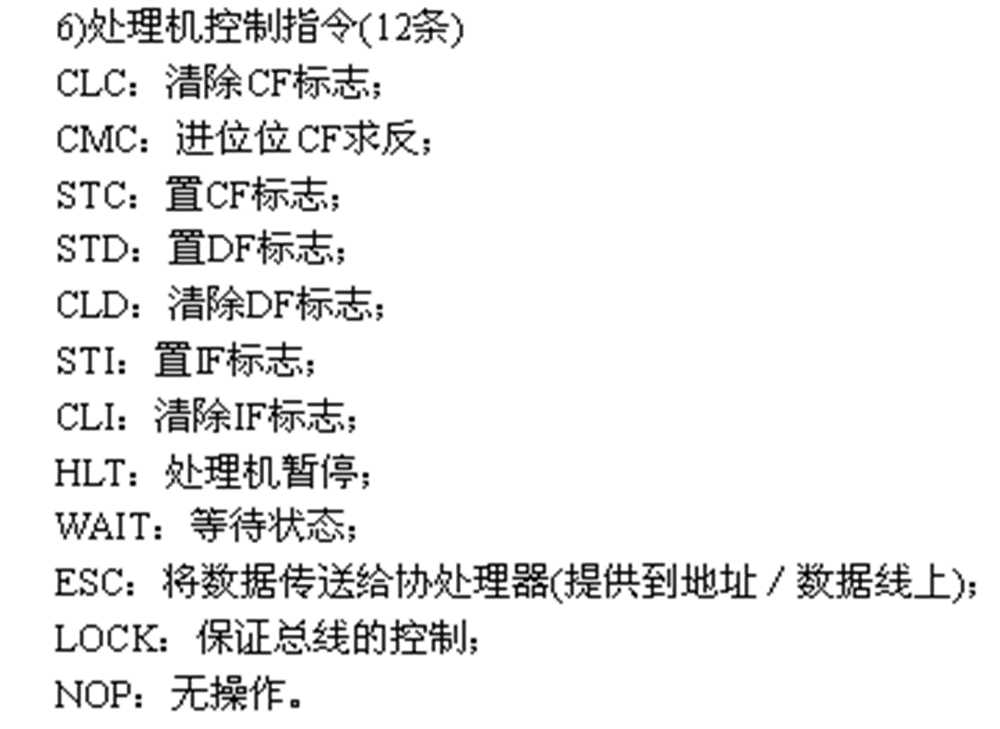

+ [author](https://github.com/3293172751)

# 第27节 DF标志和串传送指令

+ [回到目录](../README.md)
+ [回到项目首页](../../README.md)
+ [上一节](26.md)
> ❤️💕💕汇编语言目前仍在发挥着不可替代的作用，在效率上无可替代，在底层，学习linux内核，计算机外围设备和驱动，都离不开汇编。Myblog:[http://nsddd.top](http://nsddd.top/)
---
[TOC]

## DF-方向标志位（Direction Flag）

功能 

​    在串处理指令中，控制每次操作后si，di的增减。 

-  DF = 0：每次操作后si，di递增； 
-  DF = 1：每次操作后si，di递减。

对DF位进行设置的指令： 

-  cld指令：将标志寄存器的DF位设为0(clear) 
-  std指令：将标志寄存器的DF位设为1(setup)


## 串传送指令1

movsb 功能：（以字节为单位传送）

​    (1) ((es)×16 + (di)) = ((ds) ×16 + (si)) 

​    (2) 如果DF = 0则： (si) = (si) + 1 (di) = (di) + 1 

​       如果DF = 1则：(si) = (si) - 1 (di) = (di) - 1 


## 串传送指令2

movsw 功能：（以字为单位传送） 

​    (1) ((es)×16 + (di)) = ((ds) ×16 + (si)) 

​    (2) 如果DF = 0则： (si) = (si) + 2 (di) = (di) + 2 

​       如果DF = 1则：(si) = (si) - 2 (di) = (di) - 2


## rep指令

**功能**：`rep`常常和串传送指令搭配使用，根据cx的值，重复执行后面的指令

**用法**：

```assembly
rep movsb
; =======等价于
s:
	movsb
	loop s
	
	
rep movsw
; ======等价于
s:
	movsw
	loop s
```


## 处理器控制zhi'ling




## 代码

```assembly
assume cs:code, ds:data, ss:stack
 
data segment
	db 128 dup(128)
data ends
 
stack segment
	db 128 dup(128)
stack ends
 
code segment
	start:	mov dx, stack
		mov ss, dx
		mov sp, 128
 
		call cpy_Boot
 
		mov ax, 4C00H
		int 21H	
 
 
 
Boot:		mov ax, 1000H
		mov ax, 1000H
		mov ax, 1000H
		mov ax, 1000H
Boot_end:	nop
 
;=======================================
cpy_Boot:
		mov bx, cs
		mov ds, bx			; ds:[si]
		mov si, OFFSET Boot
		
		mov bx, 0
		mov es, bx
		mov di, 7E00H			; es:[di]
		
		mov cx, OFFSET Boot_end - Boot
		cld				; inc si, inc di  DF=0 清除
		; movsb 复制一个字节从ds:[si] 到 es:[di]
		rep movsb			;rep 重复   movsb:复制字节
		
		;rep movsw 移动一个字型数据，同时每次si,di都会再加2
		ret
 
code ends
 
end start
```


## END 链接

+ [回到目录](../README.md)
+ [上一节](26.md)
+ [下一节](28.md)
---
+ [参与贡献❤️💕💕](https://github.com/3293172751/Block_Chain/blob/master/Git/git-contributor.md)