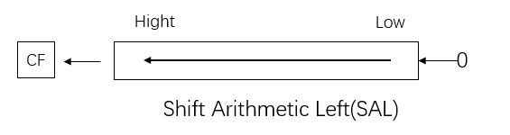
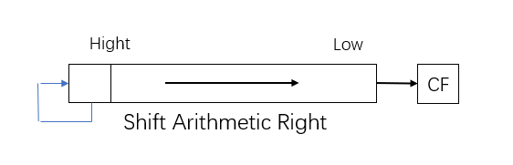
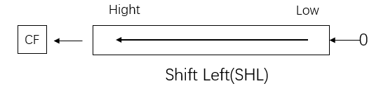
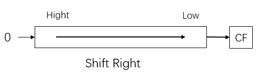
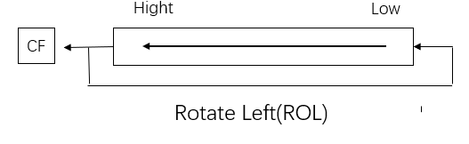
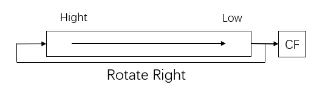
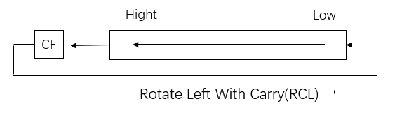
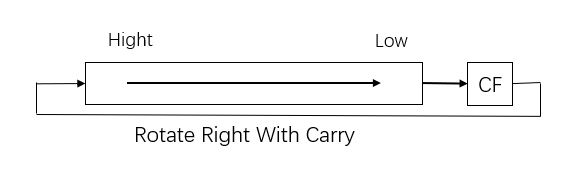

+ [author](https://github.com/3293172751)

# 第28节 移位指令

+ [回到目录](../README.md)
+ [回到项目首页](../../README.md)
+ [上一节](27.md)
> ❤️💕💕汇编语言目前仍在发挥着不可替代的作用，在效率上无可替代，在底层，学习linux内核，计算机外围设备和驱动，都离不开汇编。Myblog:[http://nsddd.top](http://nsddd.top/)
---
[TOC]

  移位指令包括了 算术移位指令、逻辑移位指令、循环移位指令。

  格式为: xxx oper1,CL/1     ; 移位次数只能是 1 或者存放在 CL 里面。

+ A : arithmetic（算数）
+ R , RO : rotate(循环)
+ C : carry(进位)
+ S, SH ：shift(移动)


## 算术移位指令

### 算术左移指令 SAL

功能：左移一次，最低位补 0，最高位送入 CF 标志位，如图：



意义：左移 n 次，等于 x2 的 n 次幂。所以可用于有符号操作数做 x2 的 n 次幂运算。

**代码：**

```
mov al,01001000b
sal al,1
```

| 移位对比 |          |
| :------: | :------: |
| 移位前： | 01001000 |
| 移位后： | 10010000 |


### 算术右移指令 SAR

功能：右移一次，最高位保持不变，最低位送入 CF 标志位，如图：



意义：右移 n 次，等于 / 2 的 n 次幂。所以可用于**有符号操作数做 / 2 的 n 次幂运算。**


## 逻辑移位指令

### 逻辑左移 SHL

功能：同 SAL, 如图：



意义：同 SAL

> 最高位的移动到 CF中

**代码：**

```
mov al,01001000b
ahl al,1
```

| 移位对比 |          |
| :------: | :------: |
| 移位前： | 01001000 |
| 移位后： | 10010000 |


#### 案例

+ 注意：当移动的位数大于1时候，移动要用cl
+ 每一次左移一次就是`X = X / 2`

```assembly
mov al,01001000b
mov cl, 3	;注意：当移动的位数大于1时候，移动要用cl
ahl al,cl 	;01000000b
```

> CF 标志变化，先放最左边 0 ，再放 1 ，再放0


### 逻辑右移 SHR

功能：右移一次，最高位补 0. 区别！最低位送入 CF 标志位。如图：



意义：用于实现无符号数 / 2 的 n 次幂操作。

**代码：**

```
mov al,01001000b
shr al,1
```

| 移位对比 |          |
| :------: | :------: |
| 移位前： | 01001000 |
| 移位后： | 00100100 |


## 循环移位指令

### 循环左移指令 ROL

功能：左移一次，左移前的最高位送入最低位以及 CF. 如图：



**代码：**

```
mov al,01001000b
rol al,1
```

| 移位对比 |          |
| :------: | :------: |
| 移位前： | 01001000 |
| 移位后： | 10010000 |


### 循环右移指令 ROR

功能：右移一次，右移前的最低位送入最高位以及 CF. 如图：




### 带进位的循环左移 RCL

功能：左移一次，左移前的最高位送入 CF，CF 的内容送入最低位. 如图：




### 带进位的循环右移 RCR

功能：右移一次，右移前的最低位送入 CF，CF 的内容送入最高位. 如图：




## END 链接

+ [回到目录](../README.md)
+ [上一节](27.md)
+ [下一节](29.md)
---
+ [参与贡献❤️💕💕](https://github.com/3293172751/Block_Chain/blob/master/Git/git-contributor.md)