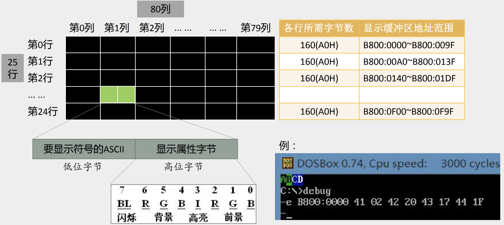
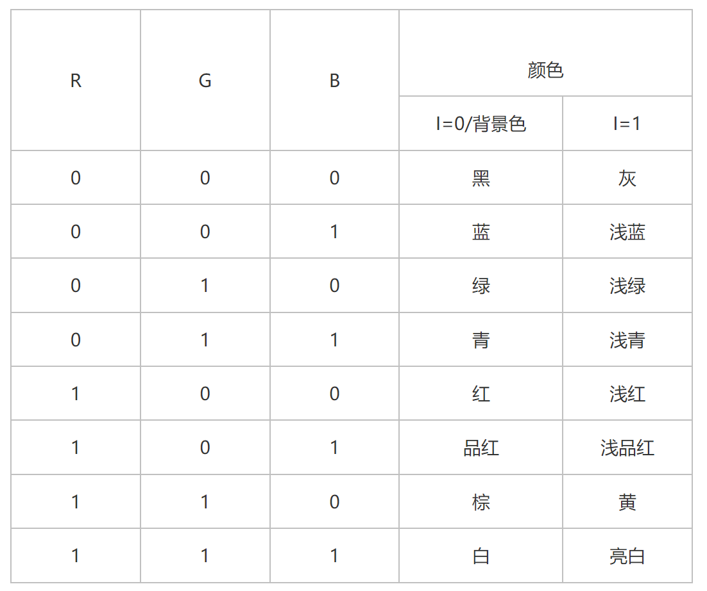

+ [author](https://github.com/3293172751)

# 第29节 操作显存数据

+ [回到目录](../README.md)
+ [回到项目首页](../../README.md)
+ [上一节](28.md)
> ❤️💕💕汇编语言目前仍在发挥着不可替代的作用，在效率上无可替代，在底层，学习linux内核，计算机外围设备和驱动，都离不开汇编。Myblog:[http://nsddd.top](http://nsddd.top/)
---
[TOC]

## 显存

我们怎么把显示器中的内容显示出来，我们知道这些信息来自CPU，如何连接CPU和屏幕


## 内存架构

- **位置**是指存储的硬件在什么地方，通过位置可知道的信息很多，如硬件单元是在芯片内部还是芯片外部，能不能插拔（意味着可扩展）以及对应的上下游存储是什么；
- **大小与速度**是指内存数据能存多大，读写数据的速度有多快；
- **传输通道**：存储与存储之间能够通过什么传输协议/通道进行数据交换。 下图列出一个简化的系统内存与设备内存架构示意图：


## 显示的原理

> 实际上，只要我们向对应的显存中输出数据，则显卡会处理这些输入的输出，然后显示在显示器上。而结合前面分析的实模式下内存的布局，与显卡的通信我认为是属于内存映射型的，因此我们直接通过访问内存即可完成与显卡的通信，从而完成显示器的显示。

> 　　实际上根据实模式下内存布局我们可以看出来，显卡支持三种模式，如下表所示
>
> | 起始地址 | 结束地址 | 大小 | 用途                   |
> | -------- | -------- | ---- | ---------------------- |
> | 0xC0000  | 0xC7FFF  | 32KB | 显示适配器的BIOS       |
> | 0xB8000  | 0xBFFFF  | 32KB | 用于文本模式显示适配器 |
> | 0xB0000  | 0xB7FFF  | 32KB | 用于黑白显示适配器     |
> | 0xA0000  | 0xAFFFF  | 64KB | 用于彩色显示适配器     |


## 显示缓存区的结构

> 屏幕是由`25`行`80`列组成，我们需要把每个位置的值表述起来
>
> 可以看到各个行所需要的字节数在显示缓冲区地址的范围
>
> 
>
> 我们使用debug显示ABCD
>
> + 用`-e`命令修改`B800:0000`的内存单元
> + ABCD 分别对应：`41`，`42`，`43`，`44`的ASII码
> + 属性字节分别对应：`02`，`20`，`43`，`1F`
>   + 02：`0000 0010`只有G为1，绿色字，背景绿色
>   + 20：`0010 0000` 绿背景，黑字



这里我们列表说明一下不同的R、G、B和I所组合出来的最终颜色，如下所示



> 这里我们基本就完成了显卡处理文本模式的规则。下面还要说明一下，显卡的文本模式也是分为多种模式的，用“列数 * 行数”来进行表明，如80 * 25等。一般情况下，在显卡加电后，默认的模式就为80 * 25,即2000个字符，也就是需要4000B的内存。这样基本介绍完了显存与输出的关系。


## 显示信息的一种直接方式

例：编写程序，在屏幕中间，白底蓝字，显示"`welcome to masm`"

+ 白色背景，蓝色字体：
+ 中间那一行：12
+ 每一行160字节
+ 中间那一列：80

```assembly
assume cs:codeseg,ds:datasg
datasg segment
	db 'welcome to masm!'
datasg ends ;将要显示的内容写到数据区

codeseg segment
start:
;初始化寄存器
;显示字符串

	mov ax,4c00h
	int 21h ;中断
codeseg ends
end start
```

初始化寄存器:

```assembly
mov ax datasg
mov ds, ax
mov ax, 0B800H
mov es, ax
mov si, 0
mov di, 160*12 + 80 - 16	;位置
```

显示字符串:

```assembly
mov cx, 16	;十六个字节
w:
mov  al, [si]
mov es:[di], al
inc di
mov al,71H	;颜色属性 -- 显示属性字节 7:0111 1:0001
mov es:[di], al
inc si
inc di
loop w
```


## 程序

```assembly
;    简单的主引导程序，但并没有实现引导的功能，仅仅实现输出字符串
;    但是其并不需要借助任何库等，这次通过直接访问显存内存，从而输出字符串
;------------------------------------------------------------------------
SECTION MBR vstart=0x7c00    ;这个地址表示将起始地址设置为0x7c00——因为BIOS会将MBR程序加载到0x7c00处

    mov    ax, cs
    mov    ds, ax        ;由于BIOS跳转到MBR时，使用指令jmp 0:0x7c00，因此cs段寄存器为0，这里将ds段寄存器也设置为了0
    mov    sp, 0x7c00    ;根据已知，至少0x500-0x7DFF为可用区域，则将其当用作栈即可

    mov    ax, 0xB800
    mov    es, ax        ;根据已知，实模式1MB内存中0xB8000-0xBFFFF为文本模式的显示适配器，方便之后通过直接寻址读写内存


;    下面首先清空屏幕，这里使用BIOS提供的中断即可，
;------------------------------------------------------------------------
;    INT 0x10;    功能号:0x06    功能描述:上卷窗口
;------------------------------------------------------------------------
;    输入:
;        AH--功能号:    0x06
;        AL--上卷的行数(如果为0，表示全部)    
;        BH--上卷行属性
;        (CL, CH)--窗口左上角(X, Y)位置
;        (DL, DH)--窗口右下角(X, Y)位置
;    输出:
;        空

    mov    ax, 0x600    ;AH = 0x06;    AL = 0x0;
    mov    bx, 0x700    ;BH = 0x07;    BL = 0x0;
    mov    cx, 0x0        ;CH = 0x0;    CL = 0x0;
    mov    dx, 0x184f    ;DH = 0x18;    DL = 0x4f;
    int    0x10
;------------------------------------------------------------------------
;    我们将上面的系统调用分析一下
;    输入:    AH--0x06;    AL--0x0;    BH--0x7;    CL--0x0;CH--0x0;    DL--0x4f;DH--0x18;
;    也就是我们调用了功能号为0x6的BIOS中断，窗口左上角为(0x0/0, 0x0/0)，窗口右上角坐标为(0x4f/80, 0x18/25)，上卷所有的窗口
;    在VGA文本模式中，一般一行容纳80个字符，共25行，也就相当于清空了整个屏幕


;    向1MB内存中的文本模式的显示适配器区域写入数据
;------------------------------------------------------------------------
;    每个字符2字节，其低字节为字符对应的ASCII码，高字节为字符的属性;    由于其为背景蓝色，前景色浅品红色，不闪烁，其高字节值为 00011101b
;------------------------------------------------------------------------

    mov    cx, 0x0
    mov byte    al, [format];    初始化计数器cx,。由于前面已经设置了ds段寄存器为0，该指令相当于将字符属性字节读入ax寄存器中

    LOOP:
        mov    di, cx

        mov byte    dl, [di + string];    这里通过变址寻址访问内存，由于前面设置了ds段寄存器为0，这里直接获取字符串中的对应字符
        sub    dl, 0
        jz    LOOPEND;    判断字符串是否结束。有条件跳转，因此仅仅修改段偏移地址，由于cs始终为０，自然跳转到LOOPEND对应的位置

        add    di, di
        mov byte    [es:di], dl;    这里通过变址寻址访问内存

        add    di, 1
        mov byte    [es:di], al;    这里通过变址寻址访问内存
        
        add    cx, 1
        jmp    LOOP;    计数器＋１后，无条件相对近跳转，会重新跳转到LOOP处执行循环

    LOOPEND:
;------------------------------------------------------------------------
;    我们将上面的指令分析一下
;    可以看到，对于内存寻址来说，这里通过直接寻址进行寻址
;    我们每一次输入两个字节信息，其中低字节是上面分析的字符的属性
;    高字节是字符对应的ascii码，从而完成了内存的写入。

;    下面进行循环，确保程序悬停在该处，从而观察输出
;------------------------------------------------------------------------

    jmp    $

;------------------------------------------------------------------------
;    我们将上面的指令分析一下
;    $表示当前行的地址，这样子相当于始终执行这一行指令，从而使程序悬停


;    下面进行常量设置
;------------------------------------------------------------------------
    string db "This is Hawk's MBR", 0;        即伪操作指令，表示每一个元素大小为1字节, 并且在结尾为\x00表明字符串结束
    format db 10011101b;            这里是显存中的字符属性，表明其为背景蓝色，前景色浅品红色，并且闪烁        

;    下面进行空白填充，确保最后程序为512字节
;------------------------------------------------------------------------
    times 510 - ($ - $$) db 0
;------------------------------------------------------------------------
;    我们将上面的汇编语句分析一下
;    $表示当前行的地址，$$表示当前SECTION的起始地址，times也是伪操作指令，相当于将后面的数据重复指定次数
;    这个指令确保了将程序填充至512字节，中间部分以0填充


;    下面我们最后填充该512字节删除的最后两个字节，为0x55，0xaa，从而使BIOS成功识别MBR
;------------------------------------------------------------------------
    db    0x55, 0xaa
```


## END 链接

+ [回到目录](../README.md)
+ [上一节](28.md)
+ [下一节](30.md)
---
+ [参与贡献❤️💕💕](https://github.com/3293172751/Block_Chain/blob/master/Git/git-contributor.md)