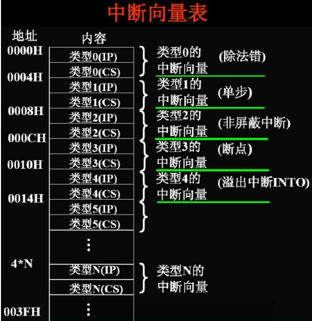
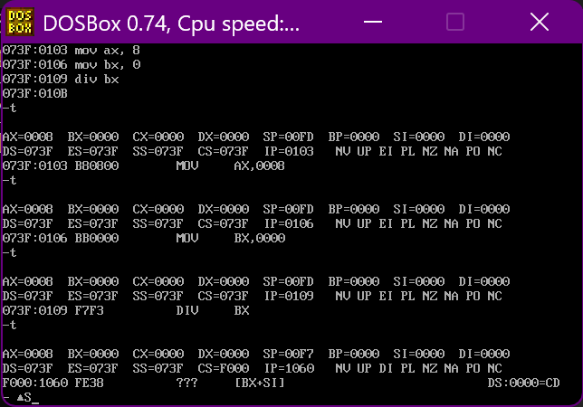

+ [author](https://github.com/3293172751)

# 第32节 中断及其处理

+ [回到目录](../README.md)
+ [回到项目首页](../../README.md)
+ [上一节](31.md)
> ❤️💕💕汇编语言目前仍在发挥着不可替代的作用，在效率上无可替代，在底层，学习linux内核，计算机外围设备和驱动，都离不开汇编。Myblog:[http://nsddd.top](http://nsddd.top/)
---
[TOC]

中断是一个非常重要的一个概念

**中断是指CPU不再接着（刚执行完的指令）向下执行，而是转去处理中断信息。**


## 中断的分类

中断按其产生的方式可分为硬件中断和软件中断。硬件中断又分为内部和外部两种。

+ 内中断：由CPU内部发生的事件而引起的中断
+ 外中断：由外部设备发生的事件而引起的中断


## 内部中断

内部中断可以由中断指令`int`来触发，也可以是因为指令执行中出现了错误而触发，例如运算结果溢出会触发溢出中断；除法指令的除数为`0`会触发除法出错中断。

**可能出现的原因**

1. 除法错误，比如执行`div`指令产生的除法溢出  — 编号：0
2. 单步执行（单步执行指令）                          — 编号：1
3. 执行`into`指令（溢出中断）                        — 编号：4
4. 执行int指令（后面写上中断号，指令中断）    — 编号：n


## 外部中断

外部中断通过`NMI`和`INTR`这两条中断信号线接入`CPU`。

- 由`NMI`接入的是非屏蔽中断`(Non Maskable Interrupt)`，来自这个引脚的中断请求信号是不受中断允许标志`IF`限制的，`CPU`接收到非屏蔽中断请求后，无论当前正在做什么事情，都必须在执行完当前指令后响应中断。因此非屏蔽中断常用于系统掉电处理，紧急停机等重大故障时。`NMI`统一被赋予中断号`2`。
- 由`INTR`接入的是可屏蔽中断。在`IBM PC/AT`机中，这个信号由两片`8259A`级联组成，接入`CPU`的中断控制逻辑电路，可管理`15`级中断。


## 中断向量表

**中断处理程序在哪里?**

> 中断处理信息和其处理程序的入口地址之间有某种联系，CPU根据中断信息可以找到要执行的处理程序。

**`8086`中断信息表（中断向量表）**



`8086`的中断系统可以识别`256`个不同类型的中断，每个中断对应一个`0~255`的编号，这个编号即中断类型码。每个中断类型码对应一个中断服务程序的入口地址，`256`个中断，理论上就需要`256`段中断处理程序。在实模式下，处理器要求将它们的入口点集中存放到内存中从物理地址 `0x00000`开始，到`0x003ff`结束，共`1KB`的空间内，这就是所谓的中断向量表`(Interrupt Vector Table, IVT)`。

每个中断在中断向量表中占`2`个字，分别是中断处理程序的**偏移地址和段地址**。中断`0`的入口点位于物理地址`0x00000`处，也就是逻辑地址`0x0000:0x0000`；中断`1`的入口点位于物理地址`0x00004`处，即逻辑地址`0x0000:0x0004`，其他中断依次类推。


**基于上面的分析，我们要找到中断号，即：**

```mathematica
（IP） = （N * 4）
（CS） = （N * 4 + 2) 
```

**我们尝试以下`类型0`的除0中断**

```assembly
mov ax, 8 
mov bh, 0
div bh
```



> 我们可以看到CS和IP指向的位置就是中断处理程序
>
> 当产生除数为0的错误，产生中断处理程序：
>
> + `???`：问号是保密的处理

**CPU随时都可能检测到中断信息，所以中断处理程序必须常驻内存。**

**中断处理程序的入口地址，即中断向量，必须存储在对应的中断向量表表项中**


## 中断处理

### 中断处理过程

> + 中断过程由CPU硬件自动完成
> + 用中断类型码找到中断向量，并且它设置`CS`和`IP`

1. 保护断点的现场,从中断信息中取得中断类型码。先将标志寄存器`FLAGS`压栈，然后清除`IF`位和`TF`位。将当前的代码段寄存器`cs`和指令指针寄存器`ip`压栈。
2. 执行中断处理程序。将中断类型码乘以`4`（每个中断在中断向量表中占`4`个字节），得到了该中断入口点在中断向量表中的偏移地址。从中断向量表中依次取出中断程序的偏移地址和段地址，分别替换`ip`和`cs`以转入中断处理程序执行。
3. 返回到断点接着执行。中断处理程序的最后一条指令必须是中断返回指令`iret`。`iret`执行时处理器依次从堆栈中弹出`ip、cs、flags`，于是处理器转到主程序继续执行。


### 伪代码表示

1. 取得中断类型码 N
2. pushf   ;标志寄存器
3. TF = 0, IF = 0    ；设置标志寄存器的第八位TF和第九位IF的值为0
4. push CS 
5. push IP 
6. (IP) = (N * 4), (CS) = (N * 4 + 2)


## END 链接
+ [回到目录](../README.md)
+ [上一节](31.md)
+ [下一节](33.md)
---
+ [参与贡献❤️💕💕](https://github.com/3293172751/Block_Chain/blob/master/Git/git-contributor.md)