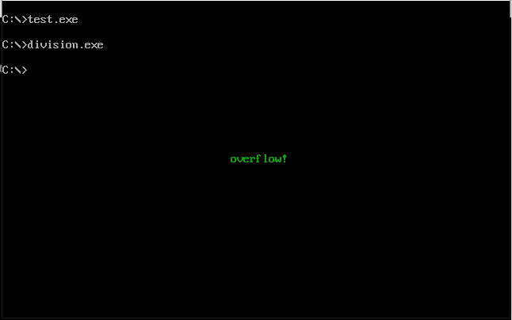
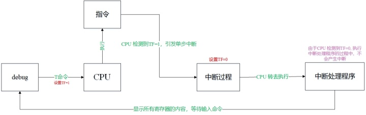

+ [author](https://github.com/3293172751)

# 第33节 编写中断处理程序

+ [回到目录](../README.md)
+ [回到项目首页](../../README.md)
+ [上一节](32.md)
> ❤️💕💕汇编语言目前仍在发挥着不可替代的作用，在效率上无可替代，在底层，学习linux内核，计算机外围设备和驱动，都离不开汇编。Myblog:[http://nsddd.top](http://nsddd.top/)
---
[TOC]


## 编程处理0号中断

> 中断处理程序，由程序员编写. 现在，我们可重新编写一个0号中断处理程序，它的功能是在屏幕中间显示"overflow!"，然后返回到操作系统.
>
> 当CPU执行div bh后，发生了除法溢出错误，产生0号中断信息，引发中断过程，CPU执行我们编写的0号中断处理程序. 在屏幕中间显示提示信息"overflow!"后，返回到操作系统中.
>
> 编程：当发生除法溢出时，在屏幕中间显示"overflow!"，返回DOS.


**我们首先进行分析：**

**第一：当发生除法溢出时，产生0号中断信息，从而引发中断过程.**

> 此时，CPU将进行以下工作.

```mathematica
① 取得中断类型码0; 
② 标志寄存器入栈，TF、IF设置为0;
③ CS、IP入栈;
④ (IP) = (0*4), (CS) = (0*4+2)
```


**第二：可见，当中断0发生时，CPU将转去执行中断处理程序.**

> 只要按如下步骤编写中断处理程序，当中断0发生时，即可显示"overflow!"

```mathematica
① 相关处理;
② 向显示缓冲区送字符串"overflow!" ;
③ 返回DOS.
```

**我们将上面这段程序称为：do0**


**第三：现在的问题是：do0应存放内存中. 因为除尘溢出随时可能发生，CPU随时都可能将CS:IP指向do0的入口，执行程序。**

> 那么do0应该放在哪里呢?
> 由于我们是操作之上使用计算机，所有的硬件资源都在操作系统的管理之下，所以我们要想得到一块内存区存放do0，应该向操作系统申请.

但在这里出于两个原因我们不想这样做：

+ 过多地讨论申请内存将偏离问题的主线;
+ 我们学习汇编的一个重要目的就是要获得对计算机底层的编程体验. 所以，在可能的情况下，我们不去理会操作系统，而直接面向硬件资源.

> 问题变得简单而直接，我们只需找到一块别的程序不会用到的内存区，将do0传送到其中即可。
>
> 前面说过，内存`0000:0000~0000:03FF`，大小为`1KB`的空间是系统存放中断处理程序入口地址的中断向量表. `8086`支持`256`个中断，但是，实际上，系统中要处理的中断事件远没有达到`256`个。所以在中断向量表中，许多单元是空的。
>
> 是不是说，我们可以在中断向量表中找到空的单元放中断程序

中断向量表是PC系统中最重要的内存区，只用来存放中断处理程序的入口地址，DOS系统和其他应用程序都不会随便使用这段空间. 可以利用中断向量表中的空闲单元来存放我们的程序. 一般情况下，从`0000:0200`至`0000:02FF`的`256`个字节的空间所对应的中断向量表项都是空的，操作系统和其他应用程序都不占用。

根据经验，可以估计出do0的长度不会超过256个字节.

结论：我们将do0传送到0000:0200处.


第四：将中断处理程序do0放到0000:0200后，若要使得除法溢出发生时，CPU转去执行do0，则必须将do0的入口地址，即0000:0200登记在中断向量表的对应表项中. 因为除法溢出对应的中断类型码为0，它的中断处理程序的入口地址应该从04地址单元开始存放，段地址放在04+2字单元中，偏移地址存放在`0*4`字单元中. 也就是说要将do0的段地址0存放在0000:0002字单元中，将偏移地址200h存放在0000:0000字单元中。

总结上面的分析，我们要做以下几件事情。

1) 编写可以显示"overflow!"的中断处理程序：do0;

2) 将do0送入内存0000:0200处;

3) 将do0的入口地址0000:0200存储在中断向量表0号表项中。


程序1的框架如下

```assembly
assume cs:code

code segment
    start:  do0 安装程序
            设置中断向量表

            mov ax, 4c00h
            int 21h

    do0:    显示字符串"overflow!"
            mov ax, 4c00h
            int 21h
```

可以看到，上面的程序分为两部分：

1) 安装do0，设置中断向量的程序;
2) do0。

程序1执行时，do0的代码是不执行的，它只是作为do0安装程序所要传送的数据。 程序1执行时，首先执行do0安装程序，将do0的代码复制到内存0:200处，然后设置中断向量表，将do0的入口地址，即偏移地址200h和段地址0，保存在0号表项中。 这两部分工作完成后，程序就返回了。 程序的目的就是在内存0:200处安装do0的代码，将0号中断处理程序的入口地址设置为0:200。 do0的代码虽然在程序中，却不在程序执行的时候执行。 它是在除法溢出发生时才得以执行的中断程序。

do0部分代码的最后两条指令是依照我们的编程要求，用来返回DOS的。


现在，我们反过来从CPU的角度看一下，什么是中断处理程序? 我们来看一下do0如何变成0号中断的中断处理程序的

1) 程序1在执行时，被加载到内存中，此时do0的代码在程序1所在的内存空间中，它只是存放在程序1的代码段中的一段要被传送到其他单元中的数据，我们不能说它是0号中断的中断处理程序;

2) 程序2中安装do0的代码执行后，do0的代码被程序1的代码段复制到0:200处。 此时，我们也不能说它是0号中断的中断处理程序，它只不过是存放在0:200处的一些数据;

3) 程序1中设置中断向量表的代码执行完后，在0号表项中填入了do0的入口地址0:200，此时0:200处的信息，即do0的代码，就变成了0号中断的中断处理程序。 因为当除法溢出(即0号中断)发生时，CPU将执行0:200处的代码。


### 安装

可以使用movsb，将do0的代码送入0:200处。 程序如下：

```assembly
assume cs:code

code segment
    start:  设置es:di指向目的地址
            设置ds:si指向源地址
            设置cx为传输长度
            设置传输方向为正
            rep movb

            设置中断向量表

            mov ax, 4c00h
            int 21h

    do0:    显示字符串"overflow!"
            mov ax, 4c00h
            int 21h

code ends

end start 
```

我们来看一下，用rep movsb指令时需要确定的信息。

1) 传送的原始位置，段地址：code，偏移地址：offset do0；

2) 传送的目的位置：0:200

3) 传送的长度：do0 部分代码的长度；

4) 传送的方向：正向

更明确的程序如下：

```assembly
assume cs:code

code segment
    start:  mov ax, cs
            mov ds, ax
            mov si, offset do0                  ; 设置ds:si指向源地址

            mov ax, 0
            mov es, ax
            mov di, 200h                        ; 设置es:di指向目的地址

            mov cx, offset do0end - offset do0  ; 设置cx为传输长度

            cld                                 ; 设置方向为正
            rep movb

            设置中断向量表

            mov ax, 4c00h
            int 21h

    do0:    显示字符串"overflow!"
            mov ax, 4c00h
            int 21h

    do0end: nop

code ends

end start

end start
```

问题是，我们如何知道do0代码的长度?最简单的方法是，计算一下do0中所有指令码的字节数。 但这样太过麻烦，因为只要do0的内容发生了改变，我们都要重新计算它的长度。

可以利用编译器来计算do0的长度，具体做法如下：

```assembly
assume cs:code

code segment
    start:  mov ax, cs
            mov ds, ax
            mov si, offset do0                  ; 设置ds:si指向源地址

            mov ax, 0
            mov es, ax
            mov di, 200h                        ; 设置es:di指向目的地址

            mov cx, offset do0end - offset do0  ; 设置cx为传输长度

            cld                                 ; 设置方向为正
            rep movb

            设置中断向量表

            mov ax, 4c00h
            int 21h

    do0:    显示字符串"overflow!"
            mov ax, 4c00h
            int 21h

    do0end: nop

code ends

end start
```

"-"是编译器识别的运算符号，编译器可以用它来进行两个常数的减法。

比如，指令：mov ax, 8-4，被编译器处理为指令：mov ax, 4。

汇编编译器可以处理表达式:
比如，指令，mov ax, (5+3)*5/10，被编译器处理为指令：mov ax, 4。

因此，对于上面程序，利用offset do0end-do0，得到do0代码长度的原理，就不过多阐述。

### 编写do0程序

do0程序的主要任务是显示字符串，程序如下：

```assembly
    do0:设置ds:si指向字符串
        mov ax, 0B800h
        mov es, ax
        mov di, 160*12+2*36

    s:  mov ch, 0
        mov cl, ds:[si]
        mov es:[di], cl
        mov byte ptr es:1[di], 2     ; 颜色
        jcxz ok                      ; 判断字符串末尾是否为0(结束标志)
        inc si
        add di, 2
        jmp short s

    ok: mov ax, 4c00h
        int 21h

do0end: nop
```

程序写好了，可要显示的字符串放在哪里呢?我们看下面的程序2。

- 程序2：

```assembly
assume cs:code

data segment
    db "overflow!", 0
data ends

code segment
    start:  mov ax, cs
            mov ds, ax
            mov si, offset do0                  ; 设置ds:si指向源地址

            mov ax, 0
            mov es, ax
            mov di, 200h                        ; 设置es:di指向目的地址

            mov cx, offset do0end - offset do0  ; 设置cx为传输长度

            cld                                 ; 设置方向为正
            rep movb

            设置中断向量表

            mov ax, 4c00h
            int 21h

    do0:    设置ds:si指向字符串
            mov ax, 0B800h
            mov es, ax
            mov di, 160*12+2*36          ; 设置es:di指向显存空间的中间位置

    s:      mov ch, 0
            mov cl, ds:[si]
            mov es:[di], cl
            mov byte ptr es:1[di], 2     ; 颜色
            jcxz ok                      ; 判断字符串末尾是否为0(结束标志)
            inc si
            add di, 2
            jmp short s

    ok:     mov ax, 4c00h
            int 21h

do0end:     nop

code ends

end start
```

上面的程序，看似合理，可实际上却大错特错。 注意，"overflow!"在程序2的data段中。 程序2执行完成后返回，它所占用的内存空间被系统释放，而在其中存放的"overflow!"也很可能被别的信息覆盖。 而do0程序被放到0:200处，随时都会因为溢出而被CPU执行，很难保证do0程序从原来程序2所处的空间中取得的是要显示的字符串"overflow!"。

因为do0程序随时可能被执行，而它要用到的字符串"overflow!"，所以该字符串也应该放在一段不会被覆盖的空间中。 正确的程序如下。

- 程序3：

```assembly
assume cs:code

data segment
    db "overflow!", 0
data ends

code segment
    start:  mov ax, cs
            mov ds, ax
            mov si, offset do0                  ; 设置ds:si指向源地址

            mov ax, 0
            mov es, ax
            mov di, 200h                        ; 设置es:di指向目的地址

            mov cx, offset do0end - offset do0  ; 设置cx为传输长度

            cld                                 ; 设置方向为正
            rep movb

            设置中断向量表

            mov ax, 4c00h
            int 21h

    do0:    jmp short do0start                  ; 该条指令占两字节
            db "overflow!", 0

do0start:   mov ax, cs
            mov ds, ax
            mov si, 202h                        ; 设置ds:si指向字符串

            mov ax, 0B800h
            mov es, ax
            mov di, 160*12+2*36                 ; 设置es:di指向显存空间的中间位置

    s:      mov ch, 0
            mov cl, ds:[si]
            mov es:[di], cl
            mov byte ptr es:1[di], 2            ; 颜色
            jcxz ok                             ; 判断字符串末尾是否为0(结束标志)
            inc si
            add di, 2
            jmp short s

    ok:     mov ax, 4c00h
            int 21h

do0end:     nop

code ends

end start
```

在程序3中，将"overflow!"放到do0程序中，程序3执行时，将标号do0到标号do0end之间的内容送到0000:0200处。

注意，因为do0程序开始处"overflow!"不是可以执行的代码，所以在"overflow!"之间加上一条jmp指令，转移到正式的do0程序。 当除法溢出发生时，CPU执行0:200处的jmp指令，跳过后面的字符串，转到正式的do0程序执行。

do0程序执行过程中必须要找到"overflow!"，那么它在哪里呢?首先来看段地址，"overflow!"和do0的代码处于同一段中，而除法溢出发生时，CS中必然do0的段地址，也就是"overflow!"的段地址；再来看偏移地址，0:200处的指令为jmp short do0start，这条指令占两个字节，所以"overflow!"的偏移地址为202h。

### 设置中断向量

下面，将do0的入口地址0:200，写入中断向量表的0号表项中，使do0成为0号中断的中断处理程序。

0号表项的地址为0:0，其中0:0字单元存放偏移地址，0:2字单元存放段地址。 程序如下：

```text
mov ax, 0
mov es, ax
mov word ptr es:[0*4], 200h
mov wort ptr es:[0*4+2], 0
```

所以最终的程序如下:

- 程序4：

```assembly
assume cs:code

code segment
    start:  
            ; do0 安装程序
            mov ax, cs
            mov ds, ax
            mov si, offset do0

            mov ax, 0
            mov es, ax
            mov di, 200h

            mov cx, do0end-do0
            cld
            rep movsb 
            

            ; 设置中断向量表
            mov word ptr es:[0], 200h
            mov word ptr es:[2], 0

            mov ax, 4c00h
            int 21h

    do0:    
            ;显示字符串"overflow!"
            jmp short do0start
            db 'overflow!', 0

do0start:   mov ax, cs
            mov ds, ax
            mov si, 202h

            mov ax, 0B800h
            mov es, ax
            mov di, 160*12+2*36

    s:      mov ch, 0
            mov cl, ds:[si]
            mov es:[di], cl
            mov byte ptr es:1[di], 2     ; 颜色
            jcxz ok
            inc si
            add di, 2
            jmp short s

    ok:     mov ax, 4c00h
            int 21h

do0end:     nop

code ends

end start
```


现在，我们来实验一下。

先写一个文件名为division。asm的文件，其文件里包含除法溢出的代码，如下：

```assembly
assume cs:code

code segment
    start:  mov ax, 1000
            mov bh, 1
            div bh

            mov ax, 4c00h
            int 21h
code ends

end start
```

把上面的程序4(最终程序)放入到一个test.asm的文件中。

通过汇编器与链接器把division.asm和test.asm 转换为divsion.exe和test.exe可执行文件.

1) 首先将0号中断处理程序写进0:200中; (test.exe)

2) 执行除法溢出程序. (division.exe)

最终的效果如下：




## 单步中断

**基本上，CPU在执行一条指令后，如果检测到标志寄存器的TF位为1，则产生单步中断，引发中断过程. 单步中断的中断类型码为1，则它所引发的中断过程如下：**

```mathematica
1) 取得中断类型码1；
2) 标志寄存器入栈，TF、IF设置为0；
3) CS、IP入栈；
4) (IP) = (1*4), (CS) = (1*4+2)
```

如上所述，如果TF = 1，则执行一条指令后，CPU就要转去执行1号中断处理程序. CPU为什么要提供这样的功能呢?

> 我们在使用Debug的t命令时，有没有想过这样的问题，Debug如何能让CPU在执行一条指令后，就显示各个寄存器的状态?我们知道，CPU在执行程序时是从CS:IP指向的某个地址开始，自动向下读取指令执行，也就是说，如果CPU不提供其他功能的话，就按这种方式工作，只要CPU一加电，它就从预设的地址开始一直执行下去，不可能有任何程序能控制它在执行一条指令后停止，去做别的事情. 可是，我们在Debug中看到的情况是，Debug可以控制CPU执行被加载程序中的一条指令，然后让它停下来，显示寄存器的状态.

Debug利用了CPU提供的一种功能. 只有CPU提供了在执行一条指令后就转去做其他事情的功能，Debug或其他的程序才能利用CPU提供的这种功能做出我们使用T命令时的效果。


### 解释

> 1. **ID中断允许标志**
>    1. IF=1，CPU允许中断
>    2. IF=0，则CPU关闭中断
> 2. **TF跟踪标志**
>    1. TF=1，机器进入单步工作方式，每条机器指令执行后，显示结果及寄存器状态
>    2. TF=0，则机器处在连续工作方式。此标志为调试机器或调试程序发现故障而设置。

- CPU在执行完一条指令之后，如果检测到标志寄存器的TF位为1，则产生单步中断，引发中断过程。单步中断的中断类型码为1。
- Debug是如何利用CPU所提供的单步中断的功能进行调试?如使用t命令查看寄存器状态。
- Debug提供了单步中断的中断处理程序，功能为显示所有寄存器中的内容后等待输入命令。
- 在使用t命令执行指令时，Debug将`TF`设置为`1`，在CPU执行完这条指令后就引发单步中断，执行单步中断的中断处理程序，所有寄存器中的内容被显示在屏幕上，并且等待输入命令。
- 在进入中断处理程序之前，设置TF=0。**从而避免CPU在执行中断处理程序的时候发生单步中断。**


```mathematica
1) 取得中断类型码N；
2) 标志寄存器入栈，TF、IF设置为0；
3) CS、IP入栈；
4) (IP) = (N*4), (CS) = (N*4+2)
```



最后，CPU提供单步中断功能的原因是，为单步跟踪程序的执行过程，提供了实现机制.

### 响应中断的特殊情况

一般情况下，CPU在执行完当前指令后，如果检测到中断信息，就响应中断，引发中断过程. 可是，在有些情况下，CPU在执行完当前指令后，即便是发生中断，也不会响应. 对于这些情况，这里就不一一举例，只是用一种情况进行说明.

> 在执行完向ss寄存器传送数据的指令后，即便是发生中断，CPU也不会响应. 这样做的主要原因是，**ss:sp联合指向栈顶，而对它们的设置应该连续完成. ** 如果在执行完设置ss的指令后，CPU响应中断，引发中断过程，要在**栈**中压入标志寄存器、CS、IP的值. 而ss改变，sp并未改变，ss:sp指向的不是正确的栈顶，将引起错误. 所以CPU在执行完设置ss的指令后，不响应中断. 这给连续设置ss和sp指向正确的栈顶提供了一个时机. 即，我们应该利用这一特性，将设置ss和sp的指令连续存放，使得sp的指令紧接着设置ss的指令执行，而在此之间，CPU不会引发中断过程. 比如，我们要将栈顶设置`1000:0`，应该：

```assembly
mov ax, 1000h
mov ss, ax
mov sp, 0	;注意，上一个ss不产生中断，而是sp执行后再产生中断
```

> 再第一条指令执行后`ip = 0103`,再执行后中断`ip = 0108`可以看到ss和sp是一起执行的

而不应该：

```assembly
mov ax,1000h
mov ss, ax
mov ax, 0
mov sp, 0
```

> 这个错误不一定是编译错误，而是执行ss时候，下一条指令自动执行了


## int n引发中断

> 中断信息可以来自CPU的内部和外部，当CPU的内部有需要处理的事情发生的时候，将产生需要马上处理的中断信息，引发中断过程。

**int指令的格式为:**

```
int n
```

`n为中断类型码，它的功能是引发中断过程。`
CPU执行int n指令，相当于引发一个n号中断的中断过程，执行过程如下

1. 取中断类型码n;

2. 标志寄存器入栈，IF=0, TF=0

3. CS, IP入栈:

4. (IP)=(n\*4), (CS)=(n\*4+2)

   从此处转去执行n号中断的中断处理程序。


可以在程序中使用int指令调用任何一个中断的中断处理程序。例如，下面的程序:

```assembly
assume cs:code
code segment
start:mov
              mov ax,0b800h
              mov es,ax
              mov byte ptr es:[12*160+40*2],'!'
              int 0
code ends
end start             
```

> 这个程序在Windows 2000中的DOS方一式下执行时，将在屏幕中间显示一个然后显示“Divide overflow”后返回到系统中。“!”是我们编程显示的，而overflow”是哪里来的呢?我们的程序中又没有做除法，不可能产生除法溢出。
> “Divide 程序是没有做除法，但是在结尾使用了`int 0`指令。CPU执行`int 0`指令时，将引发中断过程，执行0号中断处理程序，而系统设置的0号中断处理程序的功能是显示“Divideoverflow"，然后返回到系统。
> 可见，`int`指令的最终功能和`call`指令相似，都是调用一段程序。
> 一般情况下，系统将一些具有一定功能的子程序，以中断处理程序的方式提供给应用程序调用。我们在编程的时候，可以用int指令调用这些子程序。当然，也可以自己编写一些中断处理程序供别人使用。以后，我们可以将中断处理程序简称为中断例程。


### INT指令(软件中断指令)格式

《1》 int n

　　n是中断号，这就允许用户程序调用256个中断服务子程序。
　　该指令2字节长度，第一字节是int机器码，第二字节是8位立即数，表示中断号。
　　CPU在执行到INT指令时，通过中断描述符表找到中断号对应的中断服务子程序的地址，（本质上就是一个异常处理程序的软件调用）


《2》 int 3

　　INT 3 是中断指令的一种特殊形式，仅有一个字节长。
　　调试器将该指令当作软件中断指令来用。调试的时候，当程序中的某一位置加断点的时候，调试器会把断点处指令编码的第一个字节替换为INT 3指令的编码。
当程序执行到INT 3，回向调试器申请系统调用，调试器因此获得CPU控制权。之后，再用原先的编码替换INT 3 编码。


《3》INTO 中断号4

　　如果溢出标志位为1，则INTO指令会产生一个软件中断，利用这个指令可以快速测试算术运算指令之后是否有溢出产生。


《4》BOUND 中断号5

　　BOUND reg,mem
　　其执行算法为：if(reg<[mem])or(reg>[mem+sizeof(reg)]) then INT 5
　　判断数组下表是否在合理范围内，不合理触发INT 5 中断，返回地址仍是BOUND


不管是哪种，都会发生

1. 标志寄存器入栈

2. `CS:EIP` 寄存器入栈，

3. 通过中断号在中断描述符表中找到对应的描述符，并将对应的数据放入`CS:EIP`中、

CS入栈和出栈都是一个32位值，只有低16位有效。扩充的高16位无定义，目的是使堆栈保持与4字节边界对齐。这对80386的性能来说很重要


### 编写、安装中断7ch的中断例程.

+ 功能：求一word型数据的平方.
+ 参数：(ax) = 要计算的数据.
+ 返回值：dx、ax中存放结果的高16位和低16位.
+ 应用举例：`2*3456^2`

应用程序如下：

```assembly
assume cs:code

code segment
    start:  mov ax, 3456
            int 7ch           ; 调用跑断7ch的中断例程，计算ax中的数据的平方

            add ax, ax		;低十六位进位到高十六位
            adc dx, dx        ; dx:ax存放结果，将结果乘以2
            mov ax, 4c00h
            int 21h
code ends
end start
```

分析一下，我们要做以下3部分工作：

1) 编写实现求平方的功能；

2) 安装程序，将其安装在0:200处；

3) 设置中断向量表，将程序的入口地址保存在7ch表项中，使其成为中断7ch的中断例程.

安装程序如下：

```assembly
assume cs:code

code segment
    start: 
            ; 安装程序
            mov bx, cs
            mov ds, bx
            mov si, offset sqr          ; ds:si 指向源地址
            
            mov bx, 0
            mov es, bx
            mov di, 200h                ; es:di 指向目的地址

            mov cx, offset sqr - offset sqrend
            cld 
            rep movsb

            ; 中断向量表
            mov word ptr es:[7Ch*4], 200h
            mov word ptr es:[7Ch*4+2], 0

            mov ax, 4c00h
            int 21h

            ; 数据平方
    sqr: 
            mul ax
            iret ;执行这个

    sqrend: nop

code ends
end start
```

注意

> **入栈和出栈都是由硬件自动完成**

1. 在执行`int n`时：

```
pushf
push CS
push IP
```

2. 在中断例程sqr的最后，要使用`iret`指令. 用汇编语法描述，`iret`指令的功能为：

```text
pop IP
pop CS
popf
```

CPU执行int 7ch指令进入中断例程之前，标志寄存器、当前的CS和IP被压入栈中，在执行中断例程后，应该用iret指令int 7ch执行前的标志寄存器和CS、IP的值，从而接着执行应用程序.

int指令和iret指令的配合使用与call指令和ret指令的配合使用具有相似的思路.


## END 链接
+ [回到目录](../README.md)
+ [上一节](32.md)
+ [下一节](34.md)
---
+ [参与贡献❤️💕💕](https://github.com/3293172751/Block_Chain/blob/master/Git/git-contributor.md)