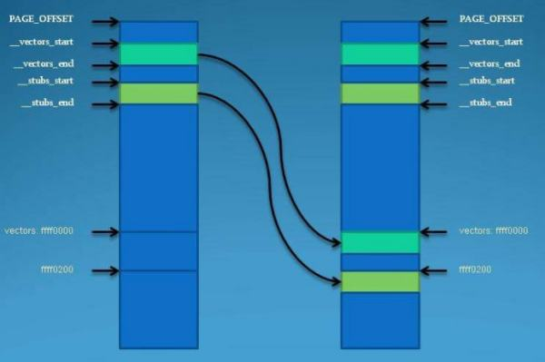

+ [author](https://github.com/3293172751)

# 第37节 外设连接和中断

+ [回到目录](../README.md)
+ [回到项目首页](../../README.md)
+ [上一节](36.md)
> ❤️💕💕汇编语言目前仍在发挥着不可替代的作用，在效率上无可替代，在底层，学习linux内核，计算机外围设备和驱动，都离不开汇编。Myblog:[http://nsddd.top](http://nsddd.top/)
---
[TOC]

## CPU通过端口与外部设备连接

**CPU可以直接读写以下3个地方的数据：**

1. CPU内部的寄存器
2. 内存单元
3. 端口
   1. 对应各种接口、网卡、显卡
   2. 主板上的接口芯片
   3. 其他芯片

> 当外部设备有请求的时候如何告诉CPU，当CPU需要用外部设备做工作，如何连接驱动？
>
> **此时需要中断的参与，这个中断类型是：外中断**

**CPU 在执行指令过程中，可以检测到发送过来的中断信息，引发中断过程，处理外设的输入。**

**外中断：外部设备发生的事件引起的中断。**

+ 可屏蔽中断

  + CPU可以不响应的中断
  + CPU是否响应可屏蔽中断，要看标志寄存器的`IF`位的设置
  + 当CPU检测到可屏蔽中断信息：
    + `IF = 1`：则CPU在执行完当前指令后响应中断，引发中断过程
    + `IF = 0`：则不响应可屏蔽中断

  

+ 不可屏蔽中断

  + CPU不可屏蔽的中断，必须响应的外中断
  + 当CPU检测到不可屏蔽中断信息，则在执行当前指令后，立即响应，引发中断
  + 对于8086CPU不可屏蔽和中断的中断类型码固定为`2`

> 典型的非屏蔽中断源的例子是电源掉电，一旦出现，必须立即无条件地响应，否则进行其他任何工作都是没有意义的。典型的可屏蔽中断源的例子是打印机中断，CPU**对打印机中断请求的响应可以快一些**，也可以慢一些，因为让打印机等待儿是完全可以的。

## 外中断的处理过程

> CPU 提供的设置IF指令
>
> + sti：设置IF= 1
> + cli：设置IF= 0

### 可屏蔽中断所引发的中断过程

可屏蔽中断处理的一般过程：

1. 接口发出中断请求。

2. 当前指令执行完后，CPU响应中断。

3. 中断类型号 N送CPU。

4. 标志寄存器入栈，IF= 0，TF= 9；
5. CS、IP入栈

6. 清除 IF(中断允许标志位，IF=0，禁止CPU响应外部中断请求，IF=1，允许响应) 和TF（跟踪标志，也称单步执行，CPU按跟踪方式执行）。

7. 由中断类型号，查中断向量表获得中断服务子程序的入口地址。

8. CPU执行中断子程序。

9. 开中断。

10. IRET指令使EIP CS HE EFR弹出栈 ，返回被中断的源程序。

### 不可屏蔽中断

1. 标志寄存器入栈，IF= 0，TF= 9；

2. CS、IP入栈
3. (IP) = (8), (CS) = (0AH)

## END 链接

+ [回到目录](../README.md)
+ [上一节](36.md)
+ [下一节](38.md)
---
+ [参与贡献❤️💕💕](https://github.com/3293172751/Block_Chain/blob/master/Git/git-contributor.md)