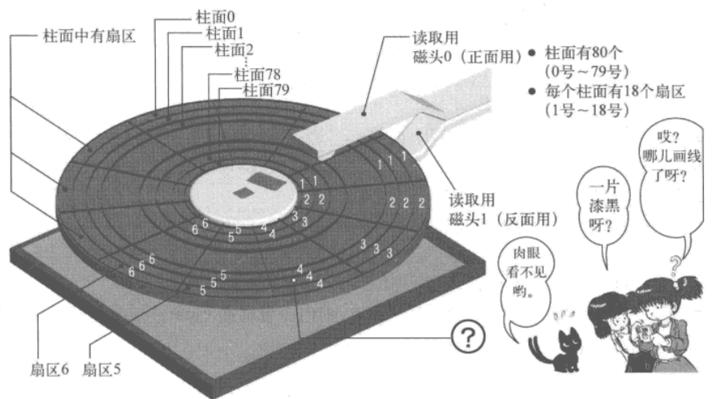

+ [author](https://github.com/3293172751)

# 第39节 磁盘读写

+ [回到目录](../README.md)
+ [回到项目首页](../../README.md)
+ [上一节](38.md)
> ❤️💕💕汇编语言目前仍在发挥着不可替代的作用，在效率上无可替代，在底层，学习linux内核，计算机外围设备和驱动，都离不开汇编。Myblog:[http://nsddd.top](http://nsddd.top/)
---
[TOC]

## 磁盘读写

### 容量

一张软盘有80个柱面、2个磁头、18个扇区
柱面：0~79
磁头：0~1
扇区：1~18

### 读盘的顺序

先读满扇区，扇区满后切换磁头，磁头满后切换柱面

### 磁盘操作方式

- AH=00h 复位磁盘驱动器。
- AH=01h 检查磁盘驱动器状态。
- AH=02h 读扇区。
- AH=03h 写扇区。
- AH=04h 校验扇区。
- AH=05h 格式化磁道。
- AH=08h 获取驱动器参数。
- AH=09h 初始化硬盘驱动器参数。
- AH=0Ch 寻道。
- AH=0Dh 复位硬盘控制器。
- AH=15h 获取驱动器类型。
- AH=16h 获取软驱中盘片的状态。

### 其他配置

AL=处理对象的扇区数（只能处理连续的扇区）
CH=柱面号
CL=扇区号
DH=磁头号
ES:BX=缓冲地址（校验及寻道时不使用）
通过CF判断是否读盘成功

> 参考
> [INT13 功能](https://icode.best/go?go=aHR0cHM6Ly9ibG9nLmNzZG4ubmV0L3lsbzUyMy9hcnRpY2xlL2RldGFpbHMvMzkwNTA3NzE=)

## END 链接
+ [回到目录](../README.md)
+ [上一节](38.md)
+ [下一节](40.md)
---
+ [参与贡献❤️💕💕](https://github.com/3293172751/Block_Chain/blob/master/Git/git-contributor.md)