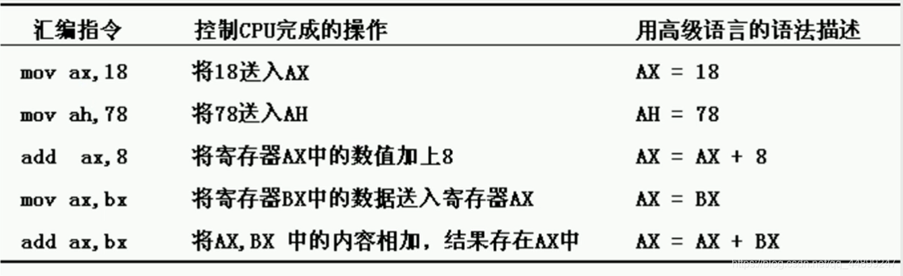

+ [author](https://github.com/3293172751)

# 第4节 MOV和ADD指令

+ [回到目录](../README.md)
+ [回到项目首页](../../README.md)
+ [上一节](3.md)
> ❤️💕💕汇编语言目前仍在发挥着不可替代的作用，在效率上无可替代，在底层，学习linux内核，计算机外围设备和驱动，都离不开汇编。Myblog:[http://nsddd.top](http://nsddd.top/)
---
[TOC]

## 指令表述

+ 上面的数值是默认的十进制，可以省略后面的`D`
+ 如果想要表达其他进制，需要在后面加上对应的字母

### 写出汇编指令后的结果

1、**mov ax,4E20H**
这里是把十六进制的4E20H这个数放到了ax寄存器中，执行指令后的ax中的数据变为`4E20H`（假设原ax，bx中的数据均为0000H）。

2、**add ax,1406H**
我们这里的命令是紧接着上一个的，所以在执行这条指令之前，ax寄存器的数值已经是4E20H了。这里相当于`ax = ax+1406H`，所以执行完毕后ax变为了`1406+4E20 = 6226H`。

注：十六进制的加减法其实跟10进制差不多，也是满了就进，不够就借。

3、**mov bx,2000H**
执行完后ax为6226，bx为2000

4、**add ax,bx**
执行完后ax为8226，bx为2000

5、**mov bx,ax**
这里需要注意的是，就像我们上面那张图说的，它类似于高级语言中的赋值语句，所以对原来的是不变的。因此bx是变成了ax存的8226，而ax依然还是6226

6、**add ax,bx**
这里如果算的话，ax应该是`8226+8226=1044C`，**但是1044C是溢出的**，超过了16位的寄存器所能承载的最大的数值，所以现在ax会变成044C，这个是需要注意的地方。

### 写出汇编指令后的结果

这里我们从新开始执行一些指令，ax和bx都先归零

1、**mov ax,001AH**
2、**mov bx,0026H**
这两个很简单，现在ax中是001A，bx中是0026

3、**add al,bl**
**注意这里的寄存器变成了al和bl，即ax和bx的低位。[上一节](./3.md "上一节中介绍的低位高位")**
所以这里应该是`1A+26=40`。ax现在是`0040H`，bx是0026H

4、**add ah,bl**
这里是加到了ah上，ax变为了`2640H`。

5、**add bh,al**
ax为2640，bx为4026

6、**mov ah,0**
这里呢把ah变为了0，所以ax变为了0040

7、**mov al,85H**
这里注意又把al变成了85h

8、**add al,93H**
这个是最需要注意的地方，93H加85H后是118，**由于我们的命令中写的是al而不是ax，所以这里我们已经变成了计算8位的相加了，并不能进位到ah中去，所以只能舍弃成18H，ax现在是`0018H`。**

## END 链接

+ [回到目录](../README.md)
+ [上一节](3.md)
+ [下一节](5.md)
---
+ [参与贡献❤️💕💕](https://github.com/3293172751/Block_Chain/blob/master/Git/git-contributor.md)