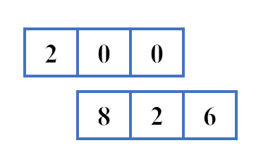
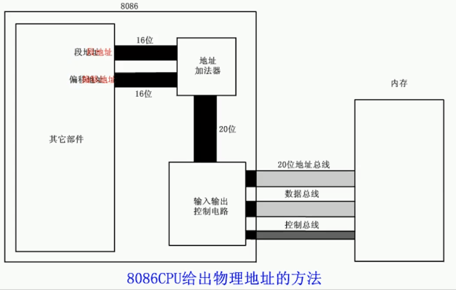

+ [author](https://github.com/3293172751)

# 第5节 8086CPU 给出物理地址的方法

+ [回到目录](../README.md)
+ [回到项目首页](../../README.md)
+ [上一节](4.md)
> ❤️💕💕汇编语言目前仍在发挥着不可替代的作用，在效率上无可替代，在底层，学习linux内核，计算机外围设备和驱动，都离不开汇编。Myblog:[http://nsddd.top](http://nsddd.top/)
---
[TOC]

## 物理地址

+ CUP访问内存单元需要给出内存单元的地址
+ 所有的内存单元构成一个线性的一维空间
+ 每个内存单元在这个空间中都有一个唯一的地址，这个唯一的地址称之为**物理地址**

> 8086有20位地址总线，可以传送20位地址，寻址能力为2^20^ = 1M
>
> 但是位结构是16位CPU
>
> + 运算器一次最多可以处理16位的数据，寄存器的最大宽度为16位
> + 在8086内部处理的、传输、暂存的地址也是16位，寻址能力也只有`64K`

##  十六位结构的CPU的特性

1、运算器一次最多可以处理16位的数据

2、寄存器最大的宽度位6位

3、寄存器和运算器之间的通路为16位

## 8086CPU给出物理地址的方式

+ **CPU中相关部件提供两个16位的地址，一个称为段地址，一个称为偏移地址**
+ 段地址和偏移地址通过内部总线送入一个称为地址加法器的部件
+ 地址加法器将两个16位地址合成位一个20位的物理地址
+ 地址加法器通过内部总线将20位物理地址送入输入输出控制电路
+ 输入输出控制电路将20位物理地址送上地址总线
+ 20位物理地址被地址总线传送到存储器

## 地址加法器原则：

> 段地址左移4位加上偏移地址 等于 物理地址

$$
物理地址=段地址×16+偏移地址
$$

CPU可以用不同的段地址和偏移地址来形成同一个物理地址，如下面十进制偏移：

> + 段地址：200
> + 偏移地址：826
> + 物理地址：**2826**

## 动画展示

> 地址加法器采用物理地址=段地址x16+偏移地址的方式合成物理地址，其思想和上述例子一样，只不过从10进制变成了计算机的16进制。

## 注意

+ 段地址×16必然是16的倍数，所以一个段的起始地址也一定是16的倍数;

+ 偏移地址为16位，16位地址的寻址能力为64KB，所以一个段的长度最大为64KB。
+ 同样的物理地址，可以由**不同的偏移地址和段地址组合**，说明了段地址并非是固定的，可以通过偏移地址的调整。

## END 链接
+ [回到目录](../README.md)
+ [上一节](4.md)
+ [下一节](6.md)
---
+ [参与贡献❤️💕💕](https://github.com/3293172751/Block_Chain/blob/master/Git/git-contributor.md)