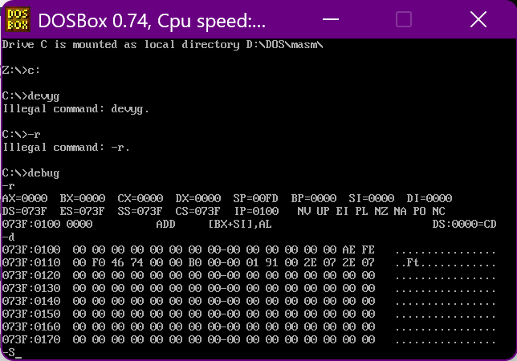
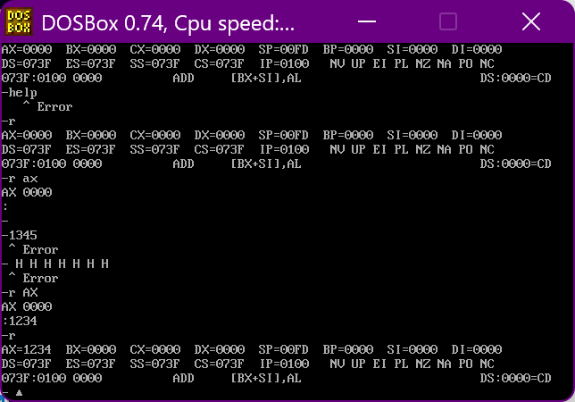
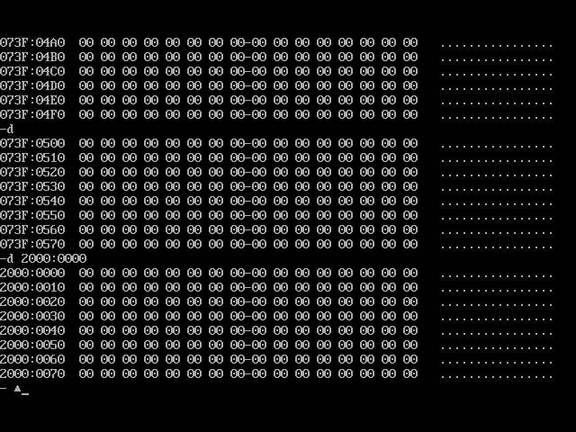
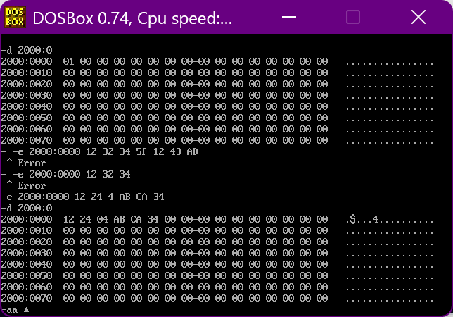
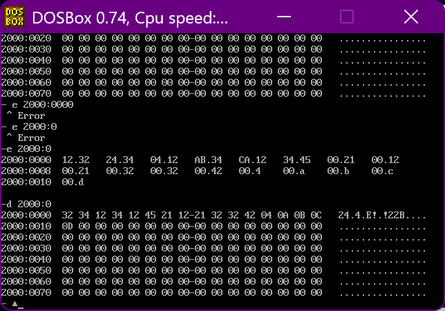
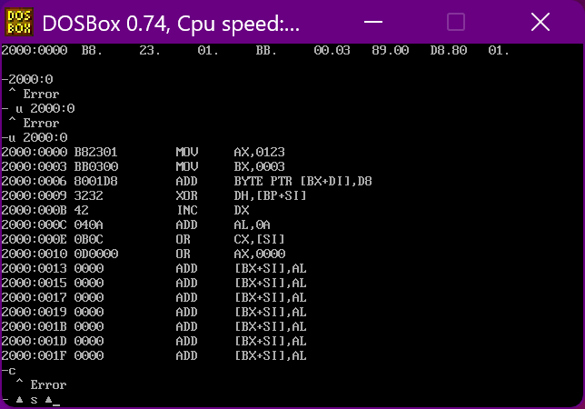
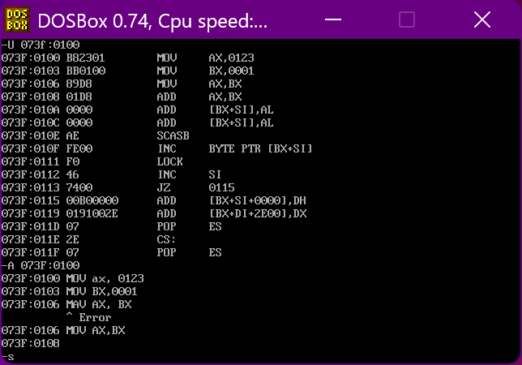
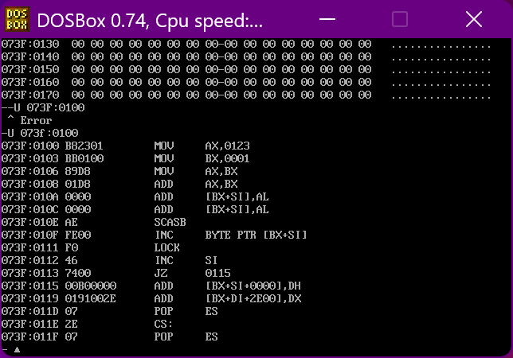
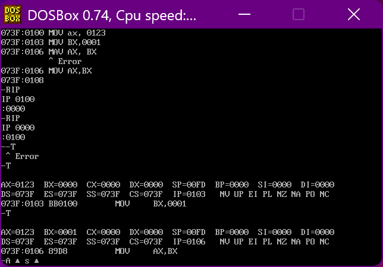

+ [author](https://github.com/3293172751)

# 第7节 Debug使用

+ [回到目录](../README.md)
+ [回到项目首页](../../README.md)
+ [上一节](6.md)
> ❤️💕💕汇编语言目前仍在发挥着不可替代的作用，在效率上无可替代，在底层，学习linux内核，计算机外围设备和驱动，都离不开汇编。Myblog:[http://nsddd.top](http://nsddd.top/)
---
[TOC]

## Debug是什么

**debug是DOS系统中著名的调试工具，也可以运行在windows系统实模式下。**



> 使用debug程序，可以查看CPU各种寄存器中的内容、内存的情况，并且在机器指令级跟踪程序的运行。


## debug命令

 DEBUG下最常用的调试指令为六个

**常用DEBUG命令：**

+ R ：查看更改cpu寄存器内容

+ D：查看内存中内容

+ E：改写内存中内容

+ U：将内存中机器指令翻译成汇编指令

+ T：执行一条机器指令

+ A：以汇编格式在内存中写入一条指令


### 命令r：查看寄存器内容

```
R - 查看寄存器内容
R 寄存器名 - 改变指定寄存器内容
```

**修改和查看寄存器值：**




### 命令d: 查看内存数据

D命令显示数据个数如下所示，内存地址格式为【段地址：偏移地址】，段地址和偏移地址共同组成内存地址，实际内存地址=段地址+偏移地址

直接输入d 显示的内存区域地址为上次查看位置后内存数据

输入命令时，可以直接输入内存地址，查看制定地址的内存数据。如D【1111:0000】 直接显示命令 段地址为1111，偏移地址为0 的内存数据。

采用$$d 段地址：起始偏移地址 结尾偏移地址$$ 可以查看起始地址到结尾地址范围内的数据 。如`d 1111:0000 FF`,查看数据范围为`1111:0000 ~ 1111:00FF`




### 命令E：改写内存中的数据

`e 段地址：偏移地址 数据1 数据2 ... 数据n`方式，一次性修改指定地址的n个数据




**也可以逐步询问式修改**




### 命令U：将指定地址的机器码翻译为汇编指令

格式：

```
U 段地址：偏移地址
```




### 命令A：以汇编形式在内存中输入机器指令

> 相对于E指令，我们输入二进制，A指令我们更常用

```
-A 段地址：偏移地址 回车后开始输入地址即可
```







### 指令T：执行一条或者多条指令

使用T 指令 执行内存地址为【CS寄存器数值：IP寄存器数据】位置的指令

+ ax寄存器原始数据为0000，修改cs:ip = 1000:100后，在cs:ip 写入 “MOV AX , 1”的机器码，使用t命令执行后，ax寄存器数据被修改为0001



> 由此可见，T命令可以逐条执行
>
> 最后通过`q`退出


## END 链接

+ [回到目录](../README.md)
+ [上一节](6.md)
+ [下一节](8.md)
---
+ [参与贡献❤️💕💕](https://github.com/3293172751/Block_Chain/blob/master/Git/git-contributor.md)