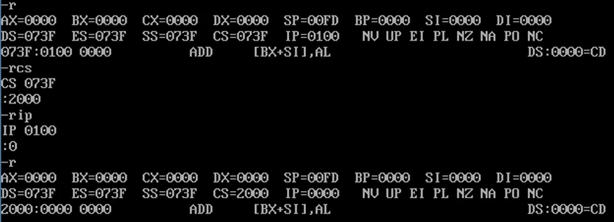
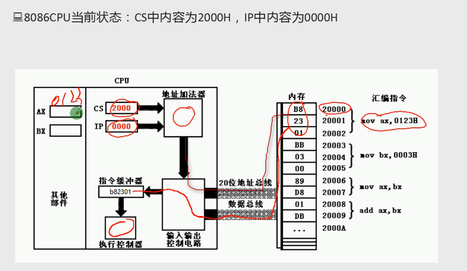
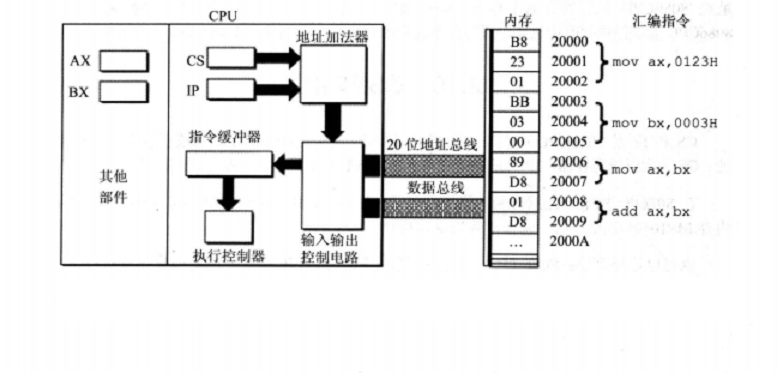
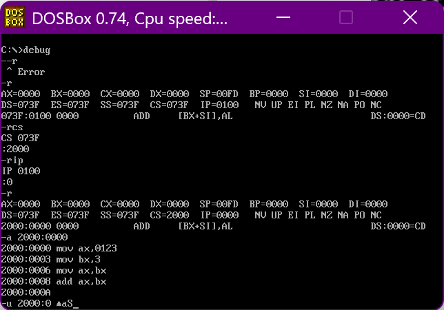
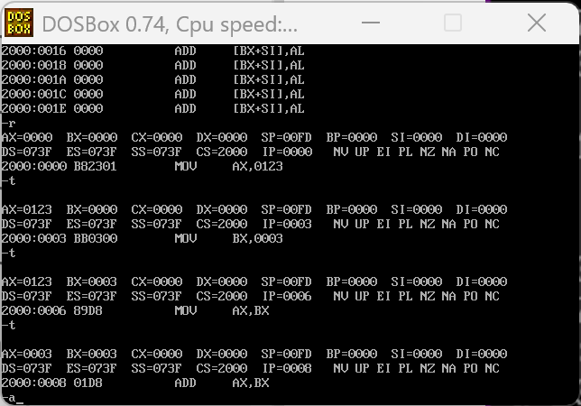
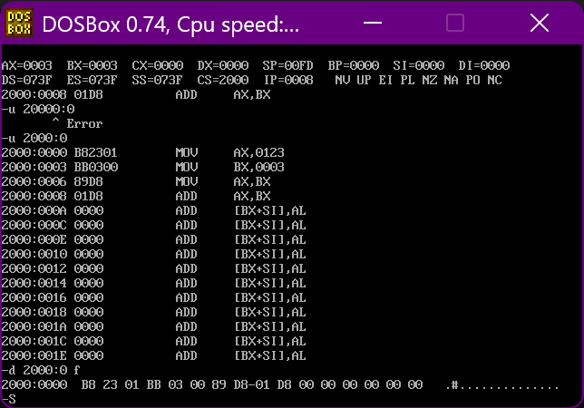
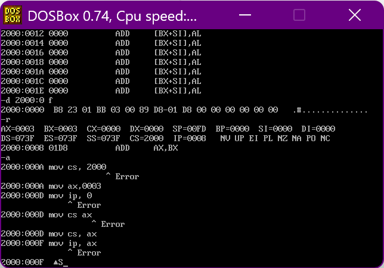
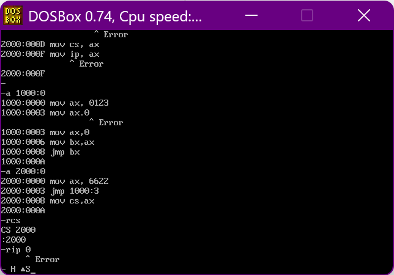
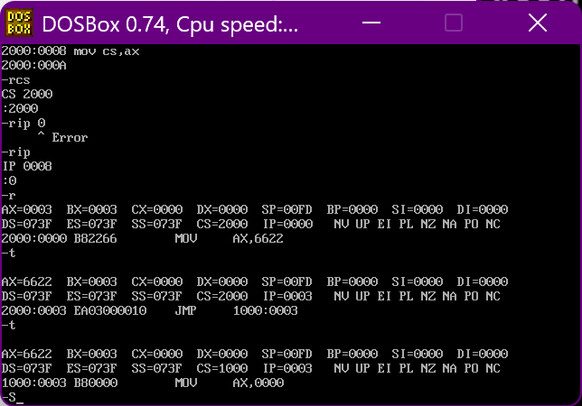
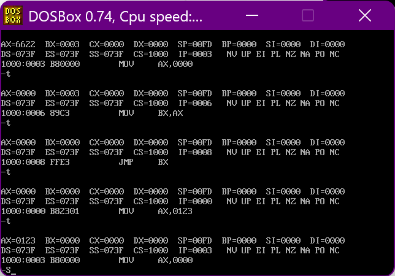

+ [author](https://github.com/3293172751)

# 第8节 CS、IP和代码段

+ [回到目录](../README.md)
+ [回到项目首页](../../README.md)
+ [上一节](7.md)
> ❤️💕💕汇编语言目前仍在发挥着不可替代的作用，在效率上无可替代，在底层，学习linux内核，计算机外围设备和驱动，都离不开汇编。Myblog:[http://nsddd.top](http://nsddd.top/)
---
[TOC]

## CS、IP

**CS:**   代码段寄存器
**IP：** 指令指针寄存器
**JMP：** 跳转指令，可以修改CS和IP两个寄存器的内容，也就是修改IP的指向。为什么用此指令“jmp ax”修改IP的值呢，直接mov ip,ax不就行了吗？这样是不被允许的，如下图所示。

> `CS：IP`:CPU将内存中的cs:ip所指向的内容当作指令执行。
>
> 我们都知道`PC`程序计数器,那么其实`CS:Ip`算是对程序计数器步骤的解析





> (1) 8086CPU当前状态: Cs中的内容为2000H, IP中的内容为0000H;
> (2)内存20000H-20009H单元存放着可执行的机器码;
> (3)内存20000H-20009H单元中存放的机器码对应的汇编指令如下。
> 地址: 20000H-20002H,内容: B8 23 01,长度: 3Byte,对应汇编指令: `mov ax,0123H`
> 地址: 20003H-20005H,内容: BB 03 00,长度: 3Byte,对应汇编指令: `mov bx,0003H`
> 地址: 20006H-20007H,内容: 89 D8,长度: 2Byte,对应汇编指令: `mov ax,bx`
> 地址: 20008H-20009H,内容: 01 D8,长度: 2Byte,对应汇编指令: `add ax,bx`


**8086cpu执行一条指令的过程：**


> 此时, CS: IP指向内存单元2000:0003.
> 执行控制器执行指令B8 23 01(即mov ax.0123H)
> 指令B82301被执行后AX中的内容为0123H(此时, CPU将从内存单元2000:0003处读取指令。)
> CS:2000H, IP:0003H(CPU将从内存2000H× 16+0003H处读取指令BB 03 00)
> CPU从内存20003H处读取指令BB 03 00入指令缓沖器(IP中的值加3)
> 执行指令вв 03 00(D mov bx.0003н)
> CPU从内存20006H处读取指令89D8入指令缓冲器(IP中的值加2)
> 执行指令89 D8(即 mov ax,bx)后, AX中的内容为0003H
> CPU从内存20008H处读取指令01 D8入指令缓冲器(IP中的值加2)
> 执行指令01 D8(即add ax.bx)后, AX中的内容为0006H

将长度为10个字节的指令,存放在123B0H-123B9H的一组内存单元中,我们就可以认为, 123B0H-123B9H这段内存是用来存放代码的,是一个代码段,它的段地址为123BH,长度为10个字节

```
mov ax, 0000      (B8 00 00)
add ax,0123B      (05 23 01)
mov bx, ax        (8B D8)
jmp bx            (FF E3)
```

> 如何使得代码段中的指令被执行呢?
> CPU并不会自动地将我们定义的代码段中的指令当作指令来执行。
> CPU只认被CS:IP指向的内存单元中的内容为指令。
> 所以,要让CPU执行我们放在代码段中的指令,必须要将CS:IP指向所定义的代码段中的第一条指令的首地址。对于上面的例子,我们将一段代码存放在123BOH-123B9H内存单元中,将其定义为代码段,如果要让这段代码得到执行,可设CS=123BH. IP=0000H。

## 调试过程







> 上面展示的是CPU的变化，使用`-d 2000:0 f`查看的数据，是一串二进制，是用作一般数据还是用作指令？
>
> CPU 是将`CS：IP` 指向的内存单元中的内容看作指令！


## JMP

+ 执行何处的指令,取决于`CS:IP`
+ 应用上:可以通过修改CS 和 IP 的内容,来控制CPU要执行的目标指令

> 如何修改?
>
> + Debug的`R`命令可以修改寄存器的值  
>
>   + rcs
>   + rip
>
>   **但是debug只是调试手段,并非程序方式**
>
> + 用指令修改   —  mov
>
>   
>
>   **可以看到MOV不能直接修改,可以通过`MOV CS,AX`**修改代码段寄存器的值,但是IP不可以
>
> + 可以通过转移指令`JMP`⏬⏬⏬

**JMP可以同时修改CS,IP的内容**

```
JMP 段地址:偏移地址
```


**JMP可以仅仅修改IP的内容**

```
JMP 某一合法寄存器
# JMP ax (类似于 mov IP,ax)   当然mov不行 , , 只是类似
```


> 如何使代码段中的指令被执行呢?
>
> 用jmp指向即可,CPU只认为被CS:IP指向的才是指令,所以要将CS:IP指向所定义的代码段中的第一条指令的首地址
>
> 从CS:IP读取的指令进入指令缓冲区







> 可以看到上面的IP陷入循环中了
>
> 可以把`JMP`类似于`goto`指令,跳转


## 小结

(1)段地址在8086CPU的段寄存器中存放。当8086CPU要访问内存时,由段寄存器提供内存单元的段地址。8086CPU有4个段寄存器,其中CS用来存放指令的段地址.
(2) CS存放指令的段地址, IP存放指令的偏移地址8086机中,任意时刻, CPU将CS:IP指向的内容当作指令执行。
(3) 8086CPU的工作过程:①从CS: IP指向的内存单元读取指令,读取的指令进入指令缓冲器:@IP指向下一条指令③执行指令。(转到步骤0,重复这个过程。)
(4) 8086CPU提供转移指令修改cs,IP的内容。

## END 链接
+ [回到目录](../README.md)
+ [上一节](7.md)
+ [下一节](9.md)
---
+ [参与贡献❤️💕💕](https://github.com/3293172751/Block_Chain/blob/master/Git/git-contributor.md)