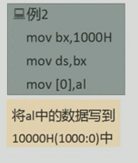
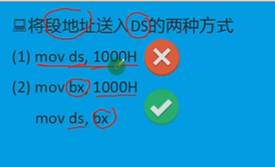
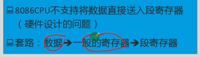
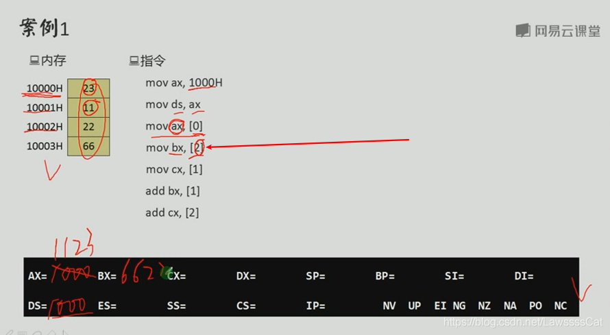
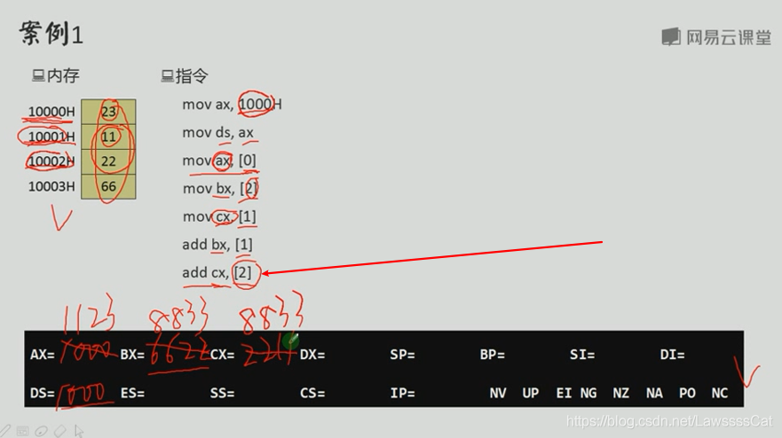
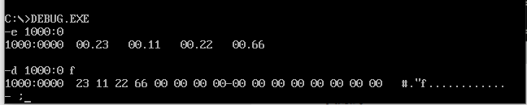
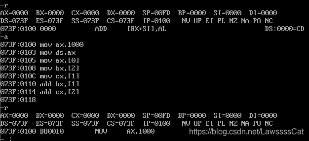
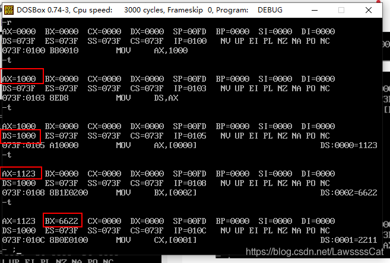
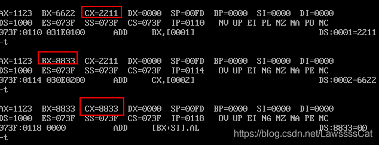

+ [author](https://github.com/3293172751)

# 第9节 内存中的字

+ [回到目录](../README.md)
+ [回到项目首页](../../README.md)
+ [上一节](8.md)
> ❤️💕💕汇编语言目前仍在发挥着不可替代的作用，在效率上无可替代，在底层，学习linux内核，计算机外围设备和驱动，都离不开汇编。Myblog:[http://nsddd.top](http://nsddd.top/)
---
[TOC]

## 内存中的字的存储

**对8086CPU来说,16位作为一个字,现在很多64位机器,那么就是64位为一个字**

> 大端小端 说的是数据的组织方式，
> 小端是高字节存高地址，低字节存低地址。
> 大端是反过来。
> 8086是小端模式。

```
20000D十六进制是:4E20H 
存放 0, 1 两个单元
```


## 字单元

**由两个连续的内存单元组成,存放一个字形数据(16位)**

> 在一个字单元中,低地址单元存放低位字节,高地址单元存放的是高位字节
>
> + 在起始地址为 0 的单元中,存放的是`4E20H`
> + 在起始地址为 2 的单元中,存放的是`0012H`
>
> 1. `0`地址单元存放的`字节型数据`是:`20H`
> 2. `0`地址单元存放的`字型数据`是:`4E20H`


**8086CPU不支持将数据直接送入段寄存器中(硬件设计问题)**

套路:$$数据–>一般寄存器–>段寄存器$$

> 要解决的问题：CPU从内存单元中要读取数据
> 要求.


CPU要读取一个内存单元的时候，必须先给出这个内存单元的地址；

> 在8086CPU中，内存地址由段地址和偏移地址组成（段地址：偏移地址）
> 解决方案：**DS和[address]结合**
> 用DS寄存器存放要访问的数据的段地址
> 偏移地址用[...]形式直接给出

- 

  


```
8086

- 16 位数据总线
  4 个 16 进制表示
  (4 个字节表示 1 个 16 进制数)
- 20 位地址总线
  寻址能力`2^20=1M`
```


**将段地址送进 DS 的两种方法**



mov ds,1000H 是不行的！
因为，电路设计中，没有支持这样的指令
而我们要给 “段寄存器” 赋值，必须通过通用寄存器

```
mov bx,1000H
mov ds,bx
```




# 字的传送

- 8086CPU 可以一次性传送一个字（16 位数据）

  ```
  mov bx,1000H
  mov ds,bx
  mov ax,[0]; `1000:0处的字型数据送入ax`
  mov [0],cx; `cx中的16位数据送到1000:0处`
  ```







**DOS 中测试**











## DS与数据段

> 累加数据段的前三个单元的数据
>
> ```ASN.1
> mov ax, 123BH
> mov ds, ax
> mov al, 0
> add al,[0]
> add al,[1]
> add ak,[2]
> ```

## END 链接

+ [回到目录](../README.md)
+ [上一节](8.md)
+ [下一节](10.md)
---
+ [参与贡献❤️💕💕](https://github.com/3293172751/Block_Chain/blob/master/Git/git-contributor.md)