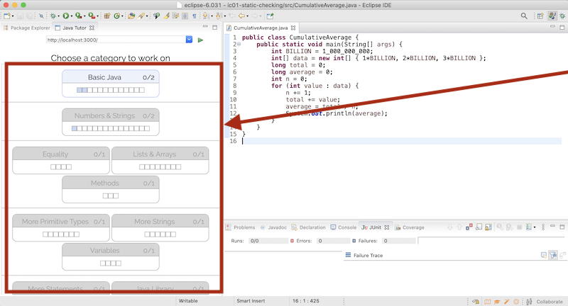
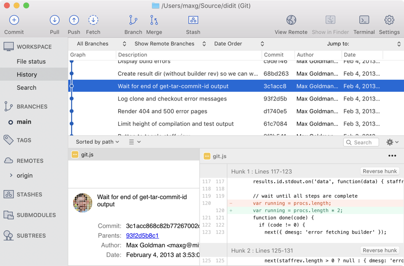
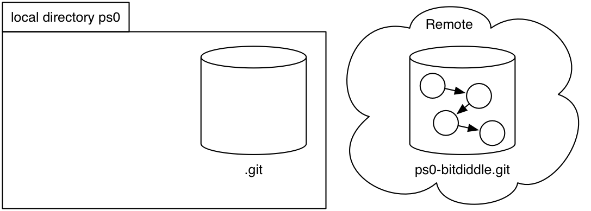
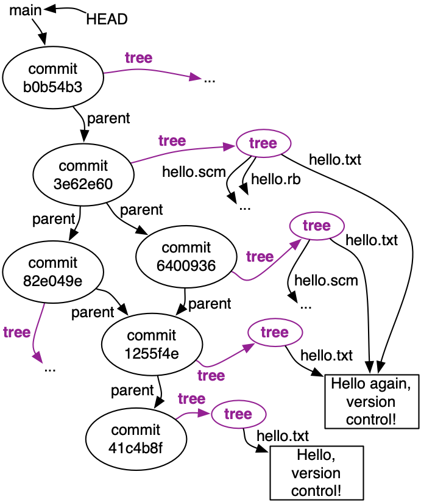
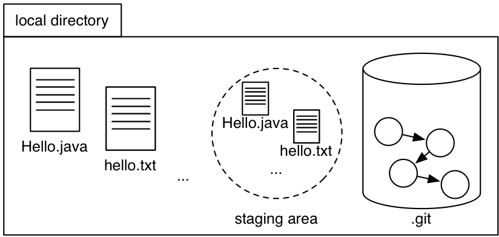
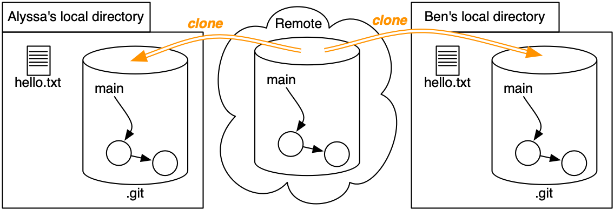

+ [author](https://github.com/3293172751)

# 第10节

+ [回到目录](../README.md)
+ [回到项目首页](../../README.md)
+ [上一节](9.md)
> ❤️💕💕包含软件工程、算法与架构：设计模式、软件架构、协同开发、质量保障。更多关注我的博客：Myblog:[http://nsddd.top](http://nsddd.top/)
---
[TOC]

## Java Tutor 练习

通过完成 Java Tutor 中的这些类别，继续在 Java 上取得进步：

 

 

## 中的软件

| 远离错误                     | 容易理解                                 | 准备好改变               |
| :--------------------------- | :--------------------------------------- | :----------------------- |
| 今天更正，在未知的未来更正。 | 与未来的程序员清楚地沟通，包括未来的你。 | 旨在适应变化而无需重写。 |


## 目标

+ 了解什么是版本控制以及我们使用它的原因
+ 了解 Git 如何将版本历史存储为图表
+ 练习阅读、创建和使用版本历史


## 介绍

[版本控制系统](http://en.wikipedia.org/wiki/Revision_control)是软件工程领域必不可少的工具。或多或少每个项目——严肃的或爱好的、开源的或专有的——都使用版本控制。如果没有版本控制，协调所有编辑同一个项目代码的程序员团队将达到令人毛骨悚然的程度。

### 你已经使用过的版本控制系统

+ 投递箱
+ [撤消/重做缓冲区](http://en.wikipedia.org/wiki/Undo)
+ 保留带有版本号的文件的多个副本


## 发明版本控制

假设[爱丽丝](http://en.wikipedia.org/wiki/Alice_and_Bob)正在解决她自己设定的问题。

| 爱丽丝 | 版本 1  你好.java |
| ------ | ----------------- |
|        |                   |

她从 pset 中的一个文件开始`Hello.java`，并持续处理了几天。

在她需要上交 pset 进行评分之前的最后一分钟，她意识到她所做的更改会破坏一切。要是她能回到过去，找回过去的版本就好了！

保存备份文件的简单原则将完成工作。

| 爱丽丝 | 版本 1  你好.1.java | 版本 2  你好.2.java | 版本 3  你好.java | 头   |
| ------ | ------------------- | ------------------- | ----------------- | ---- |
|        |                     |                     |                   |      |

Alice 使用她的判断来决定她何时达到了证明保存代码的某个里程碑。她将版本保存`Hello.java`为`Hello.1.java`、`Hello.2.java`和`Hello.java`。她遵循最新版本只是`Hello.java`为了避免混淆 Eclipse 的惯例。我们将最新版本称为*head*。


现在，当 Alice 意识到版本 3 存在致命缺陷时，她可以将版本 2 复制回她当前代码的位置。灾难避免！但是，如果版本 3 包含一些好的变化和一些不好的变化呢？Alice 可以手动比较文件以查找更改，并将它们分类为好的和坏的更改。然后她可以将好的更改复制到版本 2 中。

这是很多工作，人眼很容易错过变化。幸运的是，有用于比较文本的标准软件工具。在 UNIX 世界中，一种这样的工具是[`diff`](http://en.wikipedia.org/wiki/Diff)更好的版本控制系统将使差异易于生成。

| 云     | 版本 1  你好.1.java | 版本 2  你好.2.java | 版本 3  你好.java |
| ------ | ------------------- | ------------------- | ----------------- |
|        |                     |                     |                   |
| 爱丽丝 | 版本 1  你好.1.java | 版本 2  你好.2.java | 版本 3  你好.java |

Alice 还想为她的笔记本电脑被公共汽车碾过做好准备，因此她将工作的备份保存在云中，只要她对工作目录的内容感到满意，就会上传她的工作目录的内容。

如果她的笔记本电脑被压扁，Alice 可以检索备份并在新机器上恢复 pset 上的工作，保留随意穿越回旧版本的能力。


此外，她可以在多台机器上开发她的 pset，使用云提供商作为公共交换点。Alice 在她的笔记本电脑上进行了一些更改并将它们上传到云端。然后她下载到家里的台式机上，做更多的工作，然后将改进的代码（包括旧文件版本）上传回云端。

|                    | 云                    |      |                |                    |
| ------------------ | --------------------- | ---- | -------------- | ------------------ |
|                    |                       |      |                |                    |
| 版本 5L  你好.java | 爱丽丝在 笔记本电脑上 |      | 桌面上的爱丽丝 | 版本 5D  你好.java |

但是，如果 Alice 不小心，她可能会在这种方法中遇到麻烦。想象一下，她开始`Hello.java`在笔记本电脑上进行编辑以创建“版本 5”。然后她会分心并忘记她的变化。后来，她开始在她的台式机上开发一个新的“版本 5”，包括*不同的*改进。我们将这些版本称为“5L”和“5D”，分别代表“笔记本电脑”和“台式机”。

当需要将更改上传到云端时，就有可能发生意外！Alice 可能会将她所有的本地文件复制到云中，使其仅包含版本 5D。后来 Alice 从云端同步到她的笔记本电脑，可能会覆盖 5L 版本，失去有价值的更改。Alice 在这里真正想要的是一个*合并*，以创建一个基于两个版本 5 的新版本。

此时，仅考虑一个程序员单独工作的场景，我们已经有了一个版本控制方案应该支持的操作列表：

+ 恢复到过去的版本
+ 比较两个不同的版本
+ 将完整版本历史推送到另一个位置
+ 从那个位置*拉回历史*
+ 合并同一早期版本的分支版本


### 多个开发者

现在让我们将另一位开发人员 Bob 添加到图片中。这幅画与我们刚才所想的并没有太大的不同。

|                    | 云                 |        |      |      |                    |                    |
| ------------------ | ------------------ | ------ | ---- | ---- | ------------------ | ------------------ |
|                    |                    |        |      |      |                    |                    |
| 版本 5A  你好.java | 版本 5A  问候.java | 爱丽丝 |      | 鲍勃 | 版本 5B  你好.java | 版本 5B  问候.java |

这里的 Alice 和 Bob 就像两个 Alice 在不同的计算机上工作。他们不再共享一个大脑，这使得在推入和拉出共享云服务器时遵循严格的纪律变得更加重要。两个程序员必须协调一个方案来提出版本号。理想情况下，该方案允许我们为*整组文件*分配清晰的名称，而不仅仅是单个文件。（文件依赖于其他文件，因此孤立地考虑它们会导致不一致。）

仅仅上传新的源文件并不是向其他人传达一组更改的高级想法的好方法。因此，让我们添加一个日志，以人工编写的简短消息的形式记录每个版本*的*编写者、最终确定时间以及更改内容。

|                                                              | 云                  |                     |        |      |      |                     |                     |                                                              |
| ------------------------------------------------------------ | ------------------- | ------------------- | ------ | ---- | ---- | ------------------- | ------------------- | ------------------------------------------------------------ |
|                                                              |                     |                     |        |      |      |                     |                     |                                                              |
| 日志： 1：Alice，晚上 7 点， ... 4：Bob，晚上 8 点，... 5A：Alice，晚上 9 点，... | 版本。5A  你好.java | 版本。5A  问候.java | 爱丽丝 |      | 鲍勃 | 版本。5B  你好.java | 版本。5B  问候.java | 日志： 1：Alice，晚上 7 点， ... 4：Bob，晚上 8 点，... 5B：Bob，晚上 9 点，... |

现在推送另一个版本变得有点复杂，因为我们需要合并日志。这比 Java 文件更容易做到，因为日志的结构更简单——但如果没有工具支持，Alice 和 `Bob` 将需要手动完成！我们还希望在日志和实际可用文件集之间强制保持一致性：对于每个日志条目，应该很容易提取在创建条目时当前的完整文件集。

但是有了日志，就可以启用各种有用的操作。我们可以只查看特定文件的日志：日志视图仅限于涉及修改某些文件的那些更改。我们还可以使用日志来确定每一行代码的贡献，或者更好的是，找出每一行代码的贡献者，这样我们就知道当代码不工作时该向谁投诉。这种操作手动进行会很乏味；版本控制系统中的自动化操作称为注释（或者，不幸的是，责备）。


### 多个分支

*有时，一部分开发人员离开并在分支*上工作是有意义的，例如，用于试验新功能的并行代码世界。其他开发人员在完成之前不想引入新功能，即使同时创建了多个协调版本。即使是单个开发人员也会发现创建分支很有用，这与 Alice 最初使用云服务器的原因相同，尽管他独自工作。

一般来说，有很多共享的地方来交换项目状态是很有用的。一次可能有多个分支位置，每个分支位置由多个程序员共享。通过正确的设置，任何程序员都可以从任何位置拉动或推向任何位置，从而为合作模式创造了极大的灵活性。


## 令人震惊的结论

当然，事实证明我们在这里没有发明任何东西： [Git](http://git-scm.com/)为您完成了所有这些事情，许多其他版本控制系统也是如此。


## 分布式与集中式

| 担     |      | 颂歌 |
| ------ | ---- | ---- |
| 云     |      |      |
| 爱丽丝 |      | 鲍勃 |

[像CVS](https://www.nongnu.org/cvs/)和[Subversion](http://subversion.apache.org/)这样的传统*集中式*版本控制系统只做了我们上面想象的事情的一个子集。它们支持与一个主服务器的协作图（谁与谁共享什么更改），以及只与主服务器通信的副本。

在集中式系统中，每个人都必须与主存储库共享他们的工作。*如果更改位于主存储库中*，它们将安全地存储*在版本控制*中，因为这是唯一的存储库。

| 担     |      | 颂歌 |
| ------ | ---- | ---- |
| 鲍勃   |      |      |
| 爱丽丝 |      | 鲍勃 |

相比之下，像[Git](http://git-scm.com/)和[Mercurial这样的](https://www.mercurial-scm.org/)*分布式*版本控制系统允许各种不同的协作图，其中团队和团队的子集可以轻松地试验代码和历史的替代版本，将版本合并在一起，因为它们被确定为好主意。

在分布式系统中，所有存储库都是平等创建的，用户可以为它们分配不同的角色。不同的用户可能会在不同的存储库之间共享他们的工作，团队必须决定*在版本控制中*进行更改意味着什么。在团队的其他成员认为它是正式的之前，是否需要与指定的协作者或服务器共享一个程序员的 repo 的更改？


## 版本控制术语

+ **存储库**：我们项目中版本的本地或远程存储
+ **工作副本**：我们可以处理的项目的本地可编辑副本
+ **文件**：我们项目中的单个文件
+ **版本**或**修订**：我们项目内容在某个时间点的记录
+ **Change** or **diff** :  两个版本的区别
+ **头**：当前版本

### 版本控制系统的特点

+ **可靠**：只要我        们需要，就保留版本；允许备份
+ **多个文件**：跟踪项目的版本，而不是单个文件
+ **有意义的版本**：做了哪些改变，为什么要做出这些改变？
+ **Revert**：全部或部分恢复旧版本
+ **比较版本**：看看有什么变化
+ **查看历史记录**：针对整个项目或单个文件
+ **不仅仅是代码**：散文，图像，......

它应该**允许多人一起工作：**

+ **合并**: 合并与以前的通用版本不同的版本
+ **追踪责任**：谁做出了改变，谁触动了那行代码？
+ **并行工作**：允许一个程序员独立工作一段时间（不放弃版本控制）
+ **Work-in-progress**：允许多个程序员共享未完成的工作（不干扰其他人，不放弃版本控制）

## 吉特



我们将在 6.031 中使用的版本控制系统是[Git](http://git-scm.com/)。它功能强大，值得学习。但是 Git 的用户界面可能非常令人沮丧。Git 的用户界面是什么？

+ **在 6.031 中，我们将在命令行上使用 Git。** 命令行是生活中的事实，无处不在，因为它是如此强大。
+ 命令行可能使您很难查看存储库中发生的情况。您可能会发现适用于 Mac 和 Windows 的[SourceTree （如右图所示）很有用。](http://www.sourcetreeapp.com/)在任何平台上，[gitk](http://git-scm.com/docs/gitk)都可以为您提供基本的 Git GUI。向 Google 寻求其他建议。

**关于 Git 工具的重要说明：**

+ Eclipse 内置了对 Git 的支持。如果您按照[问题集说明](http://web.mit.edu/6.031/www/sp21/psets/ps0/)进行操作，Eclipse 将知道您的项目在 Git 中，并将向您显示有用的图标。但是，我们**不**建议使用 Eclipse Git UI 进行更改、提交等，课程人员可能无法帮助您解决问题。
+ [GitHub](http://github.com/)为 Mac 和 Windows 制作桌面应用程序。因为 GitHub 应用程序改变了一些 Git 操作的工作方式，如果您使用 GitHub 应用程序，课程人员将无法帮助您。


### 开始使用 Git

在[Git](http://git-scm.com/)网站上，您可以找到两个特别有用的资源：

+ [*Pro Git*](http://git-scm.com/book)记录了您可能需要了解的有关 Git 的所有信息。
+ [Git 命令参考](http://git-scm.com/docs)可以帮助了解 Git 命令的语法。

您已经完成了**[PS0](http://web.mit.edu/6.031/www/sp21/psets/ps0/#clone)**和**[Git 入门介绍](http://web.mit.edu/6.031/www/sp21/getting-started/#git)**。


### Git 对象图

阅读：[*Pro Git* 1.3：什么是 Git？](https://git-scm.com/book/en/v2/Getting-Started-What-is-Git%3F)

该阅读介绍了 Git 存储库的三个部分：`.git`目录、工作目录和暂存区。

我们使用 Git 进行的所有操作——克隆、添加、提交、推送、记录、合并……——都是对图形数据结构的操作，该结构存储了我们项目中所有文件的版本，以及描述这些更改的所有日志条目. **Git 对象图**存储在`.git`本地存储库的目录中。该图的另一个副本，例如 PS0，在 github.mit.edu 上，存储在某处的 IS&T 数据中心并[`6031-sp21`](https://github.mit.edu/6031-sp21/)在`ps0-«your username»`.


## 复制一个对象图`git clone`

您如何从 github.mit.edu（或任何其他远程存储）获取对象图到您的本地机器，以便开始处理问题集？ **`git clone`**复制图形。

假设您的用户名是`bitdiddle`：

```
git clone ssh://github.mit.edu/.../ps0-bitdiddle.git ps0
```

悬停或点击每个步骤以更新下图：

1. 创建一个空的本地目录`ps0`，然后`ps0/.git`。
2. 连接到 github.mit.edu 并将对象图从复制`ps0-bitdiddle.git`到`ps0/.git`.
3. **查看**当前版本的**`main`分支**。

突出显示的步骤图：



我们还没有解释对象图中的内容。但在我们这样做之前，让我们了解第 3 步`git clone`：检查`main`分支的当前版本。

对象图以方便高效的结构存储在磁盘上，用于执行 Git 操作，但不是我们可以轻松使用的格式。在[Alice 发明的版本控制方案](http://web.mit.edu/6.031/www/sp21/classes/05-version-control/#inventing_version_control)中，当前版本`Hello.java`只是被调用`Hello.java`，因为她需要能够正常编辑它。在 Git 中，我们通过从对象图中*检出文件来获取文件的正常副本。*这些是我们在 Eclipse 中看到和编辑的文件。

[我们还在上面决定，在版本历史记录中支持](http://web.mit.edu/6.031/www/sp21/classes/05-version-control/#multiple_branches)[多个*分支*](http://web.mit.edu/6.031/www/sp21/classes/05-version-control/#multiple_branches)可能很有用。多个分支对于从事长期项目的大型团队来说是必不可少的。为了在 6.031 中保持简单，我们不会使用分支，也不建议您创建任何分支。每个 6.031 Git repo 都带有一个名为的默认分支`main`，我们所有的工作都将在该`main`分支上进行。（默认分支过去是`master`按约定调用的。如果您在在线 Git 教程或 Stack Overflow 答案中看到它，只需将其替换为`main`。）

所以第 2 步为`git clone`我们提供了一个对象图，第 3 步为我们提供了一个**工作目录**，其中包含我们可以编辑的文件，从项目的当前版本开始。

让我们最终深入研究该对象图！

克隆一个示例 repo：**`https://github.com/6031/ex05-hello-git`**

使用[Getting Started](http://web.mit.edu/6.031/www/sp21/getting-started/#git)或[*Pro Git* 2.3: Viewing the Commit History](http://git-scm.com/book/en/v2/Git-Basics-Viewing-the-Commit-History)中的命令，或使用[SourceTree](http://www.sourcetreeapp.com/)之类的工具，向自己解释这个小项目的历史。

这是[`git lol`](http://web.mit.edu/6.031/www/sp21/getting-started/#git-lol)此示例存储库的输出：

```
* b0b54b3 ( HEAD , origin/main , origin/HEAD , main ) Java 问候语
*    3e62e60合并
| \   
| * 6400936计划中的问候
* |  82e049e Ruby 中的问候
| /   
* 1255f4e改变问候语
* 41c4b8f初始提交
```

Git 项目的历史是有[**向无环图**](http://en.wikipedia.org/wiki/Directed_acyclic_graph)(DAG)。历史图是存储在 中的完整对象图的主干`.git`，所以让我们花一分钟时间关注它。


历史图中的每个节点都是一个**犯罪**又名**版本**又名**修订**项目的：当时项目中所有文件的完整快照。您可能还记得我们[之前阅读](http://web.mit.edu/6.031/www/sp21/getting-started/#getting_the_history_of_the_repository)的内容，每个提交都由一个唯一的 ID 标识，显示为十六进制数字。

除了初始提交之外，每个提交都有一个指向**父**提交的指针。例如， commit`1255f4e`有 parent `41c4b8f`：这意味着`41c4b8f`先发生，然后`1255f4e`。

一些提交具有相同的父级。它们是与以前的通用版本不同的版本，例如因为两个开发人员独立工作。

一个提交可以有两个父母。这是一个将不同的历史重新联系在一起的版本，例如因为这些开发人员随后再次将他们的工作合并在一起。

一个分支——记住`main`将是我们现在唯一的分支——只是一个指向提交的名称。

最后，头指向我们当前的提交——几乎。我们还需要记住我们正在处理哪个分支。所以 HEAD 指向当前分支，它指向当前提交。

使用[Getting Started](http://web.mit.edu/6.031/www/sp21/getting-started/#git)和[*Pro Git*](http://git-scm.com/book/en/v2/Git-Basics-Viewing-the-Commit-History)中的命令或 SourceTree 之类的工具，检查您对示例 repo 的理解...


## 对象图中还有什么？

历史图是完整对象图的支柱。里面还有什么？



每个提交都是我们整个项目的快照，Git 用**树**节点表示。对于任何合理大小的项目，大多数文件在任何给定版本中*都不会*更改。存储文件的冗余副本会很浪费，所以 Git 不会这样做。

相反，Git 对象图将单个文件的每个版本存储*一次*，并允许多个提交*共享*该副本。左侧是我们示例中更完整的 Git 对象图渲染。

记住这张图片，因为它是*不可变数据类型*实现共享的一个很好的例子，我们将从现在开始讨论几个类。

每个提交还具有日志数据——谁、何时、短日志消息等——未在图中显示。


## 添加到对象图中`git commit`

我们如何向历史图表添加新的提交？**`git commit`**创建一个新的提交。

在某些替代宇宙中，`git commit`可能会根据工作目录的当前内容创建一个新的提交。因此，如果您进行了编辑`Hello.java`然后`git commit`执行，快照将包含您的更改。

我们不在那个宇宙中；在我们的宇宙中，Git 使用存储库的第三个也是最后一个部分：**暂存区**（又名**指数**，这只是一个有用的名称，因为有时它会出现在文档中）。

暂存区就像一个 proto-commit，一个 commit-in-progress。以下是我们如何使用暂存区域并**`git add`**构建新快照，然后我们使用以下方法将其固定在石头上**`git commit`**：

修改`hello.txt`, `git add hello.txt`,`git commit`

悬停或点击每个步骤以更新图表，并查看`git status`每个步骤的输出：

1. 如果我们还没有进行任何更改，那么工作目录、暂存区和 HEAD 提交都是相同的。
2. 对文件进行更改。例如，让我们编辑`hello.txt`.
   其他更改可能是创建新文件或删除文件。
3. **使用**`git add`. _
4. 使用 .从所有分阶段的更改中创建一个新的提交`git commit`。



```
$混帐状态
在分支主
你的分支是最新的'origin/main'。

没有什么可提交的，工作目录干净
```

经常使用**`git status`**来跟踪您是否有没有更改、未分阶段的更改或分阶段的更改；以及您的本地存储库中是否有尚未推送的新提交。


### 序列、树和图

当你在单台机器上独立工作时，你的版本历史的 DAG 通常看起来像一个序列：commit 1 是 commit 2 的 parent 是 commit 3 的 parent……

我们的示例存储库的历史涉及三个程序员。其中两个——Alyssa 和 Ben——“同时”做出了改变。在这种情况下，“同时”并不意味着恰好同时代。相反，这意味着他们基于相同的*先前版本制作了两个不同的**新*版本，就像[Alice 在她的笔记本电脑和台式机上制作了 5L 和 5D 版本](http://web.mit.edu/6.031/www/sp21/classes/05-version-control/#version_5L_5D)一样。

当多个提交共享同一个父提交时，我们的历史 DAG 会从序列变为树：它会分开。请注意，项目历史中的分支不需要任何人创建新的 Git 分支，只需我们从同一个提交开始并在存储库的不同副本上并行工作：

```
⋮ 
*   提交 82e049e248c63289b8a935ce71b130a74dc04152 
|    作者：Ben Bitdiddle <ben.bitdiddle@example.com>
 |    Ruby 中的问候
|      
| *提交 64009369c5ab93492931ad07962ee81bda921ded 
| /  作者：Alyssa P. Hacker <alyssa.p.hacker@example.com>
 |    计划中的问候
|   
*提交 1255f4e4a5836501c022deb337fda3f8800b02e4 
| 作者：Max Goldman <maxg@mit.edu>
 | 改变问候语
⋮
```

最后，当分支更改合并在一起时，历史 DAG 会从树形变为图形：

```
⋮ 
*   提交 3e62e60a7b4a0c262cd8eb4308ac3e5a1e94d839 
| \  作者：Max Goldman <maxg@mit.edu>
 |  | 合并
|  |    
* |  提交 82e049e248c63289b8a935ce71b130a74dc04152 
|  | 作者：Ben Bitdiddle <ben.bitdiddle@example.com>
 |  | Ruby 中的问候
|  |    
| *提交 64009369c5ab93492931ad07962ee81bda921ded 
| /  作者：Alyssa P. Hacker <alyssa.p.hacker@example.com>
 |    计划中的问候
|   
*提交 1255f4e4a5836501c022deb337fda3f8800b02e4
| 作者：Max Goldman <maxg@mit.edu>
 | 改变问候语
⋮
```

更改如何合并在一起？首先，我们需要了解历史是如何在不同用户和存储库之间共享的。

## `git push`使用&发送和接收对象图`git pull`

我们可以使用以下命令将新提交发送到远程存储库**`git push`**：

```
git push origin main
```

悬停或点击每个步骤以更新图表：

1. 当我们克隆存储库时，我们会获得历史图的副本。**Git**
   会记住我们从何处克隆为一个名为.**`origin`**
2. 使用`git commit`，我们将新的提交添加到`main`分支的本地历史记录中。
3. 要将这些更改发送回`origin`远程，请使用`git push origin main`.


我们使用**`git pull`**. 除了获取对象图的新部分之外，`git pull`还可以通过签出最新版本来更新工作副本（就像`git clone`签出工作副本一样）。如果远程存储库和本地存储库都已更改，`git pull`将尝试将这些更改合并在一起。

## 合并

让我们检查一下当更改并行发生时会发生什么：

并行创建`hello.scm`和提交`hello.rb`

悬停或点击每个步骤以更新图表：

1. Alyssa 和 Ben 都使用两个提交 (和)**克隆**存储库。`41c4b8f``1255f4e`
2. Alyssa 创建`hello.scm`并**提交**她的更改为`6400936`.
3. 同时，Ben 创建`hello.rb`并**提交**他的更改为`82e049e`.
   此时，他们的两个更改都只存在于他们的本地存储库中。在每个 repo 中，`main`现在指向不同的提交。
4. 假设 Alyssa 是第一个将她的零钱**推**送到遥控器的人。
5. 如果本现在试图推动会发生什么？推送将被拒绝：如果服务器更新`main`指向 Ben 的提交，Alyssa 的提交将从项目历史记录中消失！
6. Ben 必须**将**他的更改与 Alyssa 的更改合并。
   为了执行合并，他从远程**拉**取她的提交，这会做两件事：
   (a) 将新提交下载到 Ben 的存储库的对象图中
7. (b) 将 Ben 的历史与 Alyssa 的历史合并，创建一个新的提交 ( `3e62e60`) 将这两个历史连接在一起。此提交与任何其他提交一样是快照：应用了两个更改的存储库快照。
8. 现在本可以`git push`了，因为当他这样做时，历史不会丢失。
9. 而Alyssa可以`git pull`得到Ben的工作。



在这个例子中，Git 能够自动合并 Alyssa 和 Ben 的更改，因为他们各自修改了不同的文件。如果他们都编辑了*相同文件的相同部分*，Git 会报告**合并冲突**. Ben 在提交合并之前必须手动将他们的更改编织在一起。所有这些都在[关于合并、合并和合并冲突的入门部分](http://web.mit.edu/6.031/www/sp21/getting-started/#merges)中进行了讨论。


## 为什么提交看起来像差异？

我们已经将提交定义为我们整个项目的快照，但是如果你问 Git，它似乎不会这样看：

```
$ git show 1255f4e
提交 1255f4e4a5836501c022deb337fda3f8800b02e4
作者：马克斯·戈德曼 <maxg@mit.edu>
日期：2015 年 9 月 14 日星期一 14:58:40 -0400

    更改问候语

diff --git a/hello.txt b/hello.txt 
index c1106ab..3462165 100644 
--- a/hello.txt 
+++ b/hello.txt 
@@ -1 +1 @@ 
-你好，版本控制！
+你好，版本控制！
```

Git 假设我们的大部分项目在任何给定的提交中都没有更改，因此仅显示差异会更有用。几乎所有时候，这是真的。

但是我们可以让 Git 向我们展示特定提交时 repo 中的内容：

```
$ git show 3e62e60:
树 3e62e60:

你好.rb
你好.scm
你好.txt
```

是的，添加 a`:`完全改变了该命令的含义。

我们还可以查看该提交中特定文件中的内容：

```
$ git show 3e62e60:hello.scm
（显示“你好，版本控制！”）
```

这是您可以使用 Git 从灾难中恢复的最简单方法之一：`git show`当文件正常时，向您询问某个早期版本的现已损坏文件的内容。

我们将在课堂上练习一些灾难恢复命令。

## 版本控制和三巨头

版本控制与 6.031 的三大思想有什么关系？

+ 远离错误

  找出问题发生的时间和地点 寻找其他类似的错误 确信代码没有意外更改

+ 容易理解

  为什么要做出改变？ 同时还改变了什么？ 我可以向谁询问此代码？

+ 准备好改变

  所有关于管理和组织变更的内容 接受并整合来自其他开发人员的变更 隔离分支上的推测性工作


## END 链接
+ [回到目录](../README.md)
+ [上一节](9.md)
+ [下一节](11.md)
---
+ [**参与贡献❤️💕💕**](https://nsddd.top/archives/contributors))